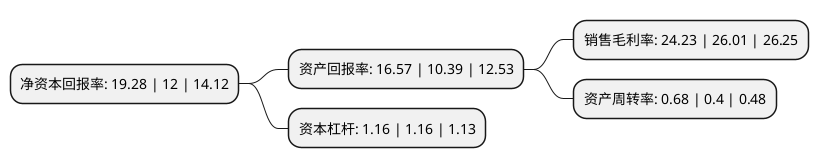

> 本页面由自动化程序生成于 2022年5月20日 01:32
> 内容可能存在错误，如有bug请提交issue至：https://github.com/Eroleice/doc-pi/issues
{.is-warning}

# 上市公司基本情况

## 基本资料

北京大豪科技股份有限公司（以下简称“大豪科技”）成立于2000年09月25日，北京市。于2015年04月22日在上交所主板上市。

大豪科技注册资本92,433.331万元，主营业务为各类缝制及针织设备电脑控制系统研发，生产和销售。本公司生产的电脑控制系统是缝制及针织设备的核心零部件，主要涉及刺绣机电脑控制系统，特种工业缝纫机电脑控制系统和针织横机电脑控制系统三大领域。以下是详细信息：

- 公司名称: 北京大豪科技股份有限公司
- 股票代码: 603025.SH
- 所在地: 北京 - 北京市
- 成立日期: 2000年09月25日
- 注册资本: 92,433.331万元
- 法定代表人: 郑建军
- 主营业务: 主营业务为各类缝制及针织设备电脑控制系统研发，生产和销售本公司生产的电脑控制系统是缝制及针织设备的核心零部件，主要涉及刺绣机电脑控制系统，特种工业缝纫机电脑控制系统和针织横机电脑控制系统三大领域
- 公司官网: www.dahaobj.com
- 公司介绍: 公司主要业务为各类拥有完全自主知识产权的电脑控制系统研发、生产和销售。电控控制系统为机械设备工业控制计算机及装置，集伺服驱动、多轴联动等自动化核心技术，是电控类机械设备整机产品的“神经中枢”和“大脑系统”。电脑控制系统通过电脑程序实现对机械设备运动过程及顺序、位移和相对坐标、速度、转速及各种辅助功能的自动控制，并通过网络管理，实现工厂的智能制造。目前公司产品主要配套于缝制及针纺机械设备，是缝制、针纺机械设备的核心零部件。公司先后获得工信部全国单项制造业冠军示范企业、第八届北京最具影响力十大品牌、第十九届上市企业金牛奖、第七届北京知名品牌、中国轻工联科技进步一等奖等多项国家、省部级奖励。

## 股东及高管情况

上市公司第一大股东为北京一轻控股有限责任公司，持股301,025,030股，占比32.57%，为上市公司实际控制人。

截至2022年03月31日，上市公司的前十大股东中，共有6名自然人股东，3名机构股东，1个海外主体，其中5%以上大股东共有6名。上市公司前十大股东明细如下：

> 截至2022年03月31日，上市公司前十大股东信息如下：

| 股东名称 | 持股数量（股） | 持股比例 |
| --- | --- | --- |
| 北京一轻控股有限责任公司 | 301,025,030 | 32.57% |
| 郑建军 | 120,942,852 | 13.08% |
| 吴海宏 | 100,195,076 | 10.84% |
| 赵玉岭 | 79,767,624 | 8.63% |
| 孙雪理 | 79,767,624 | 8.63% |
| 谭庆 | 79,767,624 | 8.63% |
| 香港中央结算有限公司(陆股通) | 1,862,736 | 0.2% |
| 王学力 | 1,685,866 | 0.18% |
| 海通证券股份有限公司 | 1,500,002 | 0.16% |
| 爱慕股份有限公司 | 1,430,000 | 0.15% |

## 利润表分析

上市公司2021年总收入为15.04亿元，净利润为3.64亿元，实现盈利。

## 杜邦分析

> 数据列示周期：2021年 | 2020年 | 2019年
{.is-info}

上市公司的净资产收益率在近一年有所上升，上升幅度为60.67%，其变化情况分解如下：
- 上市公司的销售毛利率在近一年下降了-6.84%，可能是生产效率的下降、商品原材料价格上涨或商品价格的下跌所致。
- 上市公司的资产周转率在近一年上升了70%，可能是源自于更快的销售回款或库存管理效果提升。
- 上市公司的财务杠杆比率在近一年下降了0%，可能是减少负债降低财务费用。

