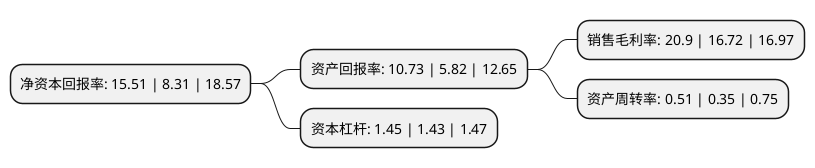

> 本页面由自动化程序生成于 2022年5月20日 01:32
> 内容可能存在错误，如有bug请提交issue至：https://github.com/Eroleice/doc-pi/issues
{.is-warning}

# 上市公司基本情况

## 基本资料

浙江越剑智能装备股份有限公司（以下简称“越剑智能”）成立于2000年04月07日，绍兴市。于2020年04月15日在上交所主板上市。

越剑智能注册资本13,200万元，公司的主营业务为纺织机械设备的研发，生产和销售。公司主要产品包括加弹机，空气包覆丝机，经编机及剑杆织机四大类产品。以下是详细信息：

- 公司名称: 浙江越剑智能装备股份有限公司
- 股票代码: 603095.SH
- 所在地: 浙江 - 绍兴市
- 成立日期: 2000年04月07日
- 注册资本: 13,200万元
- 法定代表人: 孙剑华
- 主营业务: 公司的主营业务为纺织机械设备的研发，生产和销售公司主要产品包括加弹机，空气包覆丝机，经编机及剑杆织机四大类产品
- 公司官网: www.yuejian.com.cn
- 公司介绍: 公司具有30多年纺织专用设备制造的历史，是中国纺织机械行业的重点骨干企业，并参与起草了纺织行业多项国家标准和行业标准。公司的主营业务为纺织机械设备的研发、生产和销售。公司主要产品包括加弹机、空气包覆丝机、经编机及剑杆织机四大类产品。公司技术能力雄厚，拥有包括13项发明专利在内的共计80余项拥有自主知识产权的技术专利及34项软件著作权，具备了独立设计、研发、生产纺织机械设备的能力。公司积极推动与各类科研院所、大专院校的技术研发合作，注重与上下游企业之间的联系，建立起将理论与生产实践紧密结合的研发创新体系。公司在产品的自主研发和持续创新方面获得过多项荣誉：公司YJTPS600型高速剑杆毛巾织机被浙江省经济和信息化厅、浙江省财政厅认定为2019年度浙江省装备制造业重点领域首台(套)产品等。

## 股东及高管情况

上市公司第一大股东为浙江越剑控股有限公司，持股46,178,550股，占比34.98%，为上市公司实际控制人。

截至2022年03月31日，上市公司的前十大股东中，共有8名自然人股东，1名机构股东，1个产品账户，其中5%以上大股东共有2名。上市公司前十大股东明细如下：

> 截至2022年03月31日，上市公司前十大股东信息如下：

| 股东名称 | 持股数量（股） | 持股比例 |
| --- | --- | --- |
| 浙江越剑控股有限公司 | 46,178,550 | 34.98% |
| 孙剑华 | 31,036,500 | 23.51% |
| 孙建萍 | 4,702,500 | 3.56% |
| 孙文娟 | 4,702,500 | 3.56% |
| 马红光 | 2,243,000 | 1.7% |
| 王伟良 | 1,975,050 | 1.5% |
| 王君垚 | 1,881,000 | 1.43% |
| 韩明海 | 1,881,000 | 1.43% |
| 单生良 | 1,692,900 | 1.28% |
| 中信银行股份有限公司-华安聚嘉精选混合型证券投资基金 | 730,400 | 0.55% |

## 利润表分析

上市公司2021年总收入为15.5亿元，净利润为3.23亿元，实现盈利。

## 杜邦分析

> 数据列示周期：2021年 | 2020年 | 2019年
{.is-info}

上市公司的净资产收益率在近一年有所上升，上升幅度为86.64%，其变化情况分解如下：
- 上市公司的销售毛利率在近一年上升了25%，可能是生产效率的提升、商品原材料价格下跌或商品价格的上涨所致。
- 上市公司的资产周转率在近一年上升了45.71%，可能是源自于更快的销售回款或库存管理效果提升。
- 上市公司的财务杠杆比率在近一年上升了1.4%，可能是增加负债扩大生产规模。

