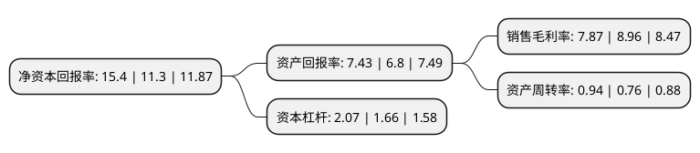

> 本页面由自动化程序生成于 2022年5月20日 01:33
> 内容可能存在错误，如有bug请提交issue至：https://github.com/Eroleice/doc-pi/issues
{.is-warning}

# 上市公司基本情况

## 基本资料

杰克科技股份有限公司（以下简称“杰克股份”）成立于2003年08月27日，台州市。于2017年01月19日在上交所主板上市。

杰克股份注册资本44,586.852万元，主要产品:工业缝纫机，裁床，铺布机，自动缝制设备等工业用缝中，缝前设备以及电机，电控等缝制机械重要零部件。主要业务:工业缝纫机的研究，开发，生产和销售。以下是详细信息：

- 公司名称: 杰克科技股份有限公司
- 股票代码: 603337.SH
- 所在地: 浙江 - 台州市
- 成立日期: 2003年08月27日
- 注册资本: 44,586.852万元
- 法定代表人: 赵新庆
- 主营业务: 主要产品:工业缝纫机，裁床，铺布机，自动缝制设备等工业用缝中，缝前设备以及电机，电控等缝制机械重要零部件工业缝纫机的研究，开发，生产和销售
- 公司官网: www.chinajack.com
- 公司介绍: 公司是一家以“聚焦、专注、简单、感恩”为核心价值观，专注于工业缝制机械的研发、生产和销售的国际化民营高新技术企业。经过多年的经营和发展，公司已成为行业领先的缝制机械制造商。公司的主营业务为工业缝制机械的研发、生产和销售，包括工业缝纫机、裁床、铺布机、自动缝制设备等工业用缝中、缝前设备以及电机、电控等缝制机械重要零部件。公司将技术研发视为驱动企业发展的核心动力，引进了先进的IPD(集成产品开发)理念，经过多年的摸索实践，形成了一套较为完善的技术研发体系。公司先后被评为国家工信部制造业单项冠军示范企业、国家技术创新示范企业、“国家企业技术中心”、“国家火炬计划重点高新技术企业”、轻工业品牌50强、“2015年度国家知识产权优势企业”、“浙江省创新型示范和试点企业”、“浙江省专利示范企业”、“浙江省缝制设备机电一体化工程技术研究中心”、“省级高新技术研究开发中心”、“浙江省机电产品出口基地公共技术研发平台”。

## 股东及高管情况

上市公司第一大股东为台州市杰克商贸有限公司，持股190,031,519股，占比42.28%，为上市公司实际控制人。

截至2022年05月12日，上市公司的前十大股东中，共有3名自然人股东，1名机构股东，5个产品账户，1个海外主体，其中5%以上大股东共有2名。上市公司前十大股东明细如下：

> 截至2022年05月12日，上市公司前十大股东信息如下：

| 股东名称 | 持股数量（股） | 持股比例 |
| --- | --- | --- |
| 台州市杰克商贸有限公司 | 190,031,519 | 42.28% |
| LAKE VILLAGE LIMITED | 83,157,500 | 18.5% |
| 胡彩芳 | 19,062,941 | 4.24% |
| 大成基金管理有限公司-社保基金17011组合 | 12,436,700 | 2.77% |
| 阮积明 | 7,798,480 | 1.73% |
| 阮福德 | 7,798,480 | 1.73% |
| 中国农业银行股份有限公司-大成高新技术产业股票型证券投资基金 | 4,942,648 | 1.1% |
| 陕西省国际信托股份有限公司-陕国投·杰克股份2021年员工持股集合资金信托计划 | 4,397,901 | 0.98% |
| 中国工商银行股份有限公司-交银施罗德趋势优先混合型证券投资基金 | 3,786,176 | 0.84% |
| 大成基金管理有限公司-社保基金1101组合 | 3,704,274 | 0.82% |

## 利润表分析

上市公司2021年总收入为60.53亿元，净利润为4.76亿元，实现盈利。

## 杜邦分析

> 数据列示周期：2021年 | 2020年 | 2019年
{.is-info}

上市公司的净资产收益率在近一年有所上升，上升幅度为36.28%，其变化情况分解如下：
- 上市公司的销售毛利率在近一年下降了-12.17%，可能是生产效率的下降、商品原材料价格上涨或商品价格的下跌所致。
- 上市公司的资产周转率在近一年上升了23.68%，可能是源自于更快的销售回款或库存管理效果提升。
- 上市公司的财务杠杆比率在近一年上升了24.7%，可能是增加负债扩大生产规模。

