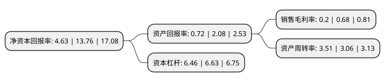

> 本页面由自动化程序生成于 2022年5月20日 01:01
> 内容可能存在错误，如有bug请提交issue至：https://github.com/Eroleice/doc-pi/issues
{.is-warning}

# 上市公司基本情况

## 基本资料

神州数码集团股份有限公司（以下简称“神州数码”）成立于1982年06月01日，深圳市。于1994年05月09日在深交所主板上市。

神州数码注册资本66,027.869万元，移动办公设备，笔记本电脑，显示设备，服务器，存储设备，网络设备，计算机配件以下是详细信息：

- 公司名称: 神州数码集团股份有限公司
- 股票代码: 000034.SZ
- 所在地: 广东 - 深圳市
- 成立日期: 1982年06月01日
- 注册资本: 66,027.869万元
- 法定代表人: 郭为
- 主营业务: 移动办公设备，笔记本电脑，显示设备，服务器，存储设备，网络设备，计算机配件
- 公司官网: www.digitalchina.com
- 公司介绍: 公司原为神州控股，2015年出售分销和系统业务，迎击“互联网+”时代浪潮，2016年4月于A股上市。公司先后荣获国家级火炬计划重点高新技术企业称号、北京市高新技术企业称号、中关村高新技术企业称号，软件开发获得CMMI4级认证，软件服务水平通过ISO20000和ISO27001认证，并在北京和武汉建成两个大型研发中心，是北京市“十百千工程”中，四家千亿核心企业之一。公司一直是国内外产品技术以及服务的提供商在中国首选的合作伙伴，与300余家国际顶尖供应商展开精诚合作，市场份额稳居第一，并建成覆盖全国860个城市、30000余家渠道伙伴的中国最大的IT营销网络，在为广大的消费者用户提供丰富的电子产品的同时，神州数码集团已累计为超过100万家中国企业提供信息化所需的产品、解决方案和服务。面向未来，公司将继续通过专业化与多元化的IT产品和服务，释放信息技术的力量，把信息技术价值转化为客户价值，推动中国信息化建设进程。

## 股东及高管情况

上市公司第一大股东为郭为，持股154,777,803股，占比23.44%，**疑似为**上市公司实际控制人。

截至2022年04月20日，上市公司的前十大股东中，共有6名自然人股东，2名机构股东，2个海外主体，其中5%以上大股东共有5名。上市公司前十大股东明细如下：

> 未能通过持股比例判定出上市公司实际控制人（持股30%以上）
> 可能存在通过间接持股、联合持股、协议控制等方式拥有实际控制权的主体，具体请参考上市公司定期公告！
{.is-warning}

> 截至2022年04月20日，上市公司前十大股东信息如下：

| 股东名称 | 持股数量（股） | 持股比例 |
| --- | --- | --- |
| 郭为 | 154,777,803 | 23.44% |
| 郭为 | 154,777,803 | 23.44% |
| 中国希格玛有限公司 | 54,282,746 | 8.22% |
| 王晓岩 | 38,458,205 | 5.82% |
| 王晓岩 | 37,337,592 | 5.6548% |
| 深圳市宝安建设投资集团有限公司 | 26,261,759 | 3.98% |
| 中国希格玛-国都证券-中希EB担保及信托财产专户 | 22,753,000 | 3.45% |
| 香港中央结算有限公司(陆股通) | 6,740,390 | 1.02% |
| 郝峻晟 | 3,628,000 | 0.55% |
| 朱丽英 | 2,868,315 | 0.43% |

## 利润表分析

上市公司2021年总收入为1,223.84亿元，净利润为2.49亿元，实现盈利。

## 杜邦分析

> 数据列示周期：2021年 | 2020年 | 2019年
{.is-info}

上市公司的净资产收益率在近一年有所下降，下降幅度为-66.35%，其变化情况分解如下：
- 上市公司的销售毛利率在近一年下降了-70.59%，可能是生产效率的下降、商品原材料价格上涨或商品价格的下跌所致。
- 上市公司的资产周转率在近一年上升了14.71%，可能是源自于更快的销售回款或库存管理效果提升。
- 上市公司的财务杠杆比率在近一年下降了-2.56%，可能是减少负债降低财务费用。

