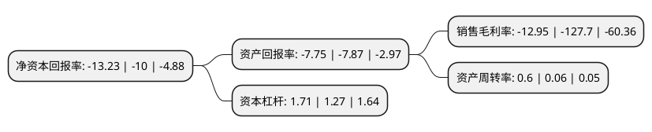

> 本页面由自动化程序生成于 2022年5月20日 01:02
> 内容可能存在错误，如有bug请提交issue至：https://github.com/Eroleice/doc-pi/issues
{.is-warning}

# 上市公司基本情况

## 基本资料

绿景控股股份有限公司（以下简称“*ST绿景”）成立于1989年09月18日，广州市。于1992年11月23日在深交所主板上市。

*ST绿景注册资本18,481.961万元，主要业务:房地产开发。主要产品:别墅，公寓。以下是详细信息：

- 公司名称: 绿景控股股份有限公司
- 股票代码: 000502.SZ
- 所在地: 广东 - 广州市
- 成立日期: 1989年09月18日
- 注册资本: 18,481.961万元
- 法定代表人: 金志峰
- 主营业务: 房地产开发主要产品:别墅，公寓
- 公司官网: www.000502.cn
- 公司介绍: 公司成立于1988年5月，是一家主营经营房地产管理和开发的大型房地产上市公司。公司按照转型医疗的既定方针，推进了公司医疗服务行业领域三级医院南宁明安医院的建设，推进了互联网+的在线医疗平台建设，这其中：推进了城市癌症早诊早治课题之随访服务平台建设，推进了育儿平台项目建设，推进了天安人寿急救包配套项目，实现了互联网+的医疗平台十余个项目的立项和研发投入，优化了相应医疗服务、信息化人才以及支持体系人员，为公司转型奠定了坚实的基础。

## 股东及高管情况

上市公司第一大股东为广州市天誉控股集团有限公司，持股41,864,466股，占比22.65%，**疑似为**上市公司实际控制人。

截至2022年03月31日，上市公司的前十大股东中，共有6名自然人股东，3名机构股东，1个产品账户，其中5%以上大股东共有1名。上市公司前十大股东明细如下：

> 未能通过持股比例判定出上市公司实际控制人（持股30%以上）
> 可能存在通过间接持股、联合持股、协议控制等方式拥有实际控制权的主体，具体请参考上市公司定期公告！
{.is-warning}

> 截至2022年03月31日，上市公司前十大股东信息如下：

| 股东名称 | 持股数量（股） | 持股比例 |
| --- | --- | --- |
| 广州市天誉控股集团有限公司 | 41,864,466 | 22.65% |
| 上海庞增投资管理中心(有限合伙)-庞增添益15号私募证券投资基金 | 9,059,100 | 4.9% |
| 俞盛 | 8,627,757 | 4.67% |
| 福建晟联辉投资有限公司 | 4,857,300 | 2.63% |
| 张丽波 | 2,935,700 | 1.59% |
| 赵永芹 | 2,090,000 | 1.13% |
| 潘光明 | 1,830,363 | 0.99% |
| 王玉 | 1,687,597 | 0.91% |
| 山东省国际信托股份有限公司-山东信托·德善齐家231号家族信托 | 1,530,990 | 0.83% |
| 施得和 | 1,507,401 | 0.82% |

## 利润表分析

上市公司2021年总收入为1.72亿元，净利润为-0.23亿元，**未实现盈利**。

## 杜邦分析

> 数据列示周期：2021年 | 2020年 | 2019年
{.is-info}

上市公司的净资产收益率在近一年有所上升，上升幅度为32.3%，其变化情况分解如下：
- 上市公司的销售毛利率在近一年下降了-89.86%，可能是生产效率的下降、商品原材料价格上涨或商品价格的下跌所致。
- 上市公司的资产周转率在近一年上升了900%，可能是源自于更快的销售回款或库存管理效果提升。
- 上市公司的财务杠杆比率在近一年上升了34.65%，可能是增加负债扩大生产规模。

