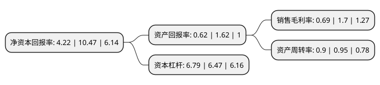

> 本页面由自动化程序生成于 2022年5月20日 01:02
> 内容可能存在错误，如有bug请提交issue至：https://github.com/Eroleice/doc-pi/issues
{.is-warning}

# 上市公司基本情况

## 基本资料

福建三木集团股份有限公司（以下简称“三木集团”）成立于1992年10月24日，福州市。于1996年11月21日在深交所主板上市。

三木集团注册资本46,551.957万元，主要业务:商品房及土地开发，施工工程，日用百货，食品与食品加工，机电产品，建筑材料。以下是详细信息：

- 公司名称: 福建三木集团股份有限公司
- 股票代码: 000632.SZ
- 所在地: 福建 - 福州市
- 成立日期: 1992年10月24日
- 注册资本: 46,551.957万元
- 法定代表人: 林昱
- 主营业务: 商品房及土地开发，施工工程，日用百货，食品与食品加工，机电产品，建筑材料
- 公司官网: www.san-mu.com
- 公司介绍: 公司是福建省内推行现代企业制度的先行者，公司率先实现股份制改革，率先实现企业兼并重组，率先实现法人股协议转让、股票上市，率先组建企业集团，在现代企业管理与运营方面积累了丰富的经验。经过多年的发展，三木集团逐渐成为以房地产开发、商业旅游资产运营和进出口贸易为主营业务的综合类企业集团，地产业务涉及福建、上海、山东、湖南等多个省市，贸易合作伙伴遍及世界一百多个国家和地区，集团的外贸进出口总额连续多年名列福州第一、福建省前茅。公司先后获得“国家一级房地产开发企业”、“国家一级物业管理企业”、“中国房地产开发经营诚信企业”等荣誉。

## 股东及高管情况

上市公司第一大股东为福建三联投资有限公司，持股84,086,401股，占比18.06%，**疑似为**上市公司实际控制人。

截至2022年03月31日，上市公司的前十大股东中，共有5名自然人股东，4名机构股东，1个产品账户，其中5%以上大股东共有2名。上市公司前十大股东明细如下：

> 未能通过持股比例判定出上市公司实际控制人（持股30%以上）
> 可能存在通过间接持股、联合持股、协议控制等方式拥有实际控制权的主体，具体请参考上市公司定期公告！
{.is-warning}

> 截至2022年03月31日，上市公司前十大股东信息如下：

| 股东名称 | 持股数量（股） | 持股比例 |
| --- | --- | --- |
| 福建三联投资有限公司 | 84,086,401 | 18.06% |
| 上海阳光龙净实业集团有限公司 | 44,264,558 | 9.51% |
| 盈嘉科达投资有限公司 | 22,014,425 | 4.73% |
| 福州开发区国有资产营运有限公司 | 15,874,200 | 3.41% |
| 上海驰泰资产管理有限公司-兴驰一号私募证券投资基金 | 5,737,006 | 1.23% |
| 于岩 | 5,588,800 | 1.2% |
| 林文融 | 5,075,945 | 1.09% |
| 鲍淑琴 | 3,980,100 | 0.85% |
| 李世忠 | 3,841,721 | 0.83% |
| 胡志平 | 3,835,700 | 0.82% |

## 利润表分析

上市公司2021年总收入为86亿元，净利润为0.59亿元，实现盈利。

## 杜邦分析

> 数据列示周期：2021年 | 2020年 | 2019年
{.is-info}

上市公司的净资产收益率在近一年有所下降，下降幅度为-59.69%，其变化情况分解如下：
- 上市公司的销售毛利率在近一年下降了-59.41%，可能是生产效率的下降、商品原材料价格上涨或商品价格的下跌所致。
- 上市公司的资产周转率在近一年下降了-5.26%，可能是源自于更慢的销售回款或库存管理效果下降。
- 上市公司的财务杠杆比率在近一年上升了4.95%，可能是增加负债扩大生产规模。

