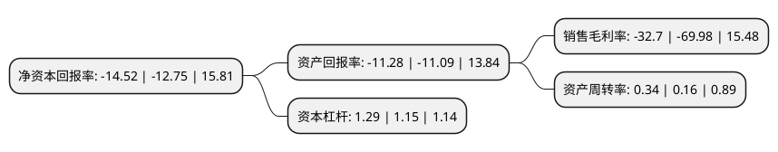

> 本页面由自动化程序生成于 2022年5月20日 01:20
> 内容可能存在错误，如有bug请提交issue至：https://github.com/Eroleice/doc-pi/issues
{.is-warning}

# 上市公司基本情况

## 基本资料

浙江米奥兰特商务会展股份有限公司（以下简称“米奥会展”）成立于2010年06月30日，杭州市。于2019年10月22日在深交所创业板上市。

米奥会展注册资本10,016.4万元，公司专业从事会展项目的策划发起，组织承办，推广及运营服务。以下是详细信息：

- 公司名称: 浙江米奥兰特商务会展股份有限公司
- 股票代码: 300795.SZ
- 所在地: 浙江 - 杭州市
- 成立日期: 2010年06月30日
- 注册资本: 10,016.4万元
- 法定代表人: 潘建军
- 主营业务: 公司专业从事会展项目的策划发起，组织承办，推广及运营服务
- 公司官网: www.meorient.com
- 公司介绍: 公司专业从事会展项目的策划发起、组织承办、推广及运营服务。打造以自主品牌、自主运营的会展为载体，引领中国中小企业开拓“一带一路”市场的会展服务平台。按照承办会展的业务类型，公司的会展业务可以分为境外自办展、境内自办展以及境外代理展，目前的核心业务为“一带一路”境外自办展，“米奥兰特国际会展”旗下的Homelife及Machinex系列展已发展成为具有较高行业知名度和国际影响力的海外展会品牌。公司自设立以来到报告期末已在波兰、土耳其、巴西、南非、约旦、哈萨克斯坦、埃及、阿联酋、印度、墨西哥、伊朗、尼日利亚、肯尼亚等十三个国家累计举办64场境外自办展。

## 股东及高管情况

上市公司第一大股东为方欢胜，持股23,879,718股，占比23.84%，**疑似为**上市公司实际控制人。

截至2022年03月31日，上市公司的前十大股东中，共有8名自然人股东，1名机构股东，1个产品账户，其中5%以上大股东共有3名。上市公司前十大股东明细如下：

> 未能通过持股比例判定出上市公司实际控制人（持股30%以上）
> 可能存在通过间接持股、联合持股、协议控制等方式拥有实际控制权的主体，具体请参考上市公司定期公告！
{.is-warning}

> 截至2022年03月31日，上市公司前十大股东信息如下：

| 股东名称 | 持股数量（股） | 持股比例 |
| --- | --- | --- |
| 方欢胜 | 23,879,718 | 23.84% |
| 潘建军 | 23,678,019 | 23.64% |
| 姚宗宪 | 9,785,386 | 9.77% |
| 俞广庆 | 4,400,113 | 4.39% |
| 太仓长三角股权投资中心(有限合伙) | 3,621,000 | 3.62% |
| 程奕俊 | 3,335,564 | 3.33% |
| 海创(上海)私募基金管理有限公司-海创价值成长精选壹号私募证券投资基金 | 1,030,000 | 1.03% |
| 孙雷 | 901,600 | 0.9% |
| 李洁 | 680,000 | 0.68% |
| 荆丰伟 | 587,300 | 0.59% |

## 利润表分析

上市公司2021年总收入为1.81亿元，净利润为-0.6亿元，**未实现盈利**。

## 杜邦分析

> 数据列示周期：2021年 | 2020年 | 2019年
{.is-info}

上市公司的净资产收益率在近一年有所上升，上升幅度为13.88%，其变化情况分解如下：
- 上市公司的销售毛利率在近一年下降了-53.27%，可能是生产效率的下降、商品原材料价格上涨或商品价格的下跌所致。
- 上市公司的资产周转率在近一年上升了112.5%，可能是源自于更快的销售回款或库存管理效果提升。
- 上市公司的财务杠杆比率在近一年上升了12.17%，可能是增加负债扩大生产规模。

