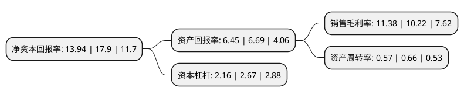

> 本页面由自动化程序生成于 2022年5月20日 01:24
> 内容可能存在错误，如有bug请提交issue至：https://github.com/Eroleice/doc-pi/issues
{.is-warning}

# 上市公司基本情况

## 基本资料

宁波联合集团股份有限公司（以下简称“宁波联合”）成立于1994年03月31日，宁波市。于1997年04月10日在上交所主板上市。

宁波联合注册资本31,088万元，主要业务:电力，热力生产和供应业务，房地产业务，批发业务及居民服务业务以下是详细信息：

- 公司名称: 宁波联合集团股份有限公司
- 股票代码: 600051.SH
- 所在地: 浙江 - 宁波市
- 成立日期: 1994年03月31日
- 注册资本: 31,088万元
- 法定代表人: 李水荣
- 主营业务: 电力，热力生产和供应业务，房地产业务，批发业务及居民服务业务
- 公司官网: www.nug.com.cn
- 公司介绍: 公司所从事的主要业务为电力、热力生产和供应业务、房地产业务、批发业务及居民服务业务。公司以稳健经营、长续发展的经营理念，努力培育主营业务，培育核心竞争能力，集中力量做强做大优势产业，在热电、房地产开发和国际贸易等领域积累了丰富的经验，并拥有优秀的经营管理团队和充足的人才储备。全资子公司热电公司的电力、热力生产和供应业务在宁波经济技术开发区联合区域具有相对垄断的竞争优势，且拥有多年的区域电网、热网的经营管理经验。子公司梁祝婚庆公司是由多方共同出资成立的有限公司，合作各方所拥有的与婚庆服务业务相关的资源不但丰富，而且互补。子公司进出口公司收到了宁波海关颁发的“宁波海关许可(20180001)号”准予行政许可决定书，成为全市首家设立海关出口监管仓库的企业。

## 股东及高管情况

上市公司第一大股东为浙江荣盛控股集团有限公司，持股90,417,600股，占比29.08%，**疑似为**上市公司实际控制人。

截至2022年03月31日，上市公司的前十大股东中，共有6名自然人股东，3名机构股东，1个海外主体，其中5%以上大股东共有1名。上市公司前十大股东明细如下：

> 未能通过持股比例判定出上市公司实际控制人（持股30%以上）
> 可能存在通过间接持股、联合持股、协议控制等方式拥有实际控制权的主体，具体请参考上市公司定期公告！
{.is-warning}

> 截至2022年03月31日，上市公司前十大股东信息如下：

| 股东名称 | 持股数量（股） | 持股比例 |
| --- | --- | --- |
| 浙江荣盛控股集团有限公司 | 90,417,600 | 29.08% |
| 李艳丽 | 12,604,660 | 4.05% |
| 宁波经济技术开发区控股有限公司 | 5,325,772 | 1.71% |
| JPMORGAN CHASE BANK, NATIONAL ASSOCIATION | 3,050,777 | 0.98% |
| 赵惠新 | 2,923,500 | 0.94% |
| 王维和 | 1,709,461 | 0.55% |
| 吴吉林 | 1,592,524 | 0.51% |
| 新余瑞达投资有限公司 | 1,516,932 | 0.49% |
| 杨丘琳 | 1,356,190 | 0.44% |
| 周天一 | 1,140,000 | 0.37% |

## 利润表分析

上市公司2021年总收入为37.25亿元，净利润为4.24亿元，实现盈利。

## 杜邦分析

> 数据列示周期：2021年 | 2020年 | 2019年
{.is-info}

上市公司的净资产收益率在近一年有所下降，下降幅度为-22.12%，其变化情况分解如下：
- 上市公司的销售毛利率在近一年上升了11.35%，可能是生产效率的提升、商品原材料价格下跌或商品价格的上涨所致。
- 上市公司的资产周转率在近一年下降了-13.64%，可能是源自于更慢的销售回款或库存管理效果下降。
- 上市公司的财务杠杆比率在近一年下降了-19.1%，可能是减少负债降低财务费用。

