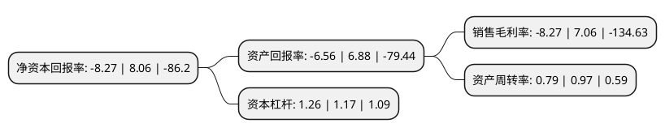

> 本页面由自动化程序生成于 2022年5月20日 01:25
> 内容可能存在错误，如有bug请提交issue至：https://github.com/Eroleice/doc-pi/issues
{.is-warning}

# 上市公司基本情况

## 基本资料

山东江泉实业股份有限公司（以下简称“江泉实业”）成立于1992年12月14日，临沂市。于1999年08月17日在上交所主板上市。

江泉实业注册资本51,169.721万元，主营业务:发电业务，铁路专用线运输业务以下是详细信息：

- 公司名称: 山东江泉实业股份有限公司
- 股票代码: 600212.SH
- 所在地: 山东 - 临沂市
- 成立日期: 1992年12月14日
- 注册资本: 51,169.721万元
- 法定代表人: 赵彤宇
- 主营业务: 主营业务:发电业务，铁路专用线运输业务
- 公司官网: lvnengdianzi.com
- 公司介绍: 公司是综合类企业，主营业务包括发电业务、铁路专用线运输业务两大类。公司发电业务是以上游钢铁、焦化企业的尾气为原料综合利用发电。铁路专用线运输业务主要经营铁路专用线及货场，铁路全线长达13公里。天地磁砖是华盛江泉集团的主导产品之一，由集团建材分公司通关下辖的三家合资企业共同生产开发。公司目前有水晶砖、亚光砖、抛光砖、玻化砖、地爬壁、仿古砖等内外墙地砖产品系列。通过精英云集的研究开发中心，源源不断的开发出适合市场需求的新品，使“天地”磁砖得以保持领先潮流且具有市场竞争力的产品结构优势。公司通过ISO：2000版国际质量体系认证标准，及ISO14000国际体系认证优质管理企业，所生产的绿色环保陶瓷，已通过国家建材放射性检测认证，属A类产品。产品销往全国28个省、市、自治区，并远销美国、澳大利亚、韩国、加拿大、罗马尼亚等国家和地区。

## 股东及高管情况

上市公司第一大股东为深圳景宏益诚实业发展有限公司，持股70,280,485股，占比13.73%，**疑似为**上市公司实际控制人。

截至2022年03月31日，上市公司的前十大股东中，共有6名自然人股东，3名机构股东，1个海外主体，其中5%以上大股东共有1名。上市公司前十大股东明细如下：

> 未能通过持股比例判定出上市公司实际控制人（持股30%以上）
> 可能存在通过间接持股、联合持股、协议控制等方式拥有实际控制权的主体，具体请参考上市公司定期公告！
{.is-warning}

> 截至2022年03月31日，上市公司前十大股东信息如下：

| 股东名称 | 持股数量（股） | 持股比例 |
| --- | --- | --- |
| 深圳景宏益诚实业发展有限公司 | 70,280,485 | 13.73% |
| 朱玉文 | 9,899,300 | 1.93% |
| 达孜县欣新投资有限公司 | 7,574,805 | 1.48% |
| 熊礼文 | 5,900,014 | 1.15% |
| 朱林 | 5,250,000 | 1.03% |
| 陈立新 | 4,684,000 | 0.92% |
| 宁波益莱投资控股有限公司 | 4,255,400 | 0.83% |
| 宋莉 | 4,163,501 | 0.81% |
| MORGAN STANLEY & CO. INTERNATIONAL PLC. | 3,891,341 | 0.76% |
| 高江 | 3,836,100 | 0.75% |

## 利润表分析

上市公司2021年总收入为2.42亿元，净利润为-0.21亿元，**未实现盈利**。

## 杜邦分析

> 数据列示周期：2021年 | 2020年 | 2019年
{.is-info}

上市公司的净资产收益率在近一年有所下降，下降幅度为-202.61%，其变化情况分解如下：
- 上市公司的销售毛利率在近一年下降了-217.14%，可能是生产效率的下降、商品原材料价格上涨或商品价格的下跌所致。
- 上市公司的资产周转率在近一年下降了-18.56%，可能是源自于更慢的销售回款或库存管理效果下降。
- 上市公司的财务杠杆比率在近一年上升了7.69%，可能是增加负债扩大生产规模。

