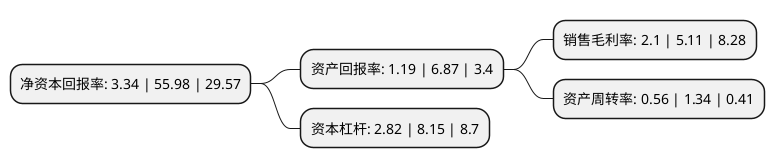

> 本页面由自动化程序生成于 2022年5月20日 01:25
> 内容可能存在错误，如有bug请提交issue至：https://github.com/Eroleice/doc-pi/issues
{.is-warning}

# 上市公司基本情况

## 基本资料

山西科新发展股份有限公司（以下简称“科新发展”）成立于1993年03月31日，太原市。于2000年06月15日在上交所主板上市。

科新发展注册资本26,252.097万元，主营业务:自有房屋租赁业务以及高端红酒贸易业务。以下是详细信息：

- 公司名称: 山西科新发展股份有限公司
- 股票代码: 600234.SH
- 所在地: 山西 - 太原市
- 成立日期: 1993年03月31日
- 注册资本: 26,252.097万元
- 法定代表人: 黄绍嘉
- 主营业务: 主营业务:自有房屋租赁业务以及高端红酒贸易业务
- 公司官网: www.600234.net
- 公司介绍: 公司主要开展自有房屋租赁业务以及高端红酒贸易业务和广告传媒业务。自有房屋租赁业务为对公司资产天龙大厦进行出租管理取得租金收入，业务和收入稳定；2018年初，原孙公司香港真金砖开始对高端红酒贸易业务进行了尝试；2018年10月，公司新设立的山水传媒公司正式开始运营，开展广告业务、市场营销策划业务等。

## 股东及高管情况

上市公司第一大股东为深圳市科新实业控股有限公司，持股60,075,093股，占比22.88%，**疑似为**上市公司实际控制人。

截至2022年03月31日，上市公司的前十大股东中，共有7名自然人股东，3名机构股东，其中5%以上大股东共有2名。上市公司前十大股东明细如下：

> 未能通过持股比例判定出上市公司实际控制人（持股30%以上）
> 可能存在通过间接持股、联合持股、协议控制等方式拥有实际控制权的主体，具体请参考上市公司定期公告！
{.is-warning}

> 截至2022年03月31日，上市公司前十大股东信息如下：

| 股东名称 | 持股数量（股） | 持股比例 |
| --- | --- | --- |
| 深圳市科新实业控股有限公司 | 60,075,093 | 22.88% |
| 深圳市前海派德高盛投资合伙企业(有限合伙) | 27,164,647 | 10.35% |
| 南京森特派斯企业管理有限公司 | 13,000,013 | 4.95% |
| 钟安升 | 11,033,598 | 4.2% |
| 刘晓聪 | 9,138,380 | 3.48% |
| 连妙琳 | 8,855,382 | 3.37% |
| 刘文赫 | 6,646,946 | 2.53% |
| 连妙纯 | 5,835,893 | 2.22% |
| 郑俊杰 | 5,400,229 | 2.06% |
| 侯武宏 | 5,396,743 | 2.06% |

## 利润表分析

上市公司2021年总收入为5.91亿元，净利润为0.12亿元，实现盈利。

## 杜邦分析

> 数据列示周期：2021年 | 2020年 | 2019年
{.is-info}

上市公司的净资产收益率在近一年有所下降，下降幅度为-94.03%，其变化情况分解如下：
- 上市公司的销售毛利率在近一年下降了-58.9%，可能是生产效率的下降、商品原材料价格上涨或商品价格的下跌所致。
- 上市公司的资产周转率在近一年下降了-58.21%，可能是源自于更慢的销售回款或库存管理效果下降。
- 上市公司的财务杠杆比率在近一年下降了-65.4%，可能是减少负债降低财务费用。

