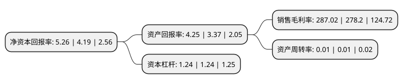

> 本页面由自动化程序生成于 2022年5月20日 01:27
> 内容可能存在错误，如有bug请提交issue至：https://github.com/Eroleice/doc-pi/issues
{.is-warning}

# 上市公司基本情况

## 基本资料

上海市天宸股份有限公司（以下简称“天宸股份”）成立于1989年07月13日，上海市。于1992年11月17日在上交所主板上市。

天宸股份注册资本68,667.711万元，主营业务:房地产，物业管理，运输及客运。以下是详细信息：

- 公司名称: 上海市天宸股份有限公司
- 股票代码: 600620.SH
- 所在地: 上海 - 上海市
- 成立日期: 1989年07月13日
- 注册资本: 68,667.711万元
- 法定代表人: 叶茂菁
- 主营业务: 主营业务:房地产，物业管理，运输及客运
- 公司官网: www.shstc.com
- 公司介绍: 公司属于综合类上市公司，目前所从事的主要业务有出租车运营、物业租赁和物业管理。公司的经营业务中，出租车经营、物业租赁和物业管理等传统型业务资质较全，在经营管理上积累了较为丰富的经验。公司整体资产状况良好，负债率较低，所持绿地控股等股权类金融资产具有可观的价值和较好的流动性，为公司未来启动存量地产的开发以及业务发展奠定了基础。

## 股东及高管情况

上市公司第一大股东为上海仲盛虹桥企业管理有限公司，持股172,225,164股，占比25.08%，**疑似为**上市公司实际控制人。

截至2022年03月31日，上市公司的前十大股东中，共有3名自然人股东，7名机构股东，其中5%以上大股东共有3名。上市公司前十大股东明细如下：

> 未能通过持股比例判定出上市公司实际控制人（持股30%以上）
> 可能存在通过间接持股、联合持股、协议控制等方式拥有实际控制权的主体，具体请参考上市公司定期公告！
{.is-warning}

> 截至2022年03月31日，上市公司前十大股东信息如下：

| 股东名称 | 持股数量（股） | 持股比例 |
| --- | --- | --- |
| 上海仲盛虹桥企业管理有限公司 | 172,225,164 | 25.08% |
| 国华人寿保险股份有限公司-万能三号 | 104,088,332 | 15.16% |
| 国华人寿保险股份有限公司-自有二号 | 47,662,054 | 6.94% |
| 上海成元投资管理有限公司 | 33,057,580 | 4.81% |
| 上海展览中心(集团)有限公司 | 27,535,741 | 4.01% |
| 国华人寿保险股份有限公司-传统一号 | 13,062,646 | 1.9% |
| 王磊 | 6,510,000 | 0.95% |
| 徐辉 | 4,951,900 | 0.72% |
| 北京享亿资产管理有限公司 | 4,827,845 | 0.7% |
| 沈定 | 4,456,000 | 0.65% |

## 利润表分析

上市公司2021年总收入为0.41亿元，净利润为1.2亿元，实现盈利。

## 杜邦分析

> 数据列示周期：2021年 | 2020年 | 2019年
{.is-info}

上市公司的净资产收益率在近一年有所上升，上升幅度为25.54%，其变化情况分解如下：
- 上市公司的销售毛利率在近一年上升了3.17%，可能是生产效率的提升、商品原材料价格下跌或商品价格的上涨所致。
- 上市公司的资产周转率在近一年下降了0%，可能是源自于更慢的销售回款或库存管理效果下降。
- 上市公司的财务杠杆比率在近一年下降了0%，可能是减少负债降低财务费用。

