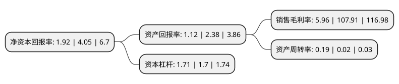

> 本页面由自动化程序生成于 2022年5月20日 01:28
> 内容可能存在错误，如有bug请提交issue至：https://github.com/Eroleice/doc-pi/issues
{.is-warning}

# 上市公司基本情况

## 基本资料

上海同达创业投资股份有限公司（以下简称“同达创业”）成立于1991年07月27日，上海市。于1993年05月04日在上交所主板上市。

同达创业注册资本13,914.355万元，主营业务:房地产，贸易。以下是详细信息：

- 公司名称: 上海同达创业投资股份有限公司
- 股票代码: 600647.SH
- 所在地: 上海 - 上海市
- 成立日期: 1991年07月27日
- 注册资本: 13,914.355万元
- 法定代表人: 牟柏强
- 主营业务: 主营业务:房地产，贸易
- 公司官网: www.shtdcy.com
- 公司介绍: 公司是一家国有控股上市公司，是中国信达资产管理股份有限公司在上海市的平台单位。公司主营贸易和资产管理业务，通过控股股东信达投资的扶持，开始涉足房地产业。公司控股子公司广州市德裕发展有限公司“信达·阳光海岸”项目和海南万立达实业有限公司“广东港澳中心”项目深受市场好评，提高了公司的品牌形象，展望未来，公司继续做好现有重点项目的经营管理，深度挖掘项目利润，同时做好自有物业的出租工作，确保公司平稳持续发展。在严格控制风险的前提下，做好财务性投资工作，增加公司新的利润来源。公司坚持以发展信达事业，实现资本增值为使命，树立厚德载物、诚信通达，稳健经营、稳步发展的核心理念。以追求卓越，开拓创新的企业精神，致力于打造知名的信达实业品牌，做受人尊敬的行业领先者。

## 股东及高管情况

上市公司第一大股东为信达投资有限公司，持股56,606,455股，占比40.68%，为上市公司实际控制人。

截至2022年03月31日，上市公司的前十大股东中，共有6名自然人股东，3名机构股东，1个产品账户，其中5%以上大股东共有1名。上市公司前十大股东明细如下：

> 截至2022年03月31日，上市公司前十大股东信息如下：

| 股东名称 | 持股数量（股） | 持股比例 |
| --- | --- | --- |
| 信达投资有限公司 | 56,606,455 | 40.68% |
| 国华人寿保险股份有限公司-传统一号 | 5,348,153 | 3.84% |
| 广州市玄元投资管理有限公司-玄元科新39号私募证券投资基金 | 2,673,289 | 1.92% |
| 光大嘉宝股份有限公司 | 2,457,000 | 1.77% |
| 余文光 | 2,269,600 | 1.63% |
| 钟馨 | 2,200,000 | 1.58% |
| 李健 | 1,765,400 | 1.27% |
| 陈辉 | 1,638,900 | 1.18% |
| 齐广胜 | 1,546,000 | 1.11% |
| 黄晓颖 | 832,400 | 0.6% |

## 利润表分析

上市公司2021年总收入为0.97亿元，净利润为0.05亿元，实现盈利。

## 杜邦分析

> 数据列示周期：2021年 | 2020年 | 2019年
{.is-info}

上市公司的净资产收益率在近一年有所下降，下降幅度为-52.59%，其变化情况分解如下：
- 上市公司的销售毛利率在近一年下降了-94.48%，可能是生产效率的下降、商品原材料价格上涨或商品价格的下跌所致。
- 上市公司的资产周转率在近一年上升了850%，可能是源自于更快的销售回款或库存管理效果提升。
- 上市公司的财务杠杆比率在近一年上升了0.59%，可能是增加负债扩大生产规模。

