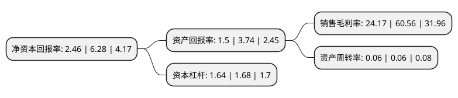

> 本页面由自动化程序生成于 2022年5月20日 01:28
> 内容可能存在错误，如有bug请提交issue至：https://github.com/Eroleice/doc-pi/issues
{.is-warning}

# 上市公司基本情况

## 基本资料

江苏综艺股份有限公司（以下简称“综艺股份”）成立于1992年10月23日，南通市。于1996年11月20日在上交所主板上市。

综艺股份注册资本130,000万元，主要业务:信息科技，新能源，股权投资以下是详细信息：

- 公司名称: 江苏综艺股份有限公司
- 股票代码: 600770.SH
- 所在地: 江苏 - 南通市
- 成立日期: 1992年10月23日
- 注册资本: 130,000万元
- 法定代表人: 昝圣达
- 主营业务: 信息科技，新能源，股权投资
- 公司官网: www.600770.com
- 公司介绍: 公司是“以新能源为龙头，信息科技和股权投资为两翼”的国际性高科技投资控股集团，公司业务领域涵盖新能源、新材料、信息科技三大国家重点战略产业。公司旗下拥有多家国家级高新技术企业，分处于产业体系的不同环节，并在芯片开发、设计、应用等细分领域内保持了不同程度的技术领先优势和竞争力；同时，业务的关联、资源的共享，亦有利于下属企业间的协同发展。公司控股子公司毅能达是国内最早从事智能卡产业发展的制造商之一，经过二十多年的稳健经营，积累了丰富的智能卡技术研发和产品制造经验，旗下产品应用范围覆盖了全国数十个省、市、自治区，在社保、医疗、交通、电信、教育、金融、政府、商业、个人身份识别等与民生息息相关的各个领域得到了广泛应用，拥有稳定增长的客户资源、多项科技软件业务资质、先进的生产设备，以及技术、运营管理等方面的丰富经验，形成了有力的核心竞争力。

## 股东及高管情况

上市公司第一大股东为南通综艺投资有限公司，持股333,955,709股，占比25.69%，**疑似为**上市公司实际控制人。

截至2022年03月31日，上市公司的前十大股东中，共有7名自然人股东，1名机构股东，2个产品账户，其中5%以上大股东共有2名。上市公司前十大股东明细如下：

> 未能通过持股比例判定出上市公司实际控制人（持股30%以上）
> 可能存在通过间接持股、联合持股、协议控制等方式拥有实际控制权的主体，具体请参考上市公司定期公告！
{.is-warning}

> 截至2022年03月31日，上市公司前十大股东信息如下：

| 股东名称 | 持股数量（股） | 持股比例 |
| --- | --- | --- |
| 南通综艺投资有限公司 | 333,955,709 | 25.69% |
| 昝圣达 | 239,885,029 | 18.45% |
| 朱照荣 | 22,215,200 | 1.71% |
| 刘学恒 | 18,192,485 | 1.4% |
| 刘英 | 11,580,900 | 0.89% |
| 中国银行股份有限公司-华泰柏瑞中证光伏产业交易型开放式指数证券投资基金 | 9,003,321 | 0.69% |
| 黄凤祥 | 6,212,800 | 0.48% |
| 陈文婷 | 6,000,118 | 0.46% |
| 中信建投证券股份有限公司-天弘中证光伏产业指数型发起式证券投资基金 | 5,595,544 | 0.43% |
| 朱希喜 | 5,005,900 | 0.39% |

## 利润表分析

上市公司2021年总收入为3.73亿元，净利润为0.9亿元，实现盈利。

## 杜邦分析

> 数据列示周期：2021年 | 2020年 | 2019年
{.is-info}

上市公司的净资产收益率在近一年有所下降，下降幅度为-60.83%，其变化情况分解如下：
- 上市公司的销售毛利率在近一年下降了-60.09%，可能是生产效率的下降、商品原材料价格上涨或商品价格的下跌所致。
- 上市公司的资产周转率在近一年下降了0%，可能是源自于更慢的销售回款或库存管理效果下降。
- 上市公司的财务杠杆比率在近一年下降了-2.38%，可能是减少负债降低财务费用。

