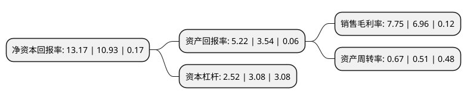

> 本页面由自动化程序生成于 2022年5月20日 01:29
> 内容可能存在错误，如有bug请提交issue至：https://github.com/Eroleice/doc-pi/issues
{.is-warning}

# 上市公司基本情况

## 基本资料

鲁银投资集团股份有限公司（以下简称“鲁银投资”）成立于1993年09月11日，济南市。于1996年12月25日在上交所主板上市。

鲁银投资注册资本67,565.228万元，主要业务:钢铁，医药，纺织。以下是详细信息：

- 公司名称: 鲁银投资集团股份有限公司
- 股票代码: 600784.SH
- 所在地: 山东 - 济南市
- 成立日期: 1993年09月11日
- 注册资本: 67,565.228万元
- 法定代表人: 杨耀东
- 主营业务: 钢铁，医药，纺织
- 公司官网: www.luyin.cn
- 公司介绍: 公司地处济南市，主要业务包括粉末冶金、房地产、贸易等。粉末冶金公司主要产品为钢铁粉末系列产品，广泛应用于汽车、家电、航空航天、焊接等领域。粉末冶金公司是目前国内最大的粉末冶金材料生产企业，产品质量稳定，客户认可度较高，具备良好的品牌形象，处于国内领先地位。房地产业务主要产品以商业和住宅楼盘开发为主，开发区域主要集中在济南、青岛等地，楼盘质量稳定，业内口碑佳。贸易业务主要以铁矿石、钢坯、建材等产品购销为主，报告期内公司扩大矿石购销业务、新增焦炭购销业务。公司与中南大学、山东大学开展合作，通过“产、学、研”相结合的方式，进一步整合粉末冶金行业技术研发与创新优势力量，解决了影响粉末冶金发展的共性技术和关键技术，强化了科技成果向生产力转化的中间环节，全面提升了粉末冶金产业的整体技术和质量水平，实现了技术成果向社会的转化。

## 股东及高管情况

上市公司第一大股东为山东国惠投资控股集团有限公司，持股213,894,109股，占比31.66%，为上市公司实际控制人。

截至2022年03月31日，上市公司的前十大股东中，共有6名自然人股东，3名机构股东，1个产品账户，其中5%以上大股东共有1名。上市公司前十大股东明细如下：

> 截至2022年03月31日，上市公司前十大股东信息如下：

| 股东名称 | 持股数量（股） | 持股比例 |
| --- | --- | --- |
| 山东国惠投资控股集团有限公司 | 213,894,109 | 31.66% |
| 山东国惠基金管理有限公司-山东国惠改革发展基金合伙企业(有限合伙) | 28,408,892 | 4.2% |
| 山东省国有资产投资控股有限公司 | 28,278,018 | 4.19% |
| 孙向东 | 12,568,800 | 1.86% |
| 冯建屏 | 9,523,425 | 1.41% |
| 郑潇潇 | 8,063,266 | 1.19% |
| 柳恒伟 | 6,986,583 | 1.03% |
| 胡杏清 | 4,772,100 | 0.71% |
| 杭州九硕实业有限公司 | 3,811,300 | 0.56% |
| 李长春 | 2,882,167 | 0.43% |

## 利润表分析

上市公司2021年总收入为30.19亿元，净利润为2.34亿元，实现盈利。

## 杜邦分析

> 数据列示周期：2021年 | 2020年 | 2019年
{.is-info}

上市公司的净资产收益率在近一年有所上升，上升幅度为20.49%，其变化情况分解如下：
- 上市公司的销售毛利率在近一年上升了11.35%，可能是生产效率的提升、商品原材料价格下跌或商品价格的上涨所致。
- 上市公司的资产周转率在近一年上升了31.37%，可能是源自于更快的销售回款或库存管理效果提升。
- 上市公司的财务杠杆比率在近一年下降了-18.18%，可能是减少负债降低财务费用。

