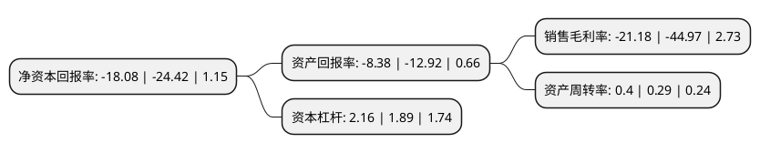

> 本页面由自动化程序生成于 2022年5月20日 01:29
> 内容可能存在错误，如有bug请提交issue至：https://github.com/Eroleice/doc-pi/issues
{.is-warning}

# 上市公司基本情况

## 基本资料

江苏悦达投资股份有限公司（以下简称“悦达投资”）成立于1991年04月12日，盐城市。于1994年01月03日在上交所主板上市。

悦达投资注册资本85,089.449万元，主要产品:公路经营，物资贸易，生物制药，拖拉机。以下是详细信息：

- 公司名称: 江苏悦达投资股份有限公司
- 股票代码: 600805.SH
- 所在地: 江苏 - 盐城市
- 成立日期: 1991年04月12日
- 注册资本: 85,089.449万元
- 法定代表人: 张乃文
- 主营业务: 主要产品:公路经营，物资贸易，生物制药，拖拉机
- 公司官网: www.yuedainvest.com
- 公司介绍: 公司是一家综合类投资型公司。公司经营范围涵盖实业投资、资产管理、财务顾问、社会经济咨询服务、机械设备、纺织品的技术开发、技术转让、技术服务、技术咨询和国内贸易。公司旗下拥有汽车、纺织、拖拉机3家在盐制造业企业，拥有西铜、京沪、徐州通达3家公路企业，拥有卡特新能源、悦达新材料2家高科技企业，陈家港电厂1家发电企业以及西蒙悦达1家煤矿企业。公司在上市公司中保持良好形象，并入选为央视财经50指数样本股，获得“央视财经50指数回报维度十佳公司”称号。

## 股东及高管情况

上市公司第一大股东为江苏黄海金融控股集团有限公司，持股13,458,454股，占比1.58%，**疑似为**上市公司实际控制人。

截至2022年03月31日，上市公司的前十大股东中，共有4名自然人股东，1名机构股东，5个产品账户。上市公司前十大股东明细如下：

> 未能通过持股比例判定出上市公司实际控制人（持股30%以上）
> 可能存在通过间接持股、联合持股、协议控制等方式拥有实际控制权的主体，具体请参考上市公司定期公告！
{.is-warning}

> 上市公司第一大股东持股不超过10%，请检查是否存在公司控制权风险！
{.is-danger}

> 截至2022年03月31日，上市公司前十大股东信息如下：

| 股东名称 | 持股数量（股） | 持股比例 |
| --- | --- | --- |
| 江苏黄海金融控股集团有限公司 | 13,458,454 | 1.58% |
| 大成基金-农业银行-大成中证金融资产管理计划 | 10,075,800 | 1.18% |
| 中欧基金-农业银行-中欧中证金融资产管理计划 | 10,075,800 | 1.18% |
| 南方基金-农业银行-南方中证金融资产管理计划 | 10,075,800 | 1.18% |
| 银华基金-农业银行-银华中证金融资产管理计划 | 10,075,800 | 1.18% |
| 嘉实基金-农业银行-嘉实中证金融资产管理计划 | 9,593,900 | 1.13% |
| 肖文霞 | 7,989,338 | 0.94% |
| 丁金莲 | 6,370,984 | 0.75% |
| 李奕鸿 | 6,344,192 | 0.75% |
| 周顺华 | 4,050,000 | 0.48% |

## 利润表分析

上市公司2021年总收入为38.86亿元，净利润为-8.24亿元，**未实现盈利**。

## 杜邦分析

> 数据列示周期：2021年 | 2020年 | 2019年
{.is-info}

上市公司的净资产收益率在近一年有所下降，下降幅度为-25.96%，其变化情况分解如下：
- 上市公司的销售毛利率在近一年下降了-52.9%，可能是生产效率的下降、商品原材料价格上涨或商品价格的下跌所致。
- 上市公司的资产周转率在近一年上升了37.93%，可能是源自于更快的销售回款或库存管理效果提升。
- 上市公司的财务杠杆比率在近一年上升了14.29%，可能是增加负债扩大生产规模。

