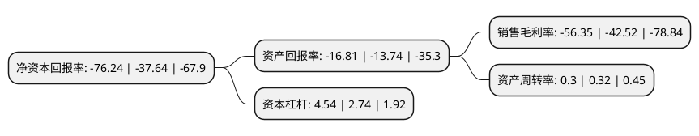

> 本页面由自动化程序生成于 2022年5月20日 01:03
> 内容可能存在错误，如有bug请提交issue至：https://github.com/Eroleice/doc-pi/issues
{.is-warning}

# 上市公司基本情况

## 基本资料

炼石航空科技股份有限公司（以下简称“炼石航空”）成立于1993年06月08日，咸阳市。于1997年03月25日在深交所主板上市。

炼石航空注册资本67,161.606万元，主营产品:各种航空器相关精密零部件，结构件等，包括飞机的机翼前缘表层，发动机相关部件，起降设备，油泵罩等核心部件以下是详细信息：

- 公司名称: 炼石航空科技股份有限公司
- 股票代码: 000697.SZ
- 所在地: 陕西 - 咸阳市
- 成立日期: 1993年06月08日
- 注册资本: 67,161.606万元
- 法定代表人: 张政
- 主营业务: 主营产品:各种航空器相关精密零部件，结构件等，包括飞机的机翼前缘表层，发动机相关部件，起降设备，油泵罩等核心部件
- 公司官网: www.lat000697.com
- 公司介绍: 公司原是以金属矿产资源采选、销售为主业的矿产企业。自2013年7月起，公司陆续投资设立了成都航宇超合金技术有限公司、成都中科航空发动机有限公司、朗星无人机系统有限公司和成都航旭涂层技术有限公司，完成了对航空业务的战略布局，构建了“铼元素→高温合金→单晶叶片→航空零部件→航空发动机→大型无人机整机”完整的产业链。2017年6月12日，公司实施完成了对英国Gardner Aerospace Holdings Limited100%股权的收购事项。Gardner的主要产品为根据主要客户的需求制造加工各种航空器相关精密零部件、结构件等，包括飞机的机翼前缘表层、发动机相关部件、起降设备、油泵罩等核心部件。

## 股东及高管情况

上市公司第一大股东为张政，持股126,303,102股，占比18.81%，**疑似为**上市公司实际控制人。

截至2022年03月31日，上市公司的前十大股东中，共有6名自然人股东，3名机构股东，1个产品账户，其中5%以上大股东共有3名。上市公司前十大股东明细如下：

> 未能通过持股比例判定出上市公司实际控制人（持股30%以上）
> 可能存在通过间接持股、联合持股、协议控制等方式拥有实际控制权的主体，具体请参考上市公司定期公告！
{.is-warning}

> 截至2022年03月31日，上市公司前十大股东信息如下：

| 股东名称 | 持股数量（股） | 持股比例 |
| --- | --- | --- |
| 张政 | 126,303,102 | 18.81% |
| 四川发展引领资本管理有限公司 | 69,368,005 | 10.33% |
| 四川富润企业重组投资有限责任公司 | 55,968,005 | 8.33% |
| 申万菱信基金-四川发展引领资本管理有限公司-申万菱信-引领资本1号大股东增持单一资产管理计划 | 12,117,726 | 1.8% |
| 咸阳市能源开发投资有限公司 | 9,024,744 | 1.34% |
| 姜鹏飞 | 7,716,052 | 1.15% |
| 陈燕萍 | 5,179,901 | 0.77% |
| 李睿智 | 2,774,300 | 0.41% |
| 王重生 | 2,708,210 | 0.4% |
| 杨孝芬 | 2,634,300 | 0.39% |

## 利润表分析

上市公司2021年总收入为9.86亿元，净利润为-5.56亿元，**未实现盈利**。

## 杜邦分析

> 数据列示周期：2021年 | 2020年 | 2019年
{.is-info}

上市公司的净资产收益率在近一年有所上升，上升幅度为102.55%，其变化情况分解如下：
- 上市公司的销售毛利率在近一年上升了32.53%，可能是生产效率的提升、商品原材料价格下跌或商品价格的上涨所致。
- 上市公司的资产周转率在近一年下降了-6.25%，可能是源自于更慢的销售回款或库存管理效果下降。
- 上市公司的财务杠杆比率在近一年上升了65.69%，可能是增加负债扩大生产规模。

