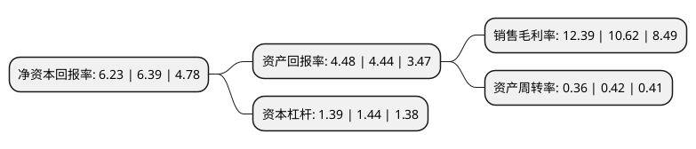

> 本页面由自动化程序生成于 2022年5月20日 01:03
> 内容可能存在错误，如有bug请提交issue至：https://github.com/Eroleice/doc-pi/issues
{.is-warning}

# 上市公司基本情况

## 基本资料

中国航发动力控制股份有限公司（以下简称“航发控制”）成立于1997年06月20日，无锡市。于1997年06月26日在深交所主板上市。

航发控制注册资本131,518.4万元，主要产品:发动机控制系统及部件，国际合作和非航产品以下是详细信息：

- 公司名称: 中国航发动力控制股份有限公司
- 股票代码: 000738.SZ
- 所在地: 江苏 - 无锡市
- 成立日期: 1997年06月20日
- 注册资本: 131,518.4万元
- 法定代表人: 缪仲明
- 主营业务: 主要产品:发动机控制系统及部件，国际合作和非航产品
- 公司官网: www.aaec.com.cn
- 公司介绍: 公司主要从事发动机控制系统及衍生产品、国际合作和非航民品及其他三大业务。从产业链上看，公司产业链涵盖研制、生产、试验、销售、维修保障等五大环节；国际合作业务以航空转包生产为主，目前正积极拓展航空产品联合开发模式。从业务范围看，为更好的统筹实施“两机”专项，公司经营进一步聚焦航空主业，主要产品为航空发动机控制系统及部件，收缩了部分与主业关联度低、产品附加值低且与公司资源冲突的非航产品市场。公司作为国内主要航空发动机控制系统研制生产企业，在军用航空发动机控制系统方面一直保持领先，与国内各发动机主机单位均有密切合作，并与国际知名厂商GE、霍尼韦尔等建立了长期稳定的合作关系。

## 股东及高管情况

上市公司第一大股东为中国航空发动机集团有限公司，持股375,810,362股，占比28.57%，**疑似为**上市公司实际控制人。

截至2022年03月31日，上市公司的前十大股东中，共有5名机构股东，4个产品账户，1个海外主体，其中5%以上大股东共有3名。上市公司前十大股东明细如下：

> 未能通过持股比例判定出上市公司实际控制人（持股30%以上）
> 可能存在通过间接持股、联合持股、协议控制等方式拥有实际控制权的主体，具体请参考上市公司定期公告！
{.is-warning}

> 截至2022年03月31日，上市公司前十大股东信息如下：

| 股东名称 | 持股数量（股） | 持股比例 |
| --- | --- | --- |
| 中国航空发动机集团有限公司 | 375,810,362 | 28.57% |
| 中国航发南方工业有限公司 | 194,200,000 | 14.77% |
| 中国航发资产管理有限公司 | 86,131,429 | 6.55% |
| 国家军民融合产业投资基金有限责任公司 | 27,613,412 | 2.1% |
| 国新投资有限公司 | 23,706,639 | 1.8% |
| 贵州盖克航空机电有限责任公司 | 22,293,481 | 1.7% |
| 香港中央结算有限公司(陆股通) | 21,456,136 | 1.63% |
| 中航融富基金管理有限公司-北京中航一期航空工业产业投资基金(有限合伙) | 15,779,092 | 1.2% |
| 中国国有企业结构调整基金股份有限公司 | 11,834,319 | 0.9% |
| 中国银行股份有限公司-国投瑞银国家安全灵活配置混合型证券投资基金 | 10,799,687 | 0.82% |

## 利润表分析

上市公司2021年总收入为41.56亿元，净利润为5.14亿元，实现盈利。

## 杜邦分析

> 数据列示周期：2021年 | 2020年 | 2019年
{.is-info}

上市公司的净资产收益率在近一年有所下降，下降幅度为-2.5%，其变化情况分解如下：
- 上市公司的销售毛利率在近一年上升了16.67%，可能是生产效率的提升、商品原材料价格下跌或商品价格的上涨所致。
- 上市公司的资产周转率在近一年下降了-14.29%，可能是源自于更慢的销售回款或库存管理效果下降。
- 上市公司的财务杠杆比率在近一年下降了-3.47%，可能是减少负债降低财务费用。

