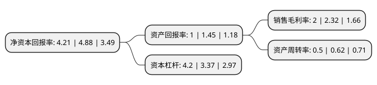

> 本页面由自动化程序生成于 2022年5月20日 01:03
> 内容可能存在错误，如有bug请提交issue至：https://github.com/Eroleice/doc-pi/issues
{.is-warning}

# 上市公司基本情况

## 基本资料

中航西安飞机工业集团股份有限公司（以下简称“中航西飞”）成立于1997年06月18日，西安市。于1997年06月26日在深交所主板上市。

中航西飞注册资本276,864.507万元，主要产品:航空零部件，铝合金型材。以下是详细信息：

- 公司名称: 中航西安飞机工业集团股份有限公司
- 股票代码: 000768.SZ
- 所在地: 陕西 - 西安市
- 成立日期: 1997年06月18日
- 注册资本: 276,864.507万元
- 法定代表人: 吴志鹏
- 主营业务: 主要产品:航空零部件，铝合金型材
- 公司官网: www.xac.com.cn
- 公司介绍: 公司是科研、生产一体化的特大型航空工业企业，是我国大中型军民用飞机的研制生产基地，国家一级企业。公司拥有国内大中型军民用飞机、全系列飞机起落架及机轮刹车系统的核心资源，主要承担各种大中型军民用飞机、起落架和机轮刹车系统的研发、制造、销售、维修与服务。公司业务清晰、资源集中、实力雄厚，是国内航空产业的骨干力量，是美国波音公司、欧洲空客公司等世界知名飞机制造商的重要合作伙伴。公司以建设治理规范高效、业绩卓越常青的优秀上市公司为己任，致力于成为国际化大中型飞机产业引领者。

## 股东及高管情况

上市公司第一大股东为中国航空工业集团有限公司，持股1,057,055,754股，占比38.18%，为上市公司实际控制人。

截至2022年03月31日，上市公司的前十大股东中，共有4名自然人股东，4名机构股东，2个产品账户，其中5%以上大股东共有3名。上市公司前十大股东明细如下：

> 截至2022年03月31日，上市公司前十大股东信息如下：

| 股东名称 | 持股数量（股） | 持股比例 |
| --- | --- | --- |
| 中国航空工业集团有限公司 | 1,057,055,754 | 38.18% |
| 西安飞机资产管理有限公司 | 303,237,398 | 10.95% |
| 中航投资控股有限公司 | 160,136,566 | 5.78% |
| 中国证券金融股份有限公司 | 93,108,418 | 3.36% |
| 刘世强 | 42,000,000 | 1.52% |
| 周荣芝 | 26,500,000 | 0.96% |
| 葛贵莲 | 24,768,039 | 0.89% |
| 王萍 | 22,336,400 | 0.81% |
| 中国建设银行股份有限公司-国泰中证军工交易型开放式指数证券投资基金 | 15,084,163 | 0.54% |
| 全国社保基金一一一组合 | 14,072,378 | 0.51% |

## 利润表分析

上市公司2021年总收入为326.99亿元，净利润为6.52亿元，实现盈利。

## 杜邦分析

> 数据列示周期：2021年 | 2020年 | 2019年
{.is-info}

上市公司的净资产收益率在近一年有所下降，下降幅度为-13.73%，其变化情况分解如下：
- 上市公司的销售毛利率在近一年下降了-13.79%，可能是生产效率的下降、商品原材料价格上涨或商品价格的下跌所致。
- 上市公司的资产周转率在近一年下降了-19.35%，可能是源自于更慢的销售回款或库存管理效果下降。
- 上市公司的财务杠杆比率在近一年上升了24.63%，可能是增加负债扩大生产规模。

