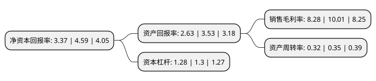

> 本页面由自动化程序生成于 2022年5月20日 01:08
> 内容可能存在错误，如有bug请提交issue至：https://github.com/Eroleice/doc-pi/issues
{.is-warning}

# 上市公司基本情况

## 基本资料

航天彩虹无人机股份有限公司（以下简称“航天彩虹”）成立于2001年11月30日，台州市。于2010年04月13日在深交所中小板上市。

航天彩虹注册资本99,698.5万元，主营业务:无人机和膜以下是详细信息：

- 公司名称: 航天彩虹无人机股份有限公司
- 股票代码: 002389.SZ
- 所在地: 浙江 - 台州市
- 成立日期: 2001年11月30日
- 注册资本: 99,698.5万元
- 法定代表人: 胡梅晓
- 主营业务: 主营业务:无人机和膜
- 公司官网: www.htchuav.com
- 公司介绍: 公司是我国最大的电容器专用电子薄膜制造企业之一，是中国高端电容器薄膜主导供应商和中国产品系列最全的电容器薄膜生产商。公司是一家“以科技为动力，以品质为核心”的创新型企业。公司一直致力于电容器用薄膜、太阳能电池背材膜、光学膜领域的工艺技术创新和新产品研发，通过对引进技术的消化、吸收，先后自主开发了薄膜表面结构控制、电气性能提高、薄膜外观品质控制、可卷绕性改善等多项专有工艺技术，并已广泛应用于生产。公司研发的“电容器用耐高温聚丙烯薄膜”、“PPM2.8μm超薄型电容器用聚丙烯膜”等多项产品通过了浙江省科技厅组织的科技成果鉴定，产品居于国内领先、国际先进水平。其中，“PPM2.8μm超薄型电容器用聚丙烯膜”填补国内空白，达国际领先水平。

## 股东及高管情况

上市公司第一大股东为中国航天空气动力技术研究院，持股206,480,242股，占比20.71%，**疑似为**上市公司实际控制人。

截至2022年04月28日，上市公司的前十大股东中，共有3名自然人股东，2名机构股东，4个产品账户，1名其他股东，其中5%以上大股东共有2名。上市公司前十大股东明细如下：

> 未能通过持股比例判定出上市公司实际控制人（持股30%以上）
> 可能存在通过间接持股、联合持股、协议控制等方式拥有实际控制权的主体，具体请参考上市公司定期公告！
{.is-warning}

> 截至2022年04月28日，上市公司前十大股东信息如下：

| 股东名称 | 持股数量（股） | 持股比例 |
| --- | --- | --- |
| 中国航天空气动力技术研究院 | 206,480,242 | 20.71% |
| 台州市金投航天有限公司 | 149,400,000 | 14.99% |
| 邵奕兴 | 38,303,598 | 3.84% |
| 航天投资控股有限公司 | 33,805,075 | 3.39% |
| 中国建设银行股份有限公司-富国低碳新经济混合型证券投资基金 | 17,558,902 | 1.76% |
| 冯江平 | 15,664,015 | 1.57% |
| 罗培栋 | 14,460,466 | 1.45% |
| 国家军民融合产业投资基金有限责任公司 | 13,914,656 | 1.4% |
| 交通银行股份有限公司-富国均衡优选混合型证券投资基金 | 12,492,882 | 1.25% |
| 中国农业银行股份有限公司-富国成长领航混合型证券投资基金 | 11,973,781 | 1.2% |

## 利润表分析

上市公司2021年总收入为29.13亿元，净利润为2.41亿元，实现盈利。

## 杜邦分析

> 数据列示周期：2021年 | 2020年 | 2019年
{.is-info}

上市公司的净资产收益率在近一年有所下降，下降幅度为-26.58%，其变化情况分解如下：
- 上市公司的销售毛利率在近一年下降了-17.28%，可能是生产效率的下降、商品原材料价格上涨或商品价格的下跌所致。
- 上市公司的资产周转率在近一年下降了-8.57%，可能是源自于更慢的销售回款或库存管理效果下降。
- 上市公司的财务杠杆比率在近一年下降了-1.54%，可能是减少负债降低财务费用。

