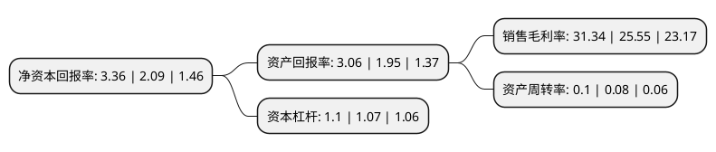

> 本页面由自动化程序生成于 2022年5月20日 01:10
> 内容可能存在错误，如有bug请提交issue至：https://github.com/Eroleice/doc-pi/issues
{.is-warning}

# 上市公司基本情况

## 基本资料

光启技术股份有限公司（以下简称“光启技术”）成立于2001年07月18日，深圳市。于2011年11月03日在深交所中小板上市。

光启技术注册资本215,458.786万元，主要产品:汽车座椅零部件及功能件。主营业务:尖端装备超材料方案提供和产品生产;超材料智能结构及装备产业化项目的实施，研制;各类汽车座椅功能件，安全件及其关键零部件研发，生产和销售以下是详细信息：

- 公司名称: 光启技术股份有限公司
- 股票代码: 002625.SZ
- 所在地: 广东 - 深圳市
- 成立日期: 2001年07月18日
- 注册资本: 215,458.786万元
- 法定代表人: 刘若鹏
- 主营业务: 主要产品:汽车座椅零部件及功能件主营业务:尖端装备超材料方案提供和产品生产;超材料智能结构及装备产业化项目的实施，研制;各类汽车座椅功能件，安全件及其关键零部件研发，生产和销售
- 公司官网: www.kc-t.cn
- 公司介绍: 公司是专业的汽车座椅金属零部件制造商，汽车座椅功能件行业的龙头企业之一。公司的主要业务为：尖端装备超材料方案提供和产品生产；超材料智能结构及装备产业化项目的实施、研制；各类汽车座椅功能件、安全件及其关键零部件研发、生产和销售。2017年公司通过重大资产重组，收购了光启尖端100%股权，实现了公司在超材料尖端装备领域的业务布局。光启尖端主要从事超材料前沿技术研究及尖端装备超材料方案提供和产品生产，是国内最早实现超材料技术在军工领域应用的企业之一，具有较强的技术领先优势。该公司已与多家军工集团建立良好的合作关系，为其提供技术研发及产品生产等服务，可以增强先进战斗机、导弹、舰艇等装备的隐身能力、提高天线探测距离、提升装备电子对抗能力和降低电磁干扰影响，展现出跨代的技术领先优势，在航空航天、海洋装备、电子装备等高精尖装备领域具有重要应用意义。

## 股东及高管情况

上市公司第一大股东为西藏映邦实业发展有限公司，持股830,298,462股，占比38.54%，为上市公司实际控制人。

截至2022年03月31日，上市公司的前十大股东中，共有5名自然人股东，4名机构股东，1个海外主体，其中5%以上大股东共有1名。上市公司前十大股东明细如下：

> 截至2022年03月31日，上市公司前十大股东信息如下：

| 股东名称 | 持股数量（股） | 持股比例 |
| --- | --- | --- |
| 西藏映邦实业发展有限公司 | 830,298,462 | 38.54% |
| 桐庐岩嵩投资管理合伙企业(有限合伙) | 66,855,324 | 3.1% |
| 石庭波 | 60,642,164 | 2.81% |
| 深圳光启空间技术有限公司 | 56,282,860 | 2.61% |
| 郑玉英 | 38,500,000 | 1.79% |
| 香港中央结算有限公司(陆股通) | 37,103,948 | 1.72% |
| 深圳市鲲鹏新产业投资有限公司 | 20,000,000 | 0.93% |
| 俞龙生 | 19,000,000 | 0.88% |
| 俞旻贝 | 18,857,830 | 0.88% |
| 石丽云 | 16,235,892 | 0.75% |

## 杜邦分析

> 数据列示周期：2021年 | 2020年 | 2019年
{.is-info}

上市公司的净资产收益率在近一年有所上升，上升幅度为60.77%，其变化情况分解如下：
- 上市公司的销售毛利率在近一年上升了22.66%，可能是生产效率的提升、商品原材料价格下跌或商品价格的上涨所致。
- 上市公司的资产周转率在近一年上升了25%，可能是源自于更快的销售回款或库存管理效果提升。
- 上市公司的财务杠杆比率在近一年上升了2.8%，可能是增加负债扩大生产规模。

