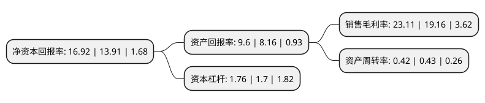

> 本页面由自动化程序生成于 2022年5月20日 01:12
> 内容可能存在错误，如有bug请提交issue至：https://github.com/Eroleice/doc-pi/issues
{.is-warning}

# 上市公司基本情况

## 基本资料

北京星网宇达科技股份有限公司（以下简称“星网宇达”）成立于2005年05月20日，北京市。于2016年12月13日在深交所中小板上市。

星网宇达注册资本15,468.504万元，主营业务:惯性技术开发及应用，主要开展惯性组合导航，惯性测量，惯性稳控产品的研发，生产及销售，并为航空，航天，航海，电子，石油，测绘，交通及通讯等领域用户提供全自主，高动态的位置，速度，姿态等信息的感知及稳定控制服务。产品主要分为惯性组合导航产品，惯性测量产品及惯性稳控产品三大类。以下是详细信息：

- 公司名称: 北京星网宇达科技股份有限公司
- 股票代码: 002829.SZ
- 所在地: 北京 - 北京市
- 成立日期: 2005年05月20日
- 注册资本: 15,468.504万元
- 法定代表人: 迟家升
- 主营业务: 主营业务:惯性技术开发及应用，主要开展惯性组合导航，惯性测量，惯性稳控产品的研发，生产及销售，并为航空，航天，航海，电子，石油，测绘，交通及通讯等领域用户提供全自主，高动态的位置，速度，姿态等信息的感知及稳定控制服务产品主要分为惯性组合导航产品，惯性测量产品及惯性稳控产品三大类
- 公司官网: www.starneto.com
- 公司介绍: 公司是国家级高新技术企业、中关村高新技术企业，是致力于惯性技术开发与产业化的领军企业。公司始终专注于惯性技术开发及产业化应用，主要开展惯性组合导航、惯性测量、惯性稳控产品的研发、生产及销售，并为航空、航天、航海、电子、石油、测绘、交通及通信等多个领域用户提供全自主、高动态的位置、速度、姿态等信息的感知、测量及稳定控制服务。经过多年的发展，公司形成了以惯性技术为核心，行业应用为驱动的“1+N”发展模式，构建了涵盖导航、测量、稳控的业务及产品体系，完成了从惯性器件、部件到系统的全产业链全自主研发能力建设，形成了研发、应用协同发展的良好局面，立志于成为惯性技术领域国内领先、国际先进的领军企业。公司曾主持国家发改委卫星应用产业化项目、北京市科委的卫星应用重大专项，承担总装备部国家第二代卫星重大专项、北京市经信委现代服务业应用示范项目。公司获得“北京市科学技术奖二等奖”、“卫星导航定位科学技术奖特等奖”、“北斗卫星导航应用创新贡献奖”等项科技创新荣誉。

## 股东及高管情况

上市公司第一大股东为迟家升，持股40,257,540股，占比26.03%，**疑似为**上市公司实际控制人。

截至2022年03月31日，上市公司的前十大股东中，共有8名自然人股东，1名机构股东，1个产品账户，其中5%以上大股东共有2名。上市公司前十大股东明细如下：

> 未能通过持股比例判定出上市公司实际控制人（持股30%以上）
> 可能存在通过间接持股、联合持股、协议控制等方式拥有实际控制权的主体，具体请参考上市公司定期公告！
{.is-warning}

> 截至2022年03月31日，上市公司前十大股东信息如下：

| 股东名称 | 持股数量（股） | 持股比例 |
| --- | --- | --- |
| 迟家升 | 40,257,540 | 26.03% |
| 李国盛 | 27,972,804 | 18.08% |
| 孙慧明 | 4,868,066 | 3.15% |
| 中国银行股份有限公司-华夏行业景气混合型证券投资基金 | 4,563,327 | 2.95% |
| 徐烨烽 | 3,104,536 | 2.01% |
| 杨燕灵 | 2,820,900 | 1.82% |
| 吴彩莲 | 1,635,000 | 1.06% |
| 李峰 | 1,283,900 | 0.83% |
| 贝国浩 | 1,135,200 | 0.73% |
| 泰康人寿保险有限责任公司-投连-多策略优选 | 699,500 | 0.45% |

## 利润表分析

上市公司2021年总收入为7.68亿元，净利润为1.77亿元，实现盈利。

## 杜邦分析

> 数据列示周期：2021年 | 2020年 | 2019年
{.is-info}

上市公司的净资产收益率在近一年有所上升，上升幅度为21.64%，其变化情况分解如下：
- 上市公司的销售毛利率在近一年上升了20.62%，可能是生产效率的提升、商品原材料价格下跌或商品价格的上涨所致。
- 上市公司的资产周转率在近一年下降了-2.33%，可能是源自于更慢的销售回款或库存管理效果下降。
- 上市公司的财务杠杆比率在近一年上升了3.53%，可能是增加负债扩大生产规模。

