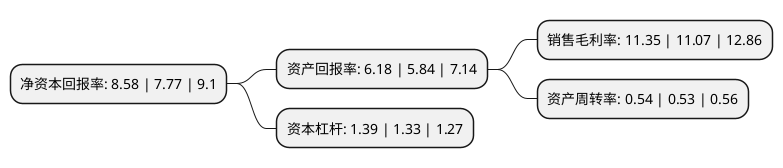

> 本页面由自动化程序生成于 2022年5月20日 01:13
> 内容可能存在错误，如有bug请提交issue至：https://github.com/Eroleice/doc-pi/issues
{.is-warning}

# 上市公司基本情况

## 基本资料

成都天奥电子股份有限公司（以下简称“天奥电子”）成立于2004年01月04日，成都市。于2018年09月03日在深交所中小板上市。

天奥电子注册资本20,800.65万元，主要从事时间频率产品，北斗卫星应用产品的研发，设计，生产和销售。主要产品:时间频率产品，北斗卫星应用产品。以下是详细信息：

- 公司名称: 成都天奥电子股份有限公司
- 股票代码: 002935.SZ
- 所在地: 四川 - 成都市
- 成立日期: 2004年01月04日
- 注册资本: 20,800.65万元
- 法定代表人: 赵晓虎
- 主营业务: 主要从事时间频率产品，北斗卫星应用产品的研发，设计，生产和销售主要产品:时间频率产品，北斗卫星应用产品
- 公司官网: www.elecspn.com
- 公司介绍: 公司成立于2004年1月，拥有国家认定企业技术中心，是高新技术企业，主要从事时间频率、北斗卫星应用产品的研发、生产、销售和服务。公司作为国内领先的时间频率企业，拥有完整的时间频率产品线，具备时频系统集成能力，可为客户提供完善的时频解决方案。主要产品包括原子钟、晶体器件、时频板卡及模块、频率组件及设备、时间同步设备及系统，主要应用于航空航天、卫星导航、军民用通信及国防装备等领域，参加了载人航天、探月工程、北斗卫星导航系统等国家重大工程。公司具备北斗导航民用分理级与终端级服务资质，主要产品包括北斗卫星手表、北斗应急预警通信终端及系统两大系列。北斗卫星手表是卫星导航技术与传统钟表技术的完美结合，荣膺“CCTV年度环球十大新锐科技”、“ISPO运动产品亚洲区设计大奖”；基于北斗短报文的应急预警通信终端及系统主要应用于防灾减灾等领域，实现信息的及时、可靠传输。

## 股东及高管情况

上市公司第一大股东为中国电子科技集团公司第十研究所，持股84,663,851股，占比40.7%，为上市公司实际控制人。

截至2022年03月31日，上市公司的前十大股东中，共有3名自然人股东，3名机构股东，4个产品账户，其中5%以上大股东共有1名。上市公司前十大股东明细如下：

> 截至2022年03月31日，上市公司前十大股东信息如下：

| 股东名称 | 持股数量（股） | 持股比例 |
| --- | --- | --- |
| 中国电子科技集团公司第十研究所 | 84,663,851 | 40.7% |
| 中电科投资控股有限公司 | 5,404,075 | 2.6% |
| 中国工商银行股份有限公司-中欧价值智选回报混合型证券投资基金 | 3,272,058 | 1.57% |
| 中国银行股份有限公司-华安文体健康主题灵活配置混合型证券投资基金 | 2,467,420 | 1.19% |
| 四川华炜投资控股集团有限公司 | 2,430,000 | 1.17% |
| 周文梅 | 2,234,100 | 1.07% |
| 招商银行股份有限公司-华安安华灵活配置混合型证券投资基金 | 2,214,558 | 1.06% |
| 陈静 | 2,042,378 | 0.98% |
| 刘类骥 | 2,034,378 | 0.98% |
| 中信银行股份有限公司-华安聚嘉精选混合型证券投资基金 | 1,959,600 | 0.94% |

## 利润表分析

上市公司2021年总收入为10.42亿元，净利润为1.18亿元，实现盈利。

## 杜邦分析

> 数据列示周期：2021年 | 2020年 | 2019年
{.is-info}

上市公司的净资产收益率在近一年有所上升，上升幅度为10.42%，其变化情况分解如下：
- 上市公司的销售毛利率在近一年上升了2.53%，可能是生产效率的提升、商品原材料价格下跌或商品价格的上涨所致。
- 上市公司的资产周转率在近一年上升了1.89%，可能是源自于更快的销售回款或库存管理效果提升。
- 上市公司的财务杠杆比率在近一年上升了4.51%，可能是增加负债扩大生产规模。

