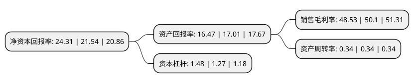

> 本页面由自动化程序生成于 2022年5月20日 01:13
> 内容可能存在错误，如有bug请提交issue至：https://github.com/Eroleice/doc-pi/issues
{.is-warning}

# 上市公司基本情况

## 基本资料

北京北摩高科摩擦材料股份有限公司（以下简称“北摩高科”）成立于2003年05月12日，北京市。于2020年04月29日在深交所中小板上市。

北摩高科注册资本25,527.2万元，主营业务:军，民两用航空航天飞行器起落架着陆系统及坦克装甲车辆，高速列车等高端装备刹车制动产品的研发，生产和销售。公司产品广泛应用于歼击机，轰炸机，运输机，教练机，军贸机，直升机，航天高空飞行器及坦克装甲车辆等重点军工装备，也可应用于民用航空，轨道交通领域。以下是详细信息：

- 公司名称: 北京北摩高科摩擦材料股份有限公司
- 股票代码: 002985.SZ
- 所在地: 北京 - 北京市
- 成立日期: 2003年05月12日
- 注册资本: 25,527.2万元
- 法定代表人: 王淑敏
- 主营业务: 主营业务:军，民两用航空航天飞行器起落架着陆系统及坦克装甲车辆，高速列车等高端装备刹车制动产品的研发，生产和销售公司产品广泛应用于歼击机，轰炸机，运输机，教练机，军贸机，直升机，航天高空飞行器及坦克装甲车辆等重点军工装备，也可应用于民用航空，轨道交通领域
- 公司官网: www.bjgk.com
- 公司介绍: 公司主要从事军、民两用航空航天飞行器起落架着陆系统及坦克装甲车辆、高速列车等高端装备刹车制动产品的研发、生产和销售，系军工领域高端装备制造的国家级高新技术企业，属于国家重点扶持的战略新兴产业。近年来公司积极响应国家军民融合战略，在巩固军用市场地位的同时，大力拓宽民航飞机起落架着陆系统及高速列车刹车制动产品市场，是军民融合重点单位。公司积极开展产学研合作，服务于国家发展战略需求，秉承“以质取胜、以信求远、超越用户需求”的经营理念，在刹车制动领域拥有深厚的技术积累和丰富的应用经验，实现了多项关键技术突破，并获得了50余项国家发明、国防发明和实用新型等专利。公司及员工先后荣获“全国五一劳动奖状”、“全国五一劳动奖章”等7项省部级以上荣誉。

## 股东及高管情况

上市公司第一大股东为王淑敏，持股89,535,875股，占比35.07%，为上市公司实际控制人。

截至2022年03月31日，上市公司的前十大股东中，共有4名自然人股东，1名机构股东，3个产品账户，1个海外主体，1名其他股东，其中5%以上大股东共有2名。上市公司前十大股东明细如下：

> 截至2022年03月31日，上市公司前十大股东信息如下：

| 股东名称 | 持股数量（股） | 持股比例 |
| --- | --- | --- |
| 王淑敏 | 89,535,875 | 35.07% |
| 陈剑锋 | 25,210,220 | 9.88% |
| 香港中央结算有限公司(陆股通) | 7,431,579 | 2.91% |
| 上海浦东发展银行股份有限公司-华夏创新未来18个月封闭运作混合型证券投资基金 | 6,611,347 | 2.59% |
| 鹰潭道信管理咨询有限责任公司 | 6,348,404 | 2.49% |
| 刘扬 | 3,822,066 | 1.5% |
| 挪威中央银行-自有资金 | 3,413,497 | 1.34% |
| 高昆 | 3,319,209 | 1.3% |
| 中国农业银行股份有限公司-华夏复兴混合型证券投资基金 | 2,712,839 | 1.06% |
| 中信证券-中信银行-中信证券卓越成长两年持有期混合型集合资产管理计划 | 2,018,670 | 0.79% |

## 利润表分析

上市公司2021年总收入为11.32亿元，净利润为5.49亿元，实现盈利。

## 杜邦分析

> 数据列示周期：2021年 | 2020年 | 2019年
{.is-info}

上市公司的净资产收益率在近一年有所上升，上升幅度为12.86%，其变化情况分解如下：
- 上市公司的销售毛利率在近一年下降了-3.13%，可能是生产效率的下降、商品原材料价格上涨或商品价格的下跌所致。
- 上市公司的资产周转率在近一年下降了0%，可能是源自于更慢的销售回款或库存管理效果下降。
- 上市公司的财务杠杆比率在近一年上升了16.54%，可能是增加负债扩大生产规模。

