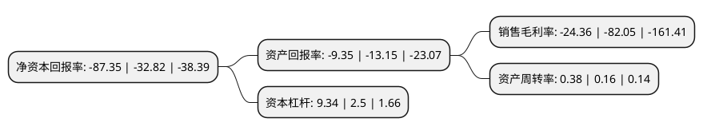

> 本页面由自动化程序生成于 2022年5月20日 01:15
> 内容可能存在错误，如有bug请提交issue至：https://github.com/Eroleice/doc-pi/issues
{.is-warning}

# 上市公司基本情况

## 基本资料

新疆机械研究院股份有限公司（以下简称“ST新研”）成立于2005年05月12日，乌鲁木齐市。于2011年01月07日在深交所创业板上市。

ST新研注册资本149,036.02万元，从事多种农牧业机械和航空航天飞行器零部件的研究开发，生产和销售。主要产品牧业收获机械，耕种机械，农副产品加工和林果机械，以及其他机械加工产品，航空航天飞行器零部件等。以下是详细信息：

- 公司名称: 新疆机械研究院股份有限公司
- 股票代码: 300159.SZ
- 所在地: 新疆 - 乌鲁木齐市
- 成立日期: 2005年05月12日
- 注册资本: 149,036.02万元
- 法定代表人: 匡理鹏
- 主营业务: 从事多种农牧业机械和航空航天飞行器零部件的研究开发，生产和销售主要产品牧业收获机械，耕种机械，农副产品加工和林果机械，以及其他机械加工产品，航空航天飞行器零部件等
- 公司官网: www.xjjxy.com.cn
- 公司介绍: 公司是专业从事农牧机械研究、设计、制造和销售的高新技术企业。公司于2015年通过收购四川明日宇航，进入了航空航天飞行器零部件制造业，实现“农机+军工”双主业发展的战略布局。公司专注于中高端农牧机械产品，拥有“牧神”、“海山”两个省级著名商标。主要产品包括轮式拖拉机系列、耕作机械系列、大型自走式谷物收割机系列、自走式玉米收获机系列、秸秆饲料收获机系列、经济作物收获机系列、林果机械系列等七大类60余种产品。其中自走式玉米收获机、青(黄)贮饲料收获机、动力旋转耙技术水平达到国内名列前茅、自走式辣椒收获机属国内开创性产品。“牧神”品牌商标系列产品被评为新疆名牌产品。公司建有以公司为依托的“农牧机械关键技术与装备国家地方联合工程研究中心”及自治区批准的“新疆农牧收获机械工程技术研究中心”、“新疆农牧机械研究成果转化基地”、“产学研联合培养研究生示范基地”。形成了农牧机械开发、中试、熟化、批量生产的技术平台。

## 股东及高管情况

上市公司第一大股东为霍尔果斯华控创业投资有限公司-嘉兴华控腾汇股权投资合伙企业(有限合伙)，持股128,148,293股，占比8.6%，**疑似为**上市公司实际控制人。

截至2022年03月31日，上市公司的前十大股东中，共有7名自然人股东，3名机构股东，其中5%以上大股东共有2名。上市公司前十大股东明细如下：

> 未能通过持股比例判定出上市公司实际控制人（持股30%以上）
> 可能存在通过间接持股、联合持股、协议控制等方式拥有实际控制权的主体，具体请参考上市公司定期公告！
{.is-warning}

> 上市公司第一大股东持股不超过10%，请检查是否存在公司控制权风险！
{.is-danger}

> 截至2022年03月31日，上市公司前十大股东信息如下：

| 股东名称 | 持股数量（股） | 持股比例 |
| --- | --- | --- |
| 霍尔果斯华控创业投资有限公司-嘉兴华控腾汇股权投资合伙企业(有限合伙) | 128,148,293 | 8.6% |
| 韩华 | 93,019,770 | 6.24% |
| 王建军 | 28,711,037 | 1.93% |
| 嘉兴华控永拓投资合伙企业(有限合伙) | 25,596,654 | 1.72% |
| 什邡星昇投资管理合伙企业(有限合伙) | 21,506,263 | 1.44% |
| 李林 | 11,400,000 | 0.76% |
| 王艳红 | 8,279,700 | 0.56% |
| 陈辉煌 | 6,311,600 | 0.42% |
| 楼文胜 | 6,288,800 | 0.42% |
| 张蕾 | 6,000,000 | 0.4% |

## 杜邦分析

> 数据列示周期：2021年 | 2020年 | 2019年
{.is-info}

上市公司的净资产收益率在近一年有所上升，上升幅度为166.15%，其变化情况分解如下：
- 上市公司的销售毛利率在近一年下降了-70.31%，可能是生产效率的下降、商品原材料价格上涨或商品价格的下跌所致。
- 上市公司的资产周转率在近一年上升了137.5%，可能是源自于更快的销售回款或库存管理效果提升。
- 上市公司的财务杠杆比率在近一年上升了273.6%，可能是增加负债扩大生产规模。

