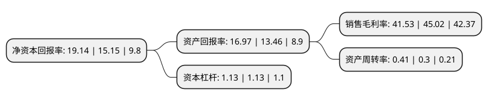

> 本页面由自动化程序生成于 2022年5月20日 01:19
> 内容可能存在错误，如有bug请提交issue至：https://github.com/Eroleice/doc-pi/issues
{.is-warning}

# 上市公司基本情况

## 基本资料

成都爱乐达航空制造股份有限公司（以下简称“爱乐达”）成立于2004年03月01日，成都市。于2017年08月22日在深交所创业板上市。

爱乐达注册资本24,429.708万元，主营业务:公司立足航空领域，报告期内主要从事军用飞机和民用客机零部件的精密加工业务。主要产品:飞机机身，机翼，尾翼，起落架等机体相关零部件的精密加工。以下是详细信息：

- 公司名称: 成都爱乐达航空制造股份有限公司
- 股票代码: 300696.SZ
- 所在地: 四川 - 成都市
- 成立日期: 2004年03月01日
- 注册资本: 24,429.708万元
- 法定代表人: 范庆新
- 主营业务: 主营业务:公司立足航空领域，报告期内主要从事军用飞机和民用客机零部件的精密加工业务主要产品:飞机机身，机翼，尾翼，起落架等机体相关零部件的精密加工
- 公司官网: www.cdald.com
- 公司介绍: 公司立足航空领域，主要从事军用飞机和民用客机零部件的精密加工业务。公司设立十余年来，累积参与了多种型号涉及3,000余项航空零部件的配套研制及生产，积累了丰富的精密加工技术和经验，并形成了一批广泛应用于公司主营业务的核心技术和专利。公司坚持“军民融合，一体两翼”的发展思路，同时开展军品和民品业务。经过多年潜心经营，凭借创新的技术优势、高水平的生产管理及质量控制优势，公司已与行业主要客户建立了广泛而深入的合作关系，客户覆盖中航工业下属多家军机主机厂、成飞民机等多家民用客机分承制厂，以及一批航空装备主修厂和多家科研院所。公司高度重视技术研发，形成了高精度盲孔加工、复杂深腔钛合金类零件加工等数十项关键核心技术，部分飞机零部件的加工技术达到国内先进水平。公司产品加工良品率达到99.50%以上，处于行业先进水平，获得中航工业下属飞机制造单位“优秀供应商”荣誉。

## 股东及高管情况

上市公司第一大股东为冉光文，持股29,762,934股，占比12.18%，**疑似为**上市公司实际控制人。

截至2022年03月31日，上市公司的前十大股东中，共有4名自然人股东，6个产品账户，其中5%以上大股东共有4名。上市公司前十大股东明细如下：

> 未能通过持股比例判定出上市公司实际控制人（持股30%以上）
> 可能存在通过间接持股、联合持股、协议控制等方式拥有实际控制权的主体，具体请参考上市公司定期公告！
{.is-warning}

> 截至2022年03月31日，上市公司前十大股东信息如下：

| 股东名称 | 持股数量（股） | 持股比例 |
| --- | --- | --- |
| 冉光文 | 29,762,934 | 12.18% |
| 丁洪涛 | 29,313,479 | 12% |
| 谢鹏 | 29,313,180 | 12% |
| 范庆新 | 29,080,757 | 11.9% |
| 中国农业银行股份有限公司-南方军工改革灵活配置混合型证券投资基金 | 10,433,060 | 4.27% |
| 中国工商银行股份有限公司-富国军工主题混合型证券投资基金 | 8,986,027 | 3.68% |
| 中国建设银行股份有限公司-长信国防军工量化灵活配置混合型证券投资基金 | 3,035,365 | 1.24% |
| 航发基金管理有限公司-北京国发航空发动机产业投资基金中心(有限合伙) | 2,380,385 | 0.97% |
| 广发基金管理有限公司-社保基金四二零组合 | 2,185,715 | 0.89% |
| 全国社保基金五零二组合 | 1,900,014 | 0.78% |

## 利润表分析

上市公司2021年总收入为6.14亿元，净利润为2.55亿元，实现盈利。

## 杜邦分析

> 数据列示周期：2021年 | 2020年 | 2019年
{.is-info}

上市公司的净资产收益率在近一年有所上升，上升幅度为26.34%，其变化情况分解如下：
- 上市公司的销售毛利率在近一年下降了-7.75%，可能是生产效率的下降、商品原材料价格上涨或商品价格的下跌所致。
- 上市公司的资产周转率在近一年上升了36.67%，可能是源自于更快的销售回款或库存管理效果提升。
- 上市公司的财务杠杆比率在近一年下降了0%，可能是减少负债降低财务费用。

