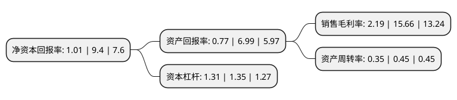

> 本页面由自动化程序生成于 2022年5月20日 01:20
> 内容可能存在错误，如有bug请提交issue至：https://github.com/Eroleice/doc-pi/issues
{.is-warning}

# 上市公司基本情况

## 基本资料

北京安达维尔科技股份有限公司（以下简称“安达维尔”）成立于2001年12月03日，北京市。于2017年11月09日在深交所创业板上市。

安达维尔注册资本25,402.925万元，公司的主营业务主要为航空机载设备研制，机载设备维修，测控设备研制等。主要产品:机载设备研制业务的主要产品包括机载机械设备，机载电子设备和PMA产品。航空机载设备维修业务主要包括机载电子设备维修和机载机械设备维修两大专业。测控设备研制业务的设备类型包括机上原位检测设备，地面综合实验设备，通用自动检测设备，专用测试设备等。以下是详细信息：

- 公司名称: 北京安达维尔科技股份有限公司
- 股票代码: 300719.SZ
- 所在地: 北京 - 北京市
- 成立日期: 2001年12月03日
- 注册资本: 25,402.925万元
- 法定代表人: 赵子安
- 主营业务: 公司的主营业务主要为航空机载设备研制，机载设备维修，测控设备研制等主要产品:机载设备研制业务的主要产品包括机载机械设备，机载电子设备和PMA产品航空机载设备维修业务主要包括机载电子设备维修和机载机械设备维修两大专业测控设备研制业务的设备类型包括机上原位检测设备，地面综合实验设备，通用自动检测设备，专用测试设备等
- 公司官网: www.andawell.com
- 公司介绍: 公司致力于航空机载电子设备维修业务，是集航空机载设备研制、航空机载设备维修、测控设备研制、飞机加改装和航材贸易等业务为一体的航空技术解决方案综合提供商。公司为军方、商业航空、通用航空及航空制造企业等用户提供系统化航空产品及相关技术保障的解决方案，综合实力处于行业领先地位。公司在持续提升航空机载设备维修技术的同时，积累了大量机载设备及测控设备的研制经验，充分利用国内现有专业资源优势，将理论研究应用到产品研发中，开展了航空机载设备及测控设备的研制业务，获得多项技术专利，实现了技术的持续创新和业务领域的不断拓展，建立并巩固了公司在行业内的领先地位。公司及其子公司因自身的技术实力及服务能力，已经获得包括国家高新技术企业、中关村高新技术企业、中关村高成长企业TOP100、中国人民解放军科学技术进步二等奖等在内的多项资质及奖项，并因为在参加“纪念中国人民抗日战争暨世界反法西斯战争胜利70周年”阅兵活动中做出贡献而获得军方客户的专项表彰。

## 股东及高管情况

上市公司第一大股东为赵子安，持股89,817,478股，占比35.36%，为上市公司实际控制人。

截至2022年03月31日，上市公司的前十大股东中，共有9名自然人股东，1名机构股东，其中5%以上大股东共有2名。上市公司前十大股东明细如下：

> 截至2022年03月31日，上市公司前十大股东信息如下：

| 股东名称 | 持股数量（股） | 持股比例 |
| --- | --- | --- |
| 赵子安 | 89,817,478 | 35.36% |
| 北京安达维尔管理咨询有限公司 | 17,966,494 | 7.07% |
| 雷录年 | 8,698,146 | 3.42% |
| 常都喜 | 7,781,230 | 3.06% |
| 刘浩东 | 5,260,046 | 2.07% |
| 乔少杰 | 5,008,680 | 1.97% |
| 孙艳玲 | 1,800,000 | 0.71% |
| 梅志光 | 1,326,600 | 0.52% |
| 李小会 | 992,700 | 0.39% |
| 楚敏 | 859,350 | 0.34% |

## 利润表分析

上市公司2021年总收入为4.75亿元，净利润为0.1亿元，实现盈利。

## 杜邦分析

> 数据列示周期：2021年 | 2020年 | 2019年
{.is-info}

上市公司的净资产收益率在近一年有所下降，下降幅度为-89.26%，其变化情况分解如下：
- 上市公司的销售毛利率在近一年下降了-86.02%，可能是生产效率的下降、商品原材料价格上涨或商品价格的下跌所致。
- 上市公司的资产周转率在近一年下降了-22.22%，可能是源自于更慢的销售回款或库存管理效果下降。
- 上市公司的财务杠杆比率在近一年下降了-2.96%，可能是减少负债降低财务费用。

