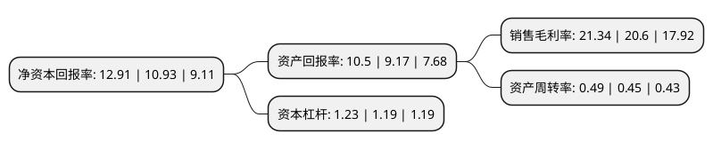

> 本页面由自动化程序生成于 2022年5月20日 01:20
> 内容可能存在错误，如有bug请提交issue至：https://github.com/Eroleice/doc-pi/issues
{.is-warning}

# 上市公司基本情况

## 基本资料

江西新余国科科技股份有限公司（以下简称“新余国科”）成立于2008年05月05日，新余市。于2017年11月10日在深交所创业板上市。

新余国科注册资本17,472万元，主要产品:火工元件(包含枪弹底火，炮弹底火，电底火，火帽，点火具，曳光管，导爆管，传爆管，针刺雷管，火焰雷管，电雷管)，火工装置(包含推销器，拔销器，切割器，分离螺栓，点火装置，开舱装置，光电对抗发烟装置)，人影燃爆器材及人影作业设备，气象观探测装备及相关软件。主要业务:火工品及其相关产品的研发，生产和销售，同时开展军品和民品业务。以下是详细信息：

- 公司名称: 江西新余国科科技股份有限公司
- 股票代码: 300722.SZ
- 所在地: 江西 - 新余市
- 成立日期: 2008年05月05日
- 注册资本: 17,472万元
- 法定代表人: 金卫平
- 主营业务: 主要产品:火工元件(包含枪弹底火，炮弹底火，电底火，火帽，点火具，曳光管，导爆管，传爆管，针刺雷管，火焰雷管，电雷管)，火工装置(包含推销器，拔销器，切割器，分离螺栓，点火装置，开舱装置，光电对抗发烟装置)，人影燃爆器材及人影作业设备，气象观探测装备及相关软件火工品及其相关产品的研发，生产和销售，同时开展军品和民品业务
- 公司官网: www.jx9394.com
- 公司介绍: 公司自成立以来一直从事火工品及其相关产品的研发、生产和销售，同时开展军品和民品业务，致力于发展军民融合产业。公司军品业务主要包括军用火工品研发、生产和销售。公司军品拥有军委装备发展部颁发的装备承制单位注册证书、国防科工局颁发的武器装备科研生产许可证、国防武器装备科研生产单位保密资格审查认证委员会颁发的武器装备三级保密资格资质、中国新时代认证中心颁发的武器装备质量体系认证证书等资格、资质。同时，公司积极发展民品业务，拥有国家工信部颁发的民用爆破器材生产许可证、中国气象局颁发的气象专用技术装备使用许可证、中国新时代认证中心颁发的质量管理体系认证证书等资格、资质。公司民品业务主要包括人工影响天气专用技术装备、气象装备及相关软件的研发、生产和销售。经过多年的发展，公司汇集了一支高素质的经营管理和产品开发、设计、制造的专业人才队伍。公司除继续保持了原有的高新技术企业和省级科技平台等资格和荣誉外，还被批准为“江西省科技型中小微企业”，且荣获新余市推进新型工业化科技创新奖。

## 股东及高管情况

上市公司第一大股东为江西省军工控股集团有限公司，持股63,637,721股，占比36.42%，为上市公司实际控制人。

截至2022年03月31日，上市公司的前十大股东中，共有2名自然人股东，4名机构股东，3个产品账户，1个海外主体，其中5%以上大股东共有2名。上市公司前十大股东明细如下：

> 截至2022年03月31日，上市公司前十大股东信息如下：

| 股东名称 | 持股数量（股） | 持股比例 |
| --- | --- | --- |
| 江西省军工控股集团有限公司 | 63,637,721 | 36.42% |
| 江西大成国有资产经营管理集团有限公司 | 48,456,320 | 27.73% |
| 新余科信投资管理中心(有限合伙) | 7,622,778 | 4.36% |
| 全国社会保障基金理事会转持一户 | 4,368,000 | 2.5% |
| 新余国晖投资管理中心(有限合伙) | 2,643,740 | 1.51% |
| 中国建设银行股份有限公司-国泰中证军工交易型开放式指数证券投资基金 | 982,367 | 0.56% |
| 亓笑 | 959,038 | 0.55% |
| 丁建国 | 408,520 | 0.23% |
| 香港中央结算有限公司(陆股通) | 382,548 | 0.22% |
| 中国建设银行股份有限公司-富国中证军工指数型证券投资基金 | 372,878 | 0.21% |

## 利润表分析

上市公司2021年总收入为2.93亿元，净利润为0.62亿元，实现盈利。

## 杜邦分析

> 数据列示周期：2021年 | 2020年 | 2019年
{.is-info}

上市公司的净资产收益率在近一年有所上升，上升幅度为18.12%，其变化情况分解如下：
- 上市公司的销售毛利率在近一年上升了3.59%，可能是生产效率的提升、商品原材料价格下跌或商品价格的上涨所致。
- 上市公司的资产周转率在近一年上升了8.89%，可能是源自于更快的销售回款或库存管理效果提升。
- 上市公司的财务杠杆比率在近一年上升了3.36%，可能是增加负债扩大生产规模。

