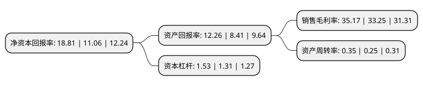

> 本页面由自动化程序生成于 2022年5月20日 01:20
> 内容可能存在错误，如有bug请提交issue至：https://github.com/Eroleice/doc-pi/issues
{.is-warning}

# 上市公司基本情况

## 基本资料

西安三角防务股份有限公司（以下简称“三角防务”）成立于2002年08月05日，西安市。于2019年05月21日在深交所创业板上市。

三角防务注册资本49,552.173万元，主要从事航空，航天，船舶等行业锻件产品的研制，生产，销售和服务。产品为特种合金锻件，主要用于制造飞机机身结构件及航空发动机盘件。以下是详细信息：

- 公司名称: 西安三角防务股份有限公司
- 股票代码: 300775.SZ
- 所在地: 陕西 - 西安市
- 成立日期: 2002年08月05日
- 注册资本: 49,552.173万元
- 法定代表人: 严建亚
- 主营业务: 主要从事航空，航天，船舶等行业锻件产品的研制，生产，销售和服务产品为特种合金锻件，主要用于制造飞机机身结构件及航空发动机盘件
- 公司官网: www.400mn.com
- 公司介绍: 公司是一家研制生产航空航天、船舶等恒业锻件的高新技术企业，公司生产的特种合金锻件，主要用于制造飞机机身结构件及航空发动机盘件。公司目前已进入国内各大主机厂的供应商名录，主要产品参与空军、海军重要装备的设计定型，已成为主要的零部件供应商。公司产品目前已应用在新一代战斗机、新一代运输机及新一代直升机中，并为各类型国产航空发动机供应主要锻件，公司拥有较强的技术研发实力和生产制造能力，建有“陕西航空大型部件锻压工程研究中心”和“西安市难变形材料成型工程技术研究中心”。公司发明专利技术水平处于行业领先，并且在军工领域已经得到充分应用。公司已经取得了生产军工产品所需资质，具备了生产军品的生产资格和保密资质。

## 股东及高管情况

上市公司第一大股东为西安航空产业投资有限公司，持股60,000,000股，占比12.11%，**疑似为**上市公司实际控制人。

截至2022年03月31日，上市公司的前十大股东中，共有1名自然人股东，5名机构股东，4个产品账户，其中5%以上大股东共有5名。上市公司前十大股东明细如下：

> 未能通过持股比例判定出上市公司实际控制人（持股30%以上）
> 可能存在通过间接持股、联合持股、协议控制等方式拥有实际控制权的主体，具体请参考上市公司定期公告！
{.is-warning}

> 截至2022年03月31日，上市公司前十大股东信息如下：

| 股东名称 | 持股数量（股） | 持股比例 |
| --- | --- | --- |
| 西安航空产业投资有限公司 | 60,000,000 | 12.11% |
| 广东温氏投资有限公司 | 41,070,000 | 8.29% |
| 西安鹏辉投资管理有限合伙企业 | 40,000,000 | 8.07% |
| 西安三森投资有限公司 | 38,500,000 | 7.77% |
| 西安投资控股有限公司 | 30,000,000 | 6.05% |
| 中国建设银行股份有限公司-易方达国防军工混合型证券投资基金 | 20,162,684 | 4.07% |
| 严建亚 | 20,000,000 | 4.04% |
| 交通银行股份有限公司-易方达高端制造混合型发起式证券投资基金 | 4,365,102 | 0.88% |
| 中国工商银行股份有限公司-华夏军工安全灵活配置混合型证券投资基金 | 3,926,493 | 0.79% |
| 中国建设银行股份有限公司-国泰中证军工交易型开放式指数证券投资基金 | 3,873,398 | 0.78% |

## 杜邦分析

> 数据列示周期：2021年 | 2020年 | 2019年
{.is-info}

上市公司的净资产收益率在近一年有所上升，上升幅度为70.07%，其变化情况分解如下：
- 上市公司的销售毛利率在近一年上升了5.77%，可能是生产效率的提升、商品原材料价格下跌或商品价格的上涨所致。
- 上市公司的资产周转率在近一年上升了40%，可能是源自于更快的销售回款或库存管理效果提升。
- 上市公司的财务杠杆比率在近一年上升了16.79%，可能是增加负债扩大生产规模。

