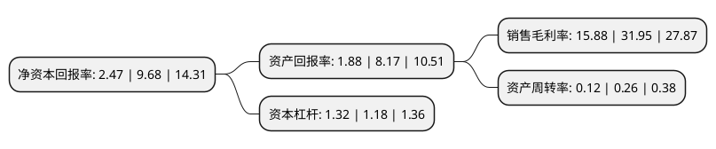

> 本页面由自动化程序生成于 2022年5月20日 01:21
> 内容可能存在错误，如有bug请提交issue至：https://github.com/Eroleice/doc-pi/issues
{.is-warning}

# 上市公司基本情况

## 基本资料

广联航空工业股份有限公司（以下简称“广联航空”）成立于2011年02月25日，哈尔滨市。于2020年10月29日在深交所创业板上市。

广联航空注册资本21,024万元，专业从事航空工业相关产品设计，研发，制造以下是详细信息：

- 公司名称: 广联航空工业股份有限公司
- 股票代码: 300900.SZ
- 所在地: 黑龙江 - 哈尔滨市
- 成立日期: 2011年02月25日
- 注册资本: 21,024万元
- 法定代表人: 王增夺
- 主营业务: 专业从事航空工业相关产品设计，研发，制造
- 公司官网: www.guanglianhangkong.com/www.glavi.cn
- 公司介绍: 公司是专业从事航空工业相关产品设计、研发、制造的国家级高新技术企业。公司以具有突出优势的航空工装业务为基础，积极开拓了航空零部件和部段、无人机等业务，产品覆盖军用和民用航空工业各领域，成为专业化程度高、技术积累丰富、广受认可的航空工业相关产品供应商。公司的客户主要为中航工业、中国商飞等国内航空工业核心制造商旗下的各飞机主机制造厂商，航天科工、中国兵装等军工央企集团下属科研院所及科研生产单位，军队研究所等军方单位。目前，公司已获得开展业务所需的航空、军工相关资质，包括AS9100航空航天质量管理体系认证、ISO9001:2015质量管理体系认证以及GJB9001C-2017国军标质量管理体系认证证书、武器装备科研生产单位三级保密资格证书、装备承制单位注册证书等。

## 股东及高管情况

上市公司第一大股东为王增夺，持股65,890,000股，占比31.34%，为上市公司实际控制人。

截至2022年03月31日，上市公司的前十大股东中，共有6名自然人股东，2名机构股东，2个产品账户，其中5%以上大股东共有1名。上市公司前十大股东明细如下：

> 截至2022年03月31日，上市公司前十大股东信息如下：

| 股东名称 | 持股数量（股） | 持股比例 |
| --- | --- | --- |
| 王增夺 | 65,890,000 | 31.34% |
| 陆岩 | 9,697,626 | 4.61% |
| 于刚 | 7,524,600 | 3.58% |
| 霍尔果斯华控创业投资有限公司-华控科工(宁波梅山保税港区)股权投资基金合伙企业(有限合伙) | 5,653,402 | 2.69% |
| 王思拓 | 5,000,000 | 2.38% |
| 朱洪敏 | 4,990,000 | 2.37% |
| 中航产业投资有限公司 | 4,298,170 | 2.04% |
| 东北证券股份有限公司 | 4,204,800 | 2% |
| 霍尔果斯华控创业投资有限公司-华控湖北科工产业投资基金(有限合伙) | 3,621,000 | 1.72% |
| 李念奎 | 3,500,051 | 1.66% |

## 利润表分析

上市公司2021年总收入为2.37亿元，净利润为0.37亿元，实现盈利。

## 杜邦分析

> 数据列示周期：2021年 | 2020年 | 2019年
{.is-info}

上市公司的净资产收益率在近一年有所下降，下降幅度为-74.48%，其变化情况分解如下：
- 上市公司的销售毛利率在近一年下降了-50.3%，可能是生产效率的下降、商品原材料价格上涨或商品价格的下跌所致。
- 上市公司的资产周转率在近一年下降了-53.85%，可能是源自于更慢的销售回款或库存管理效果下降。
- 上市公司的财务杠杆比率在近一年上升了11.86%，可能是增加负债扩大生产规模。

