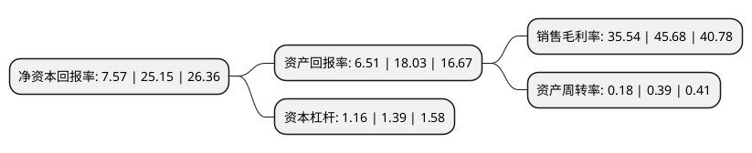

> 本页面由自动化程序生成于 2022年5月20日 01:21
> 内容可能存在错误，如有bug请提交issue至：https://github.com/Eroleice/doc-pi/issues
{.is-warning}

# 上市公司基本情况

## 基本资料

恒宇信通航空装备(北京)股份有限公司（以下简称“恒宇信通”）成立于2002年10月14日，北京市。于2021年04月02日在深交所创业板上市。

恒宇信通注册资本6,000万元，公司主营业务为直升机综合显示控制设备的研发，生产，销售，并提供相关专业技术服务。公司主要产品包括机载多功能综合显控设备及嵌入式计算机模块等航空电产品。其中，直升机机载多功能综合显控设备是公司最主要的产品。以下是详细信息：

- 公司名称: 恒宇信通航空装备(北京)股份有限公司
- 股票代码: 300965.SZ
- 所在地: 北京 - 北京市
- 成立日期: 2002年10月14日
- 注册资本: 6,000万元
- 法定代表人: 王舒公
- 主营业务: 公司主营业务为直升机综合显示控制设备的研发，生产，销售，并提供相关专业技术服务公司主要产品包括机载多功能综合显控设备及嵌入式计算机模块等航空电产品其中，直升机机载多功能综合显控设备是公司最主要的产品
- 公司官网: www.bjhyxt.cn
- 公司介绍: 公司主营业务为直升机综合显示控制设备的研发、生产、销售，并提供相关专业技术服务，系我国主要的军用直升机综合显示控制设备领域一体化系统集成及技术解决方案综合提供商。公司深耕军用直升机综合显示控制设备领域多年，主要产品包括机载多功能综合显示控制设备及嵌入式计算机模块等航空电子产品。其中，直升机机载多功能综合显示控制设备是公司最主要的产品。公司在2009年国庆阅兵保障任务和2012年朱日和演习保障任务中被评为优秀保障单位，在2019年国庆阅兵任务中，公司现场保障人员政治素养过硬，工作务实高效，保障措施有力，为装备完好、任务成功做出了重要贡献，得到了中国人民解放军某部的表扬感谢。

## 股东及高管情况

上市公司第一大股东为饶丹妮，持股32,944,500股，占比54.91%，为上市公司实际控制人。

截至2022年03月31日，上市公司的前十大股东中，共有9名自然人股东，1名机构股东，其中5%以上大股东共有3名。上市公司前十大股东明细如下：

> 截至2022年03月31日，上市公司前十大股东信息如下：

| 股东名称 | 持股数量（股） | 持股比例 |
| --- | --- | --- |
| 饶丹妮 | 32,944,500 | 54.91% |
| 吴琉滨 | 5,715,000 | 9.53% |
| 淄博恒宇同德信息咨询合伙企业(有限合伙) | 4,180,500 | 6.97% |
| 王舒公 | 2,160,000 | 3.6% |
| 沈志芳 | 160,000 | 0.27% |
| 钮福珍 | 119,100 | 0.2% |
| 张春来 | 106,000 | 0.18% |
| 郑明鉴 | 99,000 | 0.17% |
| 陈晓辉 | 97,900 | 0.16% |
| 褚林珍 | 80,000 | 0.13% |

## 利润表分析

上市公司2021年总收入为1.9亿元，净利润为0.67亿元，实现盈利。

## 杜邦分析

> 数据列示周期：2021年 | 2020年 | 2019年
{.is-info}

上市公司的净资产收益率在近一年有所下降，下降幅度为-69.9%，其变化情况分解如下：
- 上市公司的销售毛利率在近一年下降了-22.2%，可能是生产效率的下降、商品原材料价格上涨或商品价格的下跌所致。
- 上市公司的资产周转率在近一年下降了-53.85%，可能是源自于更慢的销售回款或库存管理效果下降。
- 上市公司的财务杠杆比率在近一年下降了-16.55%，可能是减少负债降低财务费用。

