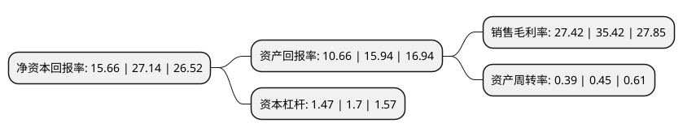

> 本页面由自动化程序生成于 2022年5月20日 01:22
> 内容可能存在错误，如有bug请提交issue至：https://github.com/Eroleice/doc-pi/issues
{.is-warning}

# 上市公司基本情况

## 基本资料

成都雷电微力科技股份有限公司（以下简称“雷电微力”）成立于2007年09月11日，成都市。于2021年08月24日在深交所创业板上市。

雷电微力注册资本9,680万元，公司专业从事毫米波有源相控阵微系统研发，制造，测试和销售，提供专用和通用的毫米波有源相控阵产品。公司主要产品为毫米波有源相控阵微系统。以下是详细信息：

- 公司名称: 成都雷电微力科技股份有限公司
- 股票代码: 301050.SZ
- 所在地: 四川 - 成都市
- 成立日期: 2007年09月11日
- 注册资本: 9,680万元
- 法定代表人: 邓洁茹
- 主营业务: 公司专业从事毫米波有源相控阵微系统研发，制造，测试和销售，提供专用和通用的毫米波有源相控阵产品公司主要产品为毫米波有源相控阵微系统
- 公司官网: www.rml138.com
- 公司介绍: 公司是一家从事毫米波有源相控阵微系统研发、制造、测试和销售的高新技术企业，提供专用和通用的毫米波有源相控阵产品。公司产品及技术广泛应用于精确制导、通信数据链、雷达探测等专用领域，未来也可拓展应用至5G通信基站、车载无人驾驶雷达、商业卫星链路系统、移动终端“动中通”等通用领域。公司将国际先进企业管理经验与我国的现实国情相结合，摸索出一套具有特色的经营管理体系。公司在项目研发方面已建立先进的IPD(集成产品开发)模式，在质量管理方面实现QFD(质量功能展开)与国军标质量管理体系有机结合。在“需求牵引+技术驱动”的新型发展模式下，公司同时推进前瞻性技术的布局和产品工程化研究，当前已成功探索出一条具有市场竞争力、高可靠性的工业化路径。

## 股东及高管情况

上市公司第一大股东为邓洁茹，持股18,778,159股，占比19.4%，**疑似为**上市公司实际控制人。

截至2022年03月31日，上市公司的前十大股东中，共有3名自然人股东，5名机构股东，2个产品账户，其中5%以上大股东共有3名。上市公司前十大股东明细如下：

> 未能通过持股比例判定出上市公司实际控制人（持股30%以上）
> 可能存在通过间接持股、联合持股、协议控制等方式拥有实际控制权的主体，具体请参考上市公司定期公告！
{.is-warning}

> 截至2022年03月31日，上市公司前十大股东信息如下：

| 股东名称 | 持股数量（股） | 持股比例 |
| --- | --- | --- |
| 邓洁茹 | 18,778,159 | 19.4% |
| 陈发树 | 8,699,538 | 8.99% |
| 重庆宜达企业管理合伙企业(有限合伙) | 6,041,133 | 6.24% |
| 共青城泰中承乾投资中心(有限合伙) | 3,646,535 | 3.77% |
| 王育贤 | 2,500,000 | 2.58% |
| 华西金智投资有限责任公司-泸州华西金智银聚股权投资基金合伙企业(有限合伙) | 2,475,000 | 2.56% |
| 北京国鼎军安天下股权投资合伙企业(有限合伙) | 2,398,502 | 2.48% |
| 中信证券-招商银行-中信证券雷电微力员工参与创业板战略配售集合资产管理计划 | 2,394,459 | 2.47% |
| 深圳榕泽资本投资有限公司 | 2,296,665 | 2.37% |
| 上海擎正投资中心(有限合伙) | 2,275,898 | 2.35% |

## 利润表分析

上市公司2021年总收入为7.35亿元，净利润为2.01亿元，实现盈利。

## 杜邦分析

> 数据列示周期：2021年 | 2020年 | 2019年
{.is-info}

上市公司的净资产收益率在近一年有所下降，下降幅度为-42.3%，其变化情况分解如下：
- 上市公司的销售毛利率在近一年下降了-22.59%，可能是生产效率的下降、商品原材料价格上涨或商品价格的下跌所致。
- 上市公司的资产周转率在近一年下降了-13.33%，可能是源自于更慢的销售回款或库存管理效果下降。
- 上市公司的财务杠杆比率在近一年下降了-13.53%，可能是减少负债降低财务费用。

