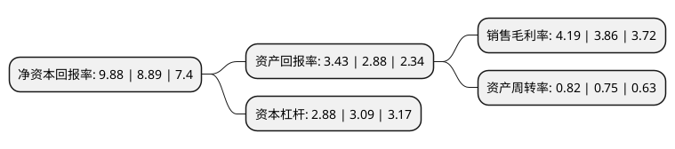

> 本页面由自动化程序生成于 2022年5月20日 01:23
> 内容可能存在错误，如有bug请提交issue至：https://github.com/Eroleice/doc-pi/issues
{.is-warning}

# 上市公司基本情况

## 基本资料

中航直升机股份有限公司（以下简称“中直股份”）成立于1999年07月30日，哈尔滨市。于2000年12月18日在上交所主板上市。

中直股份注册资本58,947.672万元，主要业务:直九直升机，Y12轻型多用途飞机，EC120直升机等航空产品研制和生产。以下是详细信息：

- 公司名称: 中航直升机股份有限公司
- 股票代码: 600038.SH
- 所在地: 黑龙江 - 哈尔滨市
- 成立日期: 1999年07月30日
- 注册资本: 58,947.672万元
- 法定代表人: 闫灵喜
- 主营业务: 直九直升机，Y12轻型多用途飞机，EC120直升机等航空产品研制和生产
- 公司官网: avicopter.avic.com
- 公司介绍: 公司是我国直升机和通用、支线飞机科研生产基地，目前已经发展成为一个拥有Y12轻型多用途飞机、Z9系列直升机、EC120直升机和转包国外航空产品四大系列产品的外向型航空骨干企业。公司是国内航空产品制造业中少数能够依托自主研发、引进、消化国际先进技术，实现产品国际取证和销售的生产企业。公司在复合材料研制和生产应用方面拥有绝对优势，主营航空产品直升机，产品性价比和技术优势较明显，综合竞争能力突出。近年来，公司荣获全国五一劳动奖状、全国文明单位、全国优秀诚信企业、高技术武器装备发展建设工程突出贡献奖、国家高技术产业化十年成就奖、中央企业先进基层党组织等荣誉称号。

## 股东及高管情况

上市公司第一大股东为哈尔滨航空工业(集团)有限公司，持股157,428,702股，占比26.71%，**疑似为**上市公司实际控制人。

截至2022年03月31日，上市公司的前十大股东中，共有6名机构股东，3个产品账户，1个海外主体，其中5%以上大股东共有4名。上市公司前十大股东明细如下：

> 未能通过持股比例判定出上市公司实际控制人（持股30%以上）
> 可能存在通过间接持股、联合持股、协议控制等方式拥有实际控制权的主体，具体请参考上市公司定期公告！
{.is-warning}

> 截至2022年03月31日，上市公司前十大股东信息如下：

| 股东名称 | 持股数量（股） | 持股比例 |
| --- | --- | --- |
| 哈尔滨航空工业(集团)有限公司 | 157,428,702 | 26.71% |
| 中航直升机有限责任公司 | 75,350,398 | 12.78% |
| 中国航空科技工业股份有限公司 | 37,178,958 | 6.31% |
| 国新投资有限公司 | 30,446,774 | 5.17% |
| 哈尔滨飞机工业集团有限责任公司 | 19,186,952 | 3.25% |
| 香港中央结算有限公司(陆股通) | 11,437,959 | 1.94% |
| 天津滨江直升机有限责任公司 | 5,600,000 | 0.95% |
| 中国建设银行股份有限公司-易方达国防军工混合型证券投资基金 | 5,455,258 | 0.93% |
| 大家人寿保险股份有限公司-万能产品 | 4,446,245 | 0.75% |
| 兴业银行股份有限公司-博时汇兴回报一年持有期灵活配置混合型证券投资基金 | 3,700,500 | 0.63% |

## 利润表分析

上市公司2021年总收入为217.89亿元，净利润为9.13亿元，实现盈利。

## 杜邦分析

> 数据列示周期：2021年 | 2020年 | 2019年
{.is-info}

上市公司的净资产收益率在近一年有所上升，上升幅度为11.14%，其变化情况分解如下：
- 上市公司的销售毛利率在近一年上升了8.55%，可能是生产效率的提升、商品原材料价格下跌或商品价格的上涨所致。
- 上市公司的资产周转率在近一年上升了9.33%，可能是源自于更快的销售回款或库存管理效果提升。
- 上市公司的财务杠杆比率在近一年下降了-6.8%，可能是减少负债降低财务费用。

