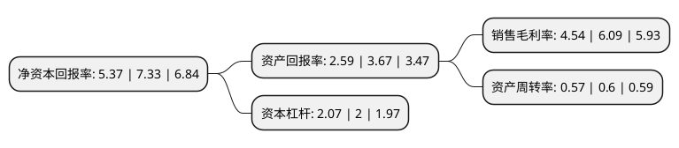

> 本页面由自动化程序生成于 2022年5月20日 01:24
> 内容可能存在错误，如有bug请提交issue至：https://github.com/Eroleice/doc-pi/issues
{.is-warning}

# 上市公司基本情况

## 基本资料

中国东方红卫星股份有限公司（以下简称“中国卫星”）成立于1997年08月21日，北京市。于1997年09月08日在上交所主板上市。

中国卫星注册资本118,248.914万元，主要产品:小卫星制造，微小卫星制造，部组件制造，卫星应用系统集成与产品制造，卫星综合应用与服务，智慧城市。主营业务:宇航制造和卫星应用。以下是详细信息：

- 公司名称: 中国东方红卫星股份有限公司
- 股票代码: 600118.SH
- 所在地: 北京 - 北京市
- 成立日期: 1997年08月21日
- 注册资本: 118,248.914万元
- 法定代表人: 林益明
- 主营业务: 主要产品:小卫星制造，微小卫星制造，部组件制造，卫星应用系统集成与产品制造，卫星综合应用与服务，智慧城市主营业务:宇航制造和卫星应用
- 公司官网: www.spacesat.com.cn
- 公司介绍: 公司是专业从事小卫星及微小卫星研制、卫星地面应用系统及设备制造和卫星运营服务的航天高新技术企业，具有天地一体化设计、研制、集成和运营服务能力，形成了航天东方红、航天恒星等一系列知名品牌。在小卫星及微小卫星研制方面，已成功开发了以CAST968(CAST1000)平台为代表的多个系列小卫星和微小卫星公用平台，成功发射对地观测、海洋监测、环境监测、空间探测、科学试验等多颗不同用途的现代小卫星，同时具备部分宇航部件产品的生产能力；在卫星地面应用系统及设备制造方面，拥有地面站系统集成、卫星导航、卫星通信、卫星遥感、信息传输与图像处理五大领域，在北斗导航、动中通产品市场占有率方面处于国内领先地位，并拥有“天绘”系列遥感卫星数据总代理权。未来公司将继续坚持宇航制造与卫星应用两翼齐飞的发展思路，把公司做大、做强、做优。

## 股东及高管情况

上市公司第一大股东为中国空间技术研究院，持股608,541,176股，占比51.46%，为上市公司实际控制人。

截至2022年03月31日，上市公司的前十大股东中，共有4名自然人股东，1名机构股东，3个产品账户，1个海外主体，1名其他股东，其中5%以上大股东共有1名。上市公司前十大股东明细如下：

> 截至2022年03月31日，上市公司前十大股东信息如下：

| 股东名称 | 持股数量（股） | 持股比例 |
| --- | --- | --- |
| 中国空间技术研究院 | 608,541,176 | 51.46% |
| 中国证券金融股份有限公司 | 10,122,484 | 0.86% |
| 中国建设银行股份有限公司-国泰中证军工交易型开放式指数证券投资基金 | 6,663,021 | 0.56% |
| 郑文宝 | 6,058,386 | 0.51% |
| 香港中央结算有限公司(陆股通) | 4,200,818 | 0.36% |
| 王青祜 | 3,840,000 | 0.32% |
| 中国建设银行股份有限公司-富国中证军工指数型证券投资基金 | 3,156,326 | 0.27% |
| 中国农业银行股份有限公司-中证500交易型开放式指数证券投资基金 | 2,897,278 | 0.25% |
| 颜翠英 | 2,593,468 | 0.22% |
| 刘丽莉 | 2,141,000 | 0.18% |

## 利润表分析

上市公司2021年总收入为70.58亿元，净利润为3.2亿元，实现盈利。

## 杜邦分析

> 数据列示周期：2021年 | 2020年 | 2019年
{.is-info}

上市公司的净资产收益率在近一年有所下降，下降幅度为-26.74%，其变化情况分解如下：
- 上市公司的销售毛利率在近一年下降了-25.45%，可能是生产效率的下降、商品原材料价格上涨或商品价格的下跌所致。
- 上市公司的资产周转率在近一年下降了-5%，可能是源自于更慢的销售回款或库存管理效果下降。
- 上市公司的财务杠杆比率在近一年上升了3.5%，可能是增加负债扩大生产规模。

