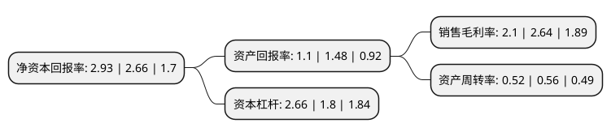

> 本页面由自动化程序生成于 2022年5月20日 01:25
> 内容可能存在错误，如有bug请提交issue至：https://github.com/Eroleice/doc-pi/issues
{.is-warning}

# 上市公司基本情况

## 基本资料

江西洪都航空工业股份有限公司（以下简称“洪都航空”）成立于1999年12月16日，南昌市。于2000年12月15日在上交所主板上市。

洪都航空注册资本71,711.451万元，主要业务:航空飞行器的研发，制造，销售和服务等业务。以下是详细信息：

- 公司名称: 江西洪都航空工业股份有限公司
- 股票代码: 600316.SH
- 所在地: 江西 - 南昌市
- 成立日期: 1999年12月16日
- 注册资本: 71,711.451万元
- 法定代表人: 纪瑞东
- 主营业务: 航空飞行器的研发，制造，销售和服务等业务
- 公司官网: www.600316.com.cn
- 公司介绍: 公司是经中国航空工业第二集团批准改制重组的航空高科技企业，是国内专业生产教练飞机和通用飞机的企业，也是我国首家以明确大批出口定单的整架飞机为主营产品的高科技外向型企业。近年来，中航工业洪都在“寓军于民、军民并举”的发展方针指引下，努力开拓转包生产新领域。在航空转包生产领域，与美国Goodrich(古德里奇)公司、波音公司、Eclipse(日蚀)公司、Timken(铁姆肯)公司、欧洲空客公司、沈飞公司、西飞公司等国内外知名航空企业开展转包生产合作；在非航空产品转包生产领域，中航工业洪都已成功进入了GE公司、Webtac(西屋制动)等世界500强企业的供应链。形成了“军民并重，两翼齐飞”的大好局面，成功的走出了一条“以科研带动生产、以生产促进科研”之路，发展壮大成为集科研、生产和经营为一体的大型企业集团。

## 股东及高管情况

上市公司第一大股东为中国航空科技工业股份有限公司，持股312,935,194股，占比43.64%，为上市公司实际控制人。

截至2022年03月31日，上市公司的前十大股东中，共有1名自然人股东，2名机构股东，7个产品账户，其中5%以上大股东共有1名。上市公司前十大股东明细如下：

> 截至2022年03月31日，上市公司前十大股东信息如下：

| 股东名称 | 持股数量（股） | 持股比例 |
| --- | --- | --- |
| 中国航空科技工业股份有限公司 | 312,935,194 | 43.64% |
| 江西洪都航空工业集团有限责任公司 | 31,428,926 | 4.38% |
| 中国银行股份有限公司-国投瑞银国家安全灵活配置混合型证券投资基金 | 8,504,037 | 1.19% |
| 中国建设银行股份有限公司-博时军工主题股票型证券投资基金 | 4,869,001 | 0.68% |
| 中国建设银行股份有限公司-国泰中证军工交易型开放式指数证券投资基金 | 4,724,352 | 0.66% |
| 中国工商银行股份有限公司-华夏产业升级混合型证券投资基金 | 3,856,785 | 0.54% |
| 招商银行股份有限公司-工银瑞信新金融股票型证券投资基金 | 2,939,681 | 0.41% |
| 中国建设银行股份有限公司-鹏华中证国防指数型证券投资基金(LOF) | 2,936,700 | 0.41% |
| 王一虎 | 2,715,100 | 0.38% |
| 中国建设银行股份有限公司-富国中证军工指数型证券投资基金 | 2,297,000 | 0.32% |

## 利润表分析

上市公司2021年总收入为72.14亿元，净利润为1.51亿元，实现盈利。

## 杜邦分析

> 数据列示周期：2021年 | 2020年 | 2019年
{.is-info}

上市公司的净资产收益率在近一年有所上升，上升幅度为10.15%，其变化情况分解如下：
- 上市公司的销售毛利率在近一年下降了-20.45%，可能是生产效率的下降、商品原材料价格上涨或商品价格的下跌所致。
- 上市公司的资产周转率在近一年下降了-7.14%，可能是源自于更慢的销售回款或库存管理效果下降。
- 上市公司的财务杠杆比率在近一年上升了47.78%，可能是增加负债扩大生产规模。

