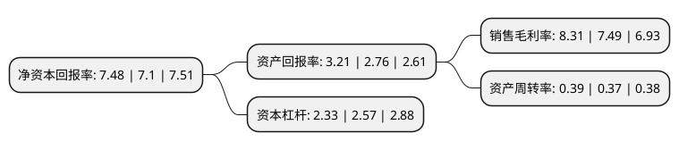

> 本页面由自动化程序生成于 2022年5月20日 01:26
> 内容可能存在错误，如有bug请提交issue至：https://github.com/Eroleice/doc-pi/issues
{.is-warning}

# 上市公司基本情况

## 基本资料

中航航空电子系统股份有限公司（以下简称“中航电子”）成立于1999年11月26日，北京市。于2001年07月06日在上交所主板上市。

中航电子注册资本175,916.294万元，主营业务:1。航空，防务及安全领域电子产品(系统，设备，器件，软件)。2。民用电子产品及相关设备。3。智能装备(分系统和关键部件为主)。4。创新项目孵化。以下是详细信息：

- 公司名称: 中航航空电子系统股份有限公司
- 股票代码: 600372.SH
- 所在地: 北京 - 北京市
- 成立日期: 1999年11月26日
- 注册资本: 175,916.294万元
- 法定代表人: 于卓
- 主营业务: 主营业务:1航空，防务及安全领域电子产品(系统，设备，器件，软件)2民用电子产品及相关设备3智能装备(分系统和关键部件为主)4创新项目孵化
- 公司官网: www.aviconics.com.cn
- 公司介绍: 公司致力于为客户提供综合化的航空电子系统整体解决方案，产品谱系覆盖飞行控制系统、雷达系统、光电探测系统、座舱显示控制系统、机载计算机与网络系统、惯性导航系统、无线电与卫星导航系统、大气数据系统、火力控制与指挥任务系统、悬挂物管理系统、综合数据管理系统、控制板组件与调光控制系统、空中交通管理系统、通信系统、电子战、无人机系统/遥控遥测/地面站、机载反潜/水声探测系统、故障诊断与健康管理系统、航空状态检测系统、电驱动与控制系统和基础元器件等航空电子相关领域。公司立足航空，积极拓展非航空防务及民用市场，面向航天、兵器、船舶、电子信息等领域提供配套产品及服务。公司民用产业涉及智能系统与机器人、智慧城市、机电自动化、电子信息、基础器件等领域。公司以为各型飞行器、发动机与防务系统提供先进的航空电子技术、产品和解决方案为使命，打造世界先进的电子信息技术、智能系统供应商；聚焦价值创造和商业成功，致力于成为让股东获利、员工满意、客户信赖、诚实守信的优秀上市公司。

## 股东及高管情况

上市公司第一大股东为中国航空科技工业股份有限公司，持股760,305,199股，占比39.43%，为上市公司实际控制人。

截至2022年03月31日，上市公司的前十大股东中，共有5名机构股东，4个产品账户，1个海外主体，其中5%以上大股东共有3名。上市公司前十大股东明细如下：

> 截至2022年03月31日，上市公司前十大股东信息如下：

| 股东名称 | 持股数量（股） | 持股比例 |
| --- | --- | --- |
| 中国航空科技工业股份有限公司 | 760,305,199 | 39.43% |
| 中航机载系统有限公司 | 316,509,442 | 16.41% |
| 中国航空工业集团有限公司 | 142,291,099 | 7.38% |
| 汉中航空工业(集团)有限公司 | 59,631,472 | 3.09% |
| 中国证券金融股份有限公司 | 34,756,824 | 1.8% |
| 中国工商银行股份有限公司-富国军工主题混合型证券投资基金 | 22,880,528 | 1.19% |
| 中国对外经济贸易信托有限公司-外贸信托-高毅晓峰鸿远集合资金信托计划 | 20,715,897 | 1.07% |
| 上海高毅资产管理合伙企业(有限合伙)-高毅晓峰2号致信基金 | 16,899,550 | 0.88% |
| 中国银行股份有限公司-国投瑞银国家安全灵活配置混合型证券投资基金 | 15,244,541 | 0.79% |
| 香港中央结算有限公司(陆股通) | 14,600,267 | 0.76% |

## 利润表分析

上市公司2021年总收入为98.39亿元，净利润为8.17亿元，实现盈利。

## 杜邦分析

> 数据列示周期：2021年 | 2020年 | 2019年
{.is-info}

上市公司的净资产收益率在近一年有所上升，上升幅度为5.35%，其变化情况分解如下：
- 上市公司的销售毛利率在近一年上升了10.95%，可能是生产效率的提升、商品原材料价格下跌或商品价格的上涨所致。
- 上市公司的资产周转率在近一年上升了5.41%，可能是源自于更快的销售回款或库存管理效果提升。
- 上市公司的财务杠杆比率在近一年下降了-9.34%，可能是减少负债降低财务费用。

