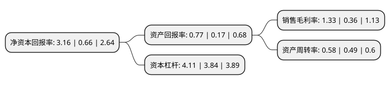

> 本页面由自动化程序生成于 2022年5月20日 01:26
> 内容可能存在错误，如有bug请提交issue至：https://github.com/Eroleice/doc-pi/issues
{.is-warning}

# 上市公司基本情况

## 基本资料

中国航发航空科技股份有限公司（以下简称“航发科技”）成立于1999年12月28日，成都市。于2001年12月12日在上交所主板上市。

航发科技注册资本33,012.937万元，主要产品包括航空发动机零部件，燃气轮机零部件，空调壳体件，石油机械零部件，纺织机械的生产，制造和销售等。以下是详细信息：

- 公司名称: 中国航发航空科技股份有限公司
- 股票代码: 600391.SH
- 所在地: 四川 - 成都市
- 成立日期: 1999年12月28日
- 注册资本: 33,012.937万元
- 法定代表人: 丛春义
- 主营业务: 主要产品包括航空发动机零部件，燃气轮机零部件，空调壳体件，石油机械零部件，纺织机械的生产，制造和销售等
- 公司官网: ast.aecc.cn
- 公司介绍: 公司是中国航发成都发动机集团有限公司作为主要发起人，联合中国航发沈阳黎明航空发动机有限责任公司、北京航空航天大学、中国燃气涡轮研究院、成都航空职业技术学院五家单位，并以发起方式设立的股份有限公司，于1999年12月28日在国家工商局注册登记。公司在长期航空发动机研制，以及与国际知名航空企业合作过程中，掌握了国际先进的航空发动机关键零部件制造技术，具有了“国家企业技术中心、专业化加工制造平台、航空制造关键核心技术”三位一体的核心竞争力，具备了航空发动机研制、生产、试验和试车能力。其“国家企业技术中心”涵盖了国家级理化检测中心、国防二级区域计量站、四川省院士(专家)工作站，是技术创新的核心平台。公司与GE、RR、HON等国际知名企业建立了长期合作关系，逐渐成为民用航空发动机、燃气轮机制造领域的国际合作重要供应商。

## 股东及高管情况

上市公司第一大股东为中国航发成都发动机有限公司，持股118,907,305股，占比36.02%，为上市公司实际控制人。

截至2022年03月31日，上市公司的前十大股东中，共有2名自然人股东，2名机构股东，6个产品账户，其中5%以上大股东共有1名。上市公司前十大股东明细如下：

> 截至2022年03月31日，上市公司前十大股东信息如下：

| 股东名称 | 持股数量（股） | 持股比例 |
| --- | --- | --- |
| 中国航发成都发动机有限公司 | 118,907,305 | 36.02% |
| 中国银行股份有限公司-国投瑞银国家安全灵活配置混合型证券投资基金 | 10,561,438 | 3.2% |
| 中国建设银行股份有限公司-博时军工主题股票型证券投资基金 | 4,041,000 | 1.22% |
| 深圳创富兆业金融管理有限公司-创富福星一号私募证券投资基金 | 2,117,880 | 0.64% |
| 招商银行股份有限公司-东方红远见价值混合型证券投资基金 | 2,002,408 | 0.61% |
| 中信证券股份有限公司 | 1,285,507 | 0.39% |
| 张宝春 | 1,226,100 | 0.37% |
| 上海青沣资产管理中心(普通合伙)-青沣有和2期私募证券投资基金 | 1,200,000 | 0.36% |
| 郭克标 | 1,130,000 | 0.34% |
| 博时基金管理有限公司-社保基金四一九组合 | 1,127,734 | 0.34% |

## 利润表分析

上市公司2021年总收入为35.04亿元，净利润为0.46亿元，实现盈利。

## 杜邦分析

> 数据列示周期：2021年 | 2020年 | 2019年
{.is-info}

上市公司的净资产收益率在近一年有所上升，上升幅度为378.79%，其变化情况分解如下：
- 上市公司的销售毛利率在近一年上升了269.44%，可能是生产效率的提升、商品原材料价格下跌或商品价格的上涨所致。
- 上市公司的资产周转率在近一年上升了18.37%，可能是源自于更快的销售回款或库存管理效果提升。
- 上市公司的财务杠杆比率在近一年上升了7.03%，可能是增加负债扩大生产规模。

