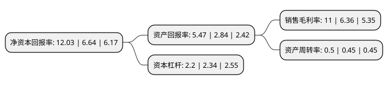

> 本页面由自动化程序生成于 2022年5月20日 01:28
> 内容可能存在错误，如有bug请提交issue至：https://github.com/Eroleice/doc-pi/issues
{.is-warning}

# 上市公司基本情况

## 基本资料

中航重机股份有限公司（以下简称“中航重机”）成立于1996年11月14日，贵阳市。于1996年11月06日在上交所主板上市。

中航重机注册资本105,163.864万元，主要业务:液压行业。以下是详细信息：

- 公司名称: 中航重机股份有限公司
- 股票代码: 600765.SH
- 所在地: 贵州 - 贵阳市
- 成立日期: 1996年11月14日
- 注册资本: 105,163.864万元
- 法定代表人: 姬苏春
- 主营业务: 液压行业
- 公司官网: www.hm.avic.com
- 公司介绍: 公司隶属中国航空工业集团公司，是中国航空工业企业首家上市公司，被誉为“中国航空工业第一股”。多年来，公司以航空技术为基础，建立了锻铸、液压、新能源投资三大业务发展平台，积极发展高端宇航锻铸造业务、高端液压系统业务、高端散热系统业务、中小型燃机成套业务，燃机成套向总承包、安装、运行维护等服务领域拓展，新能源投资业务以大力发展风力发电、燃气轮机综合应用发电和垃圾焚烧发电等为主业，辅以新能源相关领域关键技术和产业的投资，公司产品大量应用于国内外航空航天、新能源、工程机械等领域，成为了中国最具竞争力的高端装备制造企业。公司努力发展具有系统竞争优势的、以航空技术为特色的军民两用高端装备制造产业，通过专业化整合和资本化运作，努力提升产业发展能力和核心竞争能力，做强做大产业规模，成为寓军于民、协调发展的产业代表。

## 股东及高管情况

上市公司第一大股东为贵州金江航空液压有限责任公司，持股229,369,200股，占比21.81%，**疑似为**上市公司实际控制人。

截至2022年03月31日，上市公司的前十大股东中，共有5名机构股东，5个产品账户，其中5%以上大股东共有3名。上市公司前十大股东明细如下：

> 未能通过持股比例判定出上市公司实际控制人（持股30%以上）
> 可能存在通过间接持股、联合持股、协议控制等方式拥有实际控制权的主体，具体请参考上市公司定期公告！
{.is-warning}

> 截至2022年03月31日，上市公司前十大股东信息如下：

| 股东名称 | 持股数量（股） | 持股比例 |
| --- | --- | --- |
| 贵州金江航空液压有限责任公司 | 229,369,200 | 21.81% |
| 中国贵州航空工业(集团)有限责任公司 | 64,538,800 | 6.14% |
| 中航工业产融控股股份有限公司 | 64,478,311 | 6.13% |
| 中央企业乡村产业投资基金股份有限公司 | 29,424,998 | 2.8% |
| 国家军民融合产业投资基金有限责任公司 | 28,105,686 | 2.67% |
| 中航通用飞机有限责任公司 | 17,584,994 | 1.67% |
| 中国工商银行股份有限公司-富国军工主题混合型证券投资基金 | 16,413,080 | 1.56% |
| 贵州盖克航空机电有限责任公司 | 13,596,331 | 1.29% |
| 上海聚鸣投资管理有限公司-聚鸣多策略6号私募证券投资基金 | 12,281,994 | 1.17% |
| 中国农业银行股份有限公司-南方军工改革灵活配置混合型证券投资基金 | 12,084,254 | 1.15% |

## 利润表分析

上市公司2021年总收入为87.89亿元，净利润为9.66亿元，实现盈利。

## 杜邦分析

> 数据列示周期：2021年 | 2020年 | 2019年
{.is-info}

上市公司的净资产收益率在近一年有所上升，上升幅度为81.17%，其变化情况分解如下：
- 上市公司的销售毛利率在近一年上升了72.96%，可能是生产效率的提升、商品原材料价格下跌或商品价格的上涨所致。
- 上市公司的资产周转率在近一年上升了11.11%，可能是源自于更快的销售回款或库存管理效果提升。
- 上市公司的财务杠杆比率在近一年下降了-5.98%，可能是减少负债降低财务费用。

