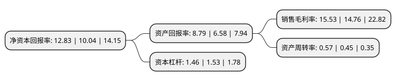

> 本页面由自动化程序生成于 2022年5月20日 01:29
> 内容可能存在错误，如有bug请提交issue至：https://github.com/Eroleice/doc-pi/issues
{.is-warning}

# 上市公司基本情况

## 基本资料

中航航空高科技股份有限公司（以下简称“中航高科”）成立于1988年12月21日，南通市。于1994年05月20日在上交所主板上市。

中航高科注册资本139,304.911万元，航空新材料，高端智能装备，轨道交通，汽车，医疗器械，装备制造，房地产，创新创业投资等。以下是详细信息：

- 公司名称: 中航航空高科技股份有限公司
- 股票代码: 600862.SH
- 所在地: 江苏 - 南通市
- 成立日期: 1988年12月21日
- 注册资本: 139,304.911万元
- 法定代表人: 李志强
- 主营业务: 航空新材料，高端智能装备，轨道交通，汽车，医疗器械，装备制造，房地产，创新创业投资等
- 公司官网: www.avicht.cn
- 公司介绍: 公司是中国航空工业集团有限公司旗下沪市A股上市公司，是主要从事航空新材料研发生产、高端智能装备研发制造的综合性大型国有控股上市企业。公司前身源于1956年成立的南通机床厂，1994年5月在上海证券交易所挂牌上市。2015年公司进行了重大资产重组，以非公开发行股票方式购买中航复合材料有限责任公司、北京优材京航生物科技有限公司、北京优材百慕航空器材有限公司等3家公司100%股权。公司重组后，各业务领域以子公司形式发展，原公司本部机床业务分立为独资子公司，依托中航工业及所属单位优势资源，将原有机床业务改造升级为数控机床及航空专用装备业务，加之重组注入的新材料业务，公司已成为新材料及装备制造领域具有相当规模和行业竞争优势的上市公司。目前业务涵盖航空新材料、高端智能装备、轨道交通、汽车、医疗器械、装备制造、房地产、创新创业投资等。

## 股东及高管情况

上市公司第一大股东为中国航空工业集团有限公司，持股583,151,381股，占比41.86%，为上市公司实际控制人。

截至2022年03月31日，上市公司的前十大股东中，共有2名自然人股东，2名机构股东，4个产品账户，2名其他股东，其中5%以上大股东共有1名。上市公司前十大股东明细如下：

> 截至2022年03月31日，上市公司前十大股东信息如下：

| 股东名称 | 持股数量（股） | 持股比例 |
| --- | --- | --- |
| 中国航空工业集团有限公司 | 583,151,381 | 41.86% |
| 中国航发北京航空材料研究院 | 60,172,533 | 4.32% |
| 中国航空制造技术研究院 | 46,723,848 | 3.35% |
| 南通产业控股集团有限公司 | 37,029,242 | 2.66% |
| 中国建设银行股份有限公司-易方达国防军工混合型证券投资基金 | 34,416,894 | 2.47% |
| 中国工商银行股份有限公司-富国军工主题混合型证券投资基金 | 19,388,023 | 1.39% |
| 王萍 | 13,440,443 | 0.96% |
| 中国工商银行股份有限公司-华夏军工安全灵活配置混合型证券投资基金 | 11,831,333 | 0.85% |
| 全国社保基金一零七组合 | 11,439,921 | 0.82% |
| 徐利云 | 9,972,200 | 0.72% |

## 利润表分析

上市公司2021年总收入为38.07亿元，净利润为5.91亿元，实现盈利。

## 杜邦分析

> 数据列示周期：2021年 | 2020年 | 2019年
{.is-info}

上市公司的净资产收益率在近一年有所上升，上升幅度为27.79%，其变化情况分解如下：
- 上市公司的销售毛利率在近一年上升了5.22%，可能是生产效率的提升、商品原材料价格下跌或商品价格的上涨所致。
- 上市公司的资产周转率在近一年上升了26.67%，可能是源自于更快的销售回款或库存管理效果提升。
- 上市公司的财务杠杆比率在近一年下降了-4.58%，可能是减少负债降低财务费用。

