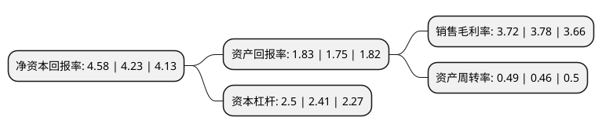

> 本页面由自动化程序生成于 2022年5月20日 01:29
> 内容可能存在错误，如有bug请提交issue至：https://github.com/Eroleice/doc-pi/issues
{.is-warning}

# 上市公司基本情况

## 基本资料

航天时代电子技术股份有限公司（以下简称“航天电子”）成立于1990年07月18日，武汉市。于1995年11月15日在上交所主板上市。

航天电子注册资本271,927.128万元，航天电子设备以下是详细信息：

- 公司名称: 航天时代电子技术股份有限公司
- 股票代码: 600879.SH
- 所在地: 湖北 - 武汉市
- 成立日期: 1990年07月18日
- 注册资本: 271,927.128万元
- 法定代表人: 任德民
- 主营业务: 航天电子设备
- 公司官网: www.catec-ltd.cn
- 公司介绍: 公司是中国航天科技集团公司旗下从事航天电子测控、航天电子对抗、航天制导、航天电子元器件专业的高科技上市公司。公司的航天高科技产品主要包括：高性能传感器、无线电测量控制系统、特种电子通信、自动跟踪系统和数据收集、传输处理系统、卫星电视广播系统、数字化有线电视网络设备、卫星通信地球站、星上精密机构及结构部件、大型地面工程业务测控站和电子支持设备，以及火箭、卫星、舰船、飞机、核能等产品配套使用的各种电连接器、继电器、电子仪器设备、电缆网及开关设备，GPS/GLONASS/北斗卫星导航应用系统及终端设备等，被广泛地应用于各类型号卫星、火箭运载工具、相应的地面通信测量与控制设备及工业自动化控制设备中。面对新机遇、新挑战，公司以强国强军为己任，以市场为导向，以经济效益为中心，以创新为动力，严谨慎密，不断超越，实现观念和机制创新的管理理念与雄厚的高科技实力相结合，使高新技术研发能力、产品批量生产能力、技术基础保障能力和规模式发展能力跃上新台阶。

## 股东及高管情况

上市公司第一大股东为中国航天时代电子有限公司，持股586,634,344股，占比21.57%，**疑似为**上市公司实际控制人。

截至2022年03月31日，上市公司的前十大股东中，共有8名机构股东，2个产品账户，其中5%以上大股东共有1名。上市公司前十大股东明细如下：

> 未能通过持股比例判定出上市公司实际控制人（持股30%以上）
> 可能存在通过间接持股、联合持股、协议控制等方式拥有实际控制权的主体，具体请参考上市公司定期公告！
{.is-warning}

> 截至2022年03月31日，上市公司前十大股东信息如下：

| 股东名称 | 持股数量（股） | 持股比例 |
| --- | --- | --- |
| 中国航天时代电子有限公司 | 586,634,344 | 21.57% |
| 陕西航天导航设备有限公司 | 53,277,182 | 1.96% |
| 湖北聚源科技投资有限公司 | 49,427,214 | 1.82% |
| 陕西苍松机械有限公司 | 45,345,306 | 1.67% |
| 北京兴华机械厂有限公司 | 38,049,810 | 1.4% |
| 中国人民人寿保险股份有限公司-传统-普通保险产品 | 37,232,274 | 1.37% |
| 北京东资远成投资中心(有限合伙) | 32,179,720 | 1.18% |
| 中国人民财产保险股份有限公司-传统-收益组合 | 27,324,489 | 1% |
| 中国建设银行股份有限公司-国泰中证军工交易型开放式指数证券投资基金 | 24,772,810 | 0.91% |
| 国机资本控股有限公司 | 23,358,226 | 0.86% |

## 利润表分析

上市公司2021年总收入为159.89亿元，净利润为5.94亿元，实现盈利。

## 杜邦分析

> 数据列示周期：2021年 | 2020年 | 2019年
{.is-info}

上市公司的净资产收益率在近一年有所上升，上升幅度为8.27%，其变化情况分解如下：
- 上市公司的销售毛利率在近一年下降了-1.59%，可能是生产效率的下降、商品原材料价格上涨或商品价格的下跌所致。
- 上市公司的资产周转率在近一年上升了6.52%，可能是源自于更快的销售回款或库存管理效果提升。
- 上市公司的财务杠杆比率在近一年上升了3.73%，可能是增加负债扩大生产规模。

