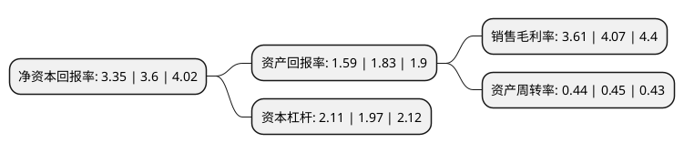

> 本页面由自动化程序生成于 2022年5月20日 01:29
> 内容可能存在错误，如有bug请提交issue至：https://github.com/Eroleice/doc-pi/issues
{.is-warning}

# 上市公司基本情况

## 基本资料

中国航发动力股份有限公司（以下简称“航发动力”）成立于1993年12月23日，西安市。于1996年04月08日在上交所主板上市。

航发动力注册资本266,559.424万元，航空发动机批量制造及修理等以下是详细信息：

- 公司名称: 中国航发动力股份有限公司
- 股票代码: 600893.SH
- 所在地: 陕西 - 西安市
- 成立日期: 1993年12月23日
- 注册资本: 266,559.424万元
- 法定代表人: 杨森
- 主营业务: 航空发动机批量制造及修理等
- 公司官网: HFDL.AECC.CN
- 公司介绍: 公司是国内大型航空发动机制造基地企业，国内唯一的生产制造涡喷、涡扇、涡轴、涡桨、活塞全种类军用航空发动机的企业。公司主要业务分为三类：航空发动机及衍生产品、外贸出口转包业务、非航空产品及其他业务。主要产品和服务有军民用航空发动机整机及部件、民用航空发动机零部件出口、军民用燃气轮机、军民用航空发动机维修保障服务。目前已具备涵盖航空发动机全寿命周期的设计、制造、总装、试车、维修整套技术和发动机综合服务保障能力，综合技术水平国内领先。公司建立了具有国际先进水平的机匣数控加工中心、表面处理中心，以及亚洲规模领先的喷涂中心、精密铸造、精密锻造、盘环加工等专业生产线；拥有国内最大的叶片生产线，全套弧齿锥齿轮加工机群、自动焊接机器设备、激光切割设备等各类高精设备，构建起了具有高科技水准的航空发动机制造技术基础平台。关键工艺制造技术国内领先，部分关键技术接近世界先进水平。在叶轮、盘、轴、机匣加工、整体结构件、精密铸造、精密锻造等关键点上具备了国内一流的制造能力。公司具备涡喷、涡扇、涡轴、涡桨、活塞全种类航空发动机生产制造能力，是三代主战机型发动机国内唯一供应商。

## 股东及高管情况

上市公司第一大股东为中国航空发动机集团有限公司，持股1,220,558,027股，占比45.79%，为上市公司实际控制人。

截至2022年03月31日，上市公司的前十大股东中，共有7名机构股东，2个产品账户，1个海外主体，其中5%以上大股东共有1名。上市公司前十大股东明细如下：

> 截至2022年03月31日，上市公司前十大股东信息如下：

| 股东名称 | 持股数量（股） | 持股比例 |
| --- | --- | --- |
| 中国航空发动机集团有限公司 | 1,220,558,027 | 45.79% |
| 航发基金管理有限公司-北京国发航空发动机产业投资基金中心(有限合伙) | 98,065,547 | 3.68% |
| 国家军民融合产业投资基金有限责任公司 | 49,032,772 | 1.84% |
| 香港中央结算有限公司(陆股通) | 46,404,983 | 1.74% |
| 交银金融资产投资有限公司 | 39,183,172 | 1.47% |
| 中国航发贵州黎阳航空发动机有限公司 | 39,050,587 | 1.46% |
| 贵州乌江能源投资有限公司 | 31,269,543 | 1.17% |
| 中国东方资产管理股份有限公司 | 28,029,923 | 1.05% |
| 中国航空工业集团有限公司 | 23,560,760 | 0.88% |
| 陕西航空产业发展集团有限公司 | 20,942,952 | 0.79% |

## 利润表分析

上市公司2021年总收入为341.02亿元，净利润为12.31亿元，实现盈利。

## 杜邦分析

> 数据列示周期：2021年 | 2020年 | 2019年
{.is-info}

上市公司的净资产收益率在近一年有所下降，下降幅度为-6.94%，其变化情况分解如下：
- 上市公司的销售毛利率在近一年下降了-11.3%，可能是生产效率的下降、商品原材料价格上涨或商品价格的下跌所致。
- 上市公司的资产周转率在近一年下降了-2.22%，可能是源自于更慢的销售回款或库存管理效果下降。
- 上市公司的财务杠杆比率在近一年上升了7.11%，可能是增加负债扩大生产规模。

