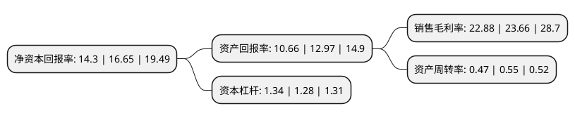

> 本页面由自动化程序生成于 2022年5月20日 01:33
> 内容可能存在错误，如有bug请提交issue至：https://github.com/Eroleice/doc-pi/issues
{.is-warning}

# 上市公司基本情况

## 基本资料

成都立航科技股份有限公司（以下简称“立航科技”）成立于2003年07月03日，成都市。于2022年03月15日在上交所主板上市。

立航科技注册资本7,696.182万元，公司目前的主要产品为飞机地面保障设备，航空器试验和检测设备，飞机工艺装备，飞机零件加工和部件装配以下是详细信息：

- 公司名称: 成都立航科技股份有限公司
- 股票代码: 603261.SH
- 所在地: 四川 - 成都市
- 成立日期: 2003年07月03日
- 注册资本: 7,696.182万元
- 法定代表人: 刘随阳
- 主营业务: 公司目前的主要产品为飞机地面保障设备，航空器试验和检测设备，飞机工艺装备，飞机零件加工和部件装配
- 公司官网: www.cdlihang.com
- 公司介绍: 公司立足航空领域，围绕航空器的生产、维护、保障广泛开展业务，是以飞机地面保障设备、航空器试验和检测设备、飞机工艺装备、飞机零件加工和飞机部件装配等专业研发、设计、制造、销售为一体的军民融合企业。公司主要产品为挂弹车和发动机安装车等飞机地面保障设备，上述产品广泛配套于我空海军现役及新一代战斗机、轰炸机及运输机，公司已成为航空工业重要主机厂飞机地面保障设备的重要供应商。公司设计、制造的飞机地面保障设备通用性强、操作简便、挂载效率高，为我国空海军实现战略机动、快速打击提供了有力保障。通过多年的努力，公司已有数个飞机地面保障设备产品完成定型生产，并批量交付、装备部队。公司目前已取得三级保密资格单位证书、武器装备科研生产许可证、装备承制单位注册证书和武器装备质量体系认证证书等军工资质，并已通过多个主机厂和科研院所的供应商综合评审，与多家主机厂及科研院所建立了广泛而深入的合作关系，稳定的客户资源是公司未来发展的坚实基础。

## 股东及高管情况

上市公司第一大股东为刘随阳，持股49,355,164股，占比64.13%，为上市公司实际控制人。

截至2022年03月31日，上市公司的前十大股东中，共有3名自然人股东，3名机构股东，4个产品账户，其中5%以上大股东共有1名。上市公司前十大股东明细如下：

> 截至2022年03月31日，上市公司前十大股东信息如下：

| 股东名称 | 持股数量（股） | 持股比例 |
| --- | --- | --- |
| 刘随阳 | 49,355,164 | 64.13% |
| 霍尔果斯华控创业投资有限公司-华控湖北科工产业投资基金(有限合伙) | 1,978,233 | 2.57% |
| 成都瑞联嘉信企业管理咨询合伙企业(有限合伙) | 1,800,000 | 2.34% |
| 万琳君 | 905,164 | 1.18% |
| 王东明 | 789,595 | 1.03% |
| 临沂云安泰信企业管理中心合伙企业(有限合伙) | 641,242 | 0.83% |
| 成都博源新航创业投资基金合伙企业(有限合伙) | 641,242 | 0.83% |
| 新余京道富城天航投资合伙企业(有限合伙) | 641,242 | 0.83% |
| 霍尔果斯华控创业投资有限公司-华控科工(宁波梅山保税港区)股权投资基金合伙企业(有限合伙) | 586,737 | 0.76% |
| 成都海成君融一号股权投资基金合伙企业(有限合伙) | 320,621 | 0.42% |

## 利润表分析

上市公司2021年总收入为3.05亿元，净利润为0.69亿元，实现盈利。

## 杜邦分析

> 数据列示周期：2021年 | 2020年 | 2019年
{.is-info}

上市公司的净资产收益率在近一年有所下降，下降幅度为-14.11%，其变化情况分解如下：
- 上市公司的销售毛利率在近一年下降了-3.3%，可能是生产效率的下降、商品原材料价格上涨或商品价格的下跌所致。
- 上市公司的资产周转率在近一年下降了-14.55%，可能是源自于更慢的销售回款或库存管理效果下降。
- 上市公司的财务杠杆比率在近一年上升了4.69%，可能是增加负债扩大生产规模。

