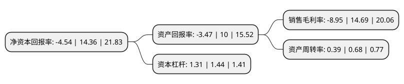

> 本页面由自动化程序生成于 2022年5月20日 01:37
> 内容可能存在错误，如有bug请提交issue至：https://github.com/Eroleice/doc-pi/issues
{.is-warning}

# 上市公司基本情况

## 基本资料

成都纵横自动化技术股份有限公司（以下简称“纵横股份”）成立于2010年04月08日，成都市。于2021年02月10日在上交所科创板上市。

纵横股份注册资本8,758万元，主要产品为无人机系统，飞控与地面指控系统，同时为客户提供无人机服务(包括无人机航飞数据服务，无人机执照培训服务)。专注于工业无人机相关产品的研发，生产，销售及服务。以下是详细信息：

- 公司名称: 成都纵横自动化技术股份有限公司
- 股票代码: 688070.SH
- 所在地: 四川 - 成都市
- 成立日期: 2010年04月08日
- 注册资本: 8,758万元
- 法定代表人: 任斌
- 主营业务: 主要产品为无人机系统，飞控与地面指控系统，同时为客户提供无人机服务(包括无人机航飞数据服务，无人机执照培训服务)专注于工业无人机相关产品的研发，生产，销售及服务
- 公司官网: www.jouav.com
- 公司介绍: 公司积极探索并推动以垂直起降固定翼无人机为主的工业无人机应用，通过多年技术研发积累及产业化应用，在飞行器平台设计及制造、飞控与航电、一体化设计及集成等领域形成了核心技术优势，并拥有工程化及产业化能力。公司整体技术水平处于国内领先水平，部分产品和技术达到国际先进水平。公司系“四川省优秀民营企业”、“成都市百强民营企业”，曾入围工业和信息化部“新一代人工智能产业创新重点任务入围揭榜潜力单位”，并获得“第二届全球无人系统大会2018年度贡献奖”等奖项。公司产品“CW-10无人机，1:500免像控航测系统”、“大鹏无人机系统CW-30”先后获得中国地理信息产业协会颁发的地理信息科技进步二等奖。公司参与完成的“大电网无人机广域智能巡检关键技术研究与应用”技术成果获得中国电力企业联合会颁发的2019年度电力创新奖一等奖。

## 股东及高管情况

上市公司第一大股东为任斌，持股20,502,000股，占比23.41%，**疑似为**上市公司实际控制人。

截至2022年03月31日，上市公司的前十大股东中，共有4名自然人股东，2名机构股东，4个产品账户，其中5%以上大股东共有5名。上市公司前十大股东明细如下：

> 未能通过持股比例判定出上市公司实际控制人（持股30%以上）
> 可能存在通过间接持股、联合持股、协议控制等方式拥有实际控制权的主体，具体请参考上市公司定期公告！
{.is-warning}

> 截至2022年03月31日，上市公司前十大股东信息如下：

| 股东名称 | 持股数量（股） | 持股比例 |
| --- | --- | --- |
| 任斌 | 20,502,000 | 23.41% |
| 王陈 | 13,668,000 | 15.61% |
| 成都永信大鹏企业管理中心(有限合伙) | 9,000,000 | 10.28% |
| 深圳市德青投资有限公司 | 8,640,000 | 9.87% |
| 陈鹏 | 6,030,000 | 6.89% |
| 中航南山股权投资基金管理(深圳)有限公司-深圳南山中航无人系统股权投资基金合伙企业(有限合伙) | 2,736,000 | 3.12% |
| 赵建平 | 2,000,000 | 2.28% |
| 国泰君安证券资管-兴业银行-国泰君安君享科创板纵横股份1号战略配售集合资产管理计划 | 1,819,264 | 2.08% |
| 深圳市中小担人才股权投资基金管理有限公司-深圳市人才创新创业三号一期股权投资基金合伙企业(有限合伙) | 1,560,000 | 1.78% |
| 四川商投资本股权投资基金管理有限公司-成都鹰击长空投资中心(有限合伙) | 1,470,186 | 1.68% |

## 利润表分析

上市公司2021年总收入为2.5亿元，净利润为-0.23亿元，**未实现盈利**。

## 杜邦分析

> 数据列示周期：2021年 | 2020年 | 2019年
{.is-info}

上市公司的净资产收益率在近一年有所下降，下降幅度为-131.62%，其变化情况分解如下：
- 上市公司的销售毛利率在近一年下降了-160.93%，可能是生产效率的下降、商品原材料价格上涨或商品价格的下跌所致。
- 上市公司的资产周转率在近一年下降了-42.65%，可能是源自于更慢的销售回款或库存管理效果下降。
- 上市公司的财务杠杆比率在近一年下降了-9.03%，可能是减少负债降低财务费用。

