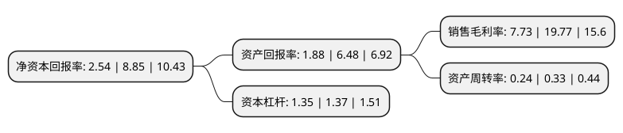

> 本页面由自动化程序生成于 2022年5月20日 01:39
> 内容可能存在错误，如有bug请提交issue至：https://github.com/Eroleice/doc-pi/issues
{.is-warning}

# 上市公司基本情况

## 基本资料

无锡航亚科技股份有限公司（以下简称“航亚科技”）成立于2013年01月30日，无锡市。于2020年12月16日在上交所科创板上市。

航亚科技注册资本25,838.261万元，专注于航空发动机关键零部件及医疗骨科植入锻件的研发，生产及销售，主要产品包括航空发动机压气机叶片，转动件及结构件(整体叶盘，盘环件，机匣，整流器等)，医疗骨科植入锻件(髋臼杯，髋柄及胫骨平台等精锻件)等高性能零部件。以下是详细信息：

- 公司名称: 无锡航亚科技股份有限公司
- 股票代码: 688510.SH
- 所在地: 江苏 - 无锡市
- 成立日期: 2013年01月30日
- 注册资本: 25,838.261万元
- 法定代表人: 严奇
- 主营业务: 专注于航空发动机关键零部件及医疗骨科植入锻件的研发，生产及销售，主要产品包括航空发动机压气机叶片，转动件及结构件(整体叶盘，盘环件，机匣，整流器等)，医疗骨科植入锻件(髋臼杯，髋柄及胫骨平台等精锻件)等高性能零部件
- 公司官网: www.hyatech.cn
- 公司介绍: 公司是一家专业的航空发动机及医疗骨科领域的高性能零部件制造商，专注于航空发动机关键零部件及医疗骨科植入锻件的研发、生产及销售，主要产品包括航空发动机压气机叶片、转动件及结构件(整体叶盘、盘环件、机匣、整流器等)、医疗骨科植入锻件(髋臼杯、髋柄及胫骨平台等精锻件)等高性能零部件,凭借较强的工艺技术实力及过程管控能力、经验丰富且配置完整的人才团队、快速的技术开发响应能力、持续的技术创新能力、丰富的国际项目产业化实施经验等综合优势，公司与航空发动机及医疗骨科关节领域的国内外一流客户群建立了深入、稳定、持续的合作关系,在航空发动机领域，公司向国际主流航空发动机公司大批量供应航空发动机压气机叶片，全球四大航空发动机厂商中的赛峰、GE航空为公司主要客户。凭借一贯的高品质产品与服务，公司获得了国内外航空发动机客户的高度认可：2019年，公司获得中国航发下属主机厂授予的“优秀配套供应商”奖项；2018年，公司获得了CFM公司(赛峰与GE航空的合营公司)授予的“卓越供应商-践行承诺奖”。国内医疗骨科植入件市场占有率前十名厂商中有多家为公司客户(强生医疗、施乐辉、威高骨科、春立正达)。

## 股东及高管情况

上市公司第一大股东为严奇，持股37,317,391股，占比14.44%，**疑似为**上市公司实际控制人。

截至2022年03月31日，上市公司的前十大股东中，共有4名自然人股东，5名机构股东，1个产品账户，其中5%以上大股东共有5名。上市公司前十大股东明细如下：

> 未能通过持股比例判定出上市公司实际控制人（持股30%以上）
> 可能存在通过间接持股、联合持股、协议控制等方式拥有实际控制权的主体，具体请参考上市公司定期公告！
{.is-warning}

> 截至2022年03月31日，上市公司前十大股东信息如下：

| 股东名称 | 持股数量（股） | 持股比例 |
| --- | --- | --- |
| 严奇 | 37,317,391 | 14.44% |
| 阮仕海 | 21,884,091 | 8.47% |
| 中国航发资产管理有限公司 | 20,000,000 | 7.74% |
| 伊犁苏新投资基金合伙企业(有限合伙) | 18,444,666 | 7.14% |
| 北京华睿互联创业投资中心(有限合伙) | 13,913,043 | 5.38% |
| 江苏新苏投资发展集团有限公司 | 12,000,000 | 4.64% |
| 无锡华航科创投资中心(有限合伙) | 10,033,300 | 3.88% |
| 无锡通汇投资有限公司 | 10,000,000 | 3.87% |
| 沈稚辉 | 7,500,000 | 2.9% |
| 吴晓林 | 7,286,682 | 2.82% |

## 利润表分析

上市公司2021年总收入为3.12亿元，净利润为0.24亿元，实现盈利。

## 杜邦分析

> 数据列示周期：2021年 | 2020年 | 2019年
{.is-info}

上市公司的净资产收益率在近一年有所下降，下降幅度为-71.3%，其变化情况分解如下：
- 上市公司的销售毛利率在近一年下降了-60.9%，可能是生产效率的下降、商品原材料价格上涨或商品价格的下跌所致。
- 上市公司的资产周转率在近一年下降了-27.27%，可能是源自于更慢的销售回款或库存管理效果下降。
- 上市公司的财务杠杆比率在近一年下降了-1.46%，可能是减少负债降低财务费用。

