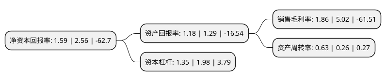

> 本页面由自动化程序生成于 2022年5月20日 01:14
> 内容可能存在错误，如有bug请提交issue至：https://github.com/Eroleice/doc-pi/issues
{.is-warning}

# 上市公司基本情况

## 基本资料

天海融合防务装备技术股份有限公司（以下简称“天海防务”）成立于2001年10月29日，上海市。于2009年10月30日在深交所创业板上市。

天海防务注册资本172,802.913万元，船舶与海洋工程装备产品设计，船舶建造工程监理，港口与海洋工程，机电安装工程承包及机电设备的批发与销售。以下是详细信息：

- 公司名称: 天海融合防务装备技术股份有限公司
- 股票代码: 300008.SZ
- 所在地: 上海 - 上海市
- 成立日期: 2001年10月29日
- 注册资本: 172,802.913万元
- 法定代表人: 占金锋
- 主营业务: 船舶与海洋工程装备产品设计，船舶建造工程监理，港口与海洋工程，机电安装工程承包及机电设备的批发与销售
- 公司官网: www.bestwaysh.com
- 公司介绍: 公司是国内规模最大、实力最强的专业民用船舶与海洋工程设计企业，自设立以来一直以船舶与海洋工程装备设计为主营业务。专业从事船舶与海洋工程研发设计、船舶与海洋工程监理和技术咨询、船舶及船舶内装工程承包、游艇设计与制造等业务，业务品种涵盖各类民用运输船、客船和公务船、海洋工程船、海洋工程结构物等，是国内一流的专业民用船舶与海洋工程科技企业。公司收购了上海沃金天然气利用公司，致力于构建水陆一体的天然气增值服务链和金海运船用设备公司，开始了海洋和防务特种装备研发制造领域的业务拓展。军民融合和清洁能源应用已经成为公司转型发展的两大驱动力。

## 股东及高管情况

上市公司第一大股东为厦门隆海重能投资合伙企业(有限合伙)，持股216,000,000股，占比12.5%，**疑似为**上市公司实际控制人。

截至2022年03月31日，上市公司的前十大股东中，共有5名自然人股东，5名机构股东，其中5%以上大股东共有3名。上市公司前十大股东明细如下：

> 未能通过持股比例判定出上市公司实际控制人（持股30%以上）
> 可能存在通过间接持股、联合持股、协议控制等方式拥有实际控制权的主体，具体请参考上市公司定期公告！
{.is-warning}

> 截至2022年03月31日，上市公司前十大股东信息如下：

| 股东名称 | 持股数量（股） | 持股比例 |
| --- | --- | --- |
| 厦门隆海重能投资合伙企业(有限合伙) | 216,000,000 | 12.5% |
| 刘楠 | 144,196,453 | 8.34% |
| 中国长城资产管理股份有限公司 | 106,429,235 | 6.16% |
| 王玮 | 80,000,000 | 4.63% |
| 李露 | 70,312,500 | 4.07% |
| 冯翠英 | 19,681,819 | 1.14% |
| 江兴浩 | 16,844,200 | 0.97% |
| 上海佳船企业发展有限公司 | 14,415,275 | 0.83% |
| 深圳市弘茂盛欣投资企业(有限合伙) | 11,020,050 | 0.64% |
| 泰州市金洋源投资中心(有限合伙) | 10,000,000 | 0.58% |

## 利润表分析

上市公司2021年总收入为14.21亿元，净利润为0.26亿元，实现盈利。

## 杜邦分析

> 数据列示周期：2021年 | 2020年 | 2019年
{.is-info}

上市公司的净资产收益率在近一年有所下降，下降幅度为-37.89%，其变化情况分解如下：
- 上市公司的销售毛利率在近一年下降了-62.95%，可能是生产效率的下降、商品原材料价格上涨或商品价格的下跌所致。
- 上市公司的资产周转率在近一年上升了142.31%，可能是源自于更快的销售回款或库存管理效果提升。
- 上市公司的财务杠杆比率在近一年下降了-31.82%，可能是减少负债降低财务费用。

