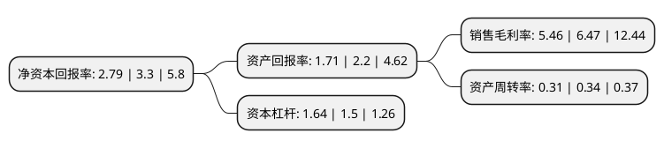

> 本页面由自动化程序生成于 2022年5月20日 01:14
> 内容可能存在错误，如有bug请提交issue至：https://github.com/Eroleice/doc-pi/issues
{.is-warning}

# 上市公司基本情况

## 基本资料

北京海兰信数据科技股份有限公司（以下简称“海兰信”）成立于2001年02月14日，北京市。于2010年03月26日在深交所创业板上市。

海兰信注册资本62,985.681万元，主要从事航海电子科技产品和系统的研发，生产，销售和服务。公司目前生产与研发的主要产品包括:船载航行数据记录仪(VDR，又称“船用黑匣子”)，船舶远程监控管理系统(VMS)，船舶电子集成系统(VEIS)，船舶操舵仪(SCS)以及雷达等。以下是详细信息：

- 公司名称: 北京海兰信数据科技股份有限公司
- 股票代码: 300065.SZ
- 所在地: 北京 - 北京市
- 成立日期: 2001年02月14日
- 注册资本: 62,985.681万元
- 法定代表人: 申万秋
- 主营业务: 主要从事航海电子科技产品和系统的研发，生产，销售和服务公司目前生产与研发的主要产品包括:船载航行数据记录仪(VDR，又称“船用黑匣子”)，船舶远程监控管理系统(VMS)，船舶电子集成系统(VEIS)，船舶操舵仪(SCS)以及雷达等
- 公司官网: www.highlander.com.cn
- 公司介绍: 公司一直专注于航海电子科技领域，主要从事航海电子科技产品和系统的研发、生产、销售和服务。主要产品包括：船载航行数据记录仪(VDR“船用黑匣子”)、船舶远程监控管理系统(VMS)、船舶电子集成系统(VEIS)、船舶操舵仪(SCS)以及雷达等，广泛应用于中远集团、中海集团、海事局、救捞局、台塑国内外船东和诸多国内外大型造船集团，并且远销至三十多个国家和地区。公司在自主研发产品的基础上，积极为用户提供通信导航产品系统服务，为国内外诸多船东提供船岸系统解决方案。

## 股东及高管情况

上市公司第一大股东为申万秋，持股86,192,091股，占比13.6%，**疑似为**上市公司实际控制人。

截至2022年03月31日，上市公司的前十大股东中，共有6名自然人股东，3名机构股东，1个产品账户，其中5%以上大股东共有1名。上市公司前十大股东明细如下：

> 未能通过持股比例判定出上市公司实际控制人（持股30%以上）
> 可能存在通过间接持股、联合持股、协议控制等方式拥有实际控制权的主体，具体请参考上市公司定期公告！
{.is-warning}

> 截至2022年03月31日，上市公司前十大股东信息如下：

| 股东名称 | 持股数量（股） | 持股比例 |
| --- | --- | --- |
| 申万秋 | 86,192,091 | 13.6% |
| 海南海钢集团有限公司 | 31,000,000 | 4.89% |
| 汪涓 | 11,660,900 | 1.84% |
| 上海言盛投资合伙企业(有限合伙) | 7,745,042 | 1.22% |
| 珠海市智海创信海洋科技服务合伙企业(有限合伙) | 7,352,515 | 1.16% |
| 杜月姣 | 6,177,100 | 0.97% |
| 高雅萍 | 5,577,400 | 0.88% |
| 李振龙 | 3,980,100 | 0.63% |
| 樊勇 | 3,925,000 | 0.62% |
| 上海浦东发展银行股份有限公司-广发恒昌一年持有期混合型证券投资基金 | 3,599,685 | 0.57% |

## 利润表分析

上市公司2021年总收入为9.02亿元，净利润为0.49亿元，实现盈利。

## 杜邦分析

> 数据列示周期：2021年 | 2020年 | 2019年
{.is-info}

上市公司的净资产收益率在近一年有所下降，下降幅度为-15.45%，其变化情况分解如下：
- 上市公司的销售毛利率在近一年下降了-15.61%，可能是生产效率的下降、商品原材料价格上涨或商品价格的下跌所致。
- 上市公司的资产周转率在近一年下降了-8.82%，可能是源自于更慢的销售回款或库存管理效果下降。
- 上市公司的财务杠杆比率在近一年上升了9.33%，可能是增加负债扩大生产规模。

