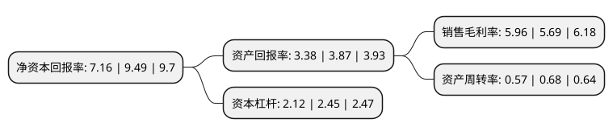

> 本页面由自动化程序生成于 2022年5月20日 01:18
> 内容可能存在错误，如有bug请提交issue至：https://github.com/Eroleice/doc-pi/issues
{.is-warning}

# 上市公司基本情况

## 基本资料

江龙船艇科技股份有限公司（以下简称“江龙船艇”）成立于2003年01月21日，中山市。于2017年01月13日在深交所创业板上市。

江龙船艇注册资本22,215.765万元，主要产品:按照用途可分为旅游休闲船艇，公务执法船艇，按材质可分为玻璃钢船艇，金属及多材质复合船艇。主营业务:本公司主要从事旅游休闲船艇和公务执法船艇的设计，研发，生产和销售，为客户提供从应用设计，产品制造到维修保养等全方位的个性化服务解决方案，是国内优秀的高性能玻璃钢，金属及多材质复合船艇供应商。以下是详细信息：

- 公司名称: 江龙船艇科技股份有限公司
- 股票代码: 300589.SZ
- 所在地: 广东 - 中山市
- 成立日期: 2003年01月21日
- 注册资本: 22,215.765万元
- 法定代表人: 晏志清
- 主营业务: 主要产品:按照用途可分为旅游休闲船艇，公务执法船艇，按材质可分为玻璃钢船艇，金属及多材质复合船艇主营业务:本公司主要从事旅游休闲船艇和公务执法船艇的设计，研发，生产和销售，为客户提供从应用设计，产品制造到维修保养等全方位的个性化服务解决方案，是国内优秀的高性能玻璃钢，金属及多材质复合船艇供应商
- 公司官网: www.jianglong.cn
- 公司介绍: 公司主要从事旅游休闲船艇和公务执法船艇的设计、研发、制造和销售，为客户提供从应用设计、产品制造到维修保养等全方位的个性化服务解决方案，是国内优秀的高性能全钢质、全铝合金及多材质复合船艇供应商。公司已是国家高新技术企业、广东省创新型企业，还被评为广东省级企业技术中心、广东省工程技术研究中心。依托持续的技术创新、优异的产品性能和齐全的产品线结构，公司已在行业内树立起了良好的市场口碑，客户认知度高，市场地位突出。目前，公司是国内为数不多可同时生产全铝合金船艇、全钢质船艇及多材质复合船艇的企业之一。公司研发生产的“铝合金-玻璃钢复合型高速船”、“多功能钢-玻璃钢复合型豪华商务游艇”、“钢铝水上执法船”等多款产品被认定为广东省高新技术产品。

## 股东及高管情况

上市公司第一大股东为夏刚，持股54,537,850股，占比24.55%，**疑似为**上市公司实际控制人。

截至2022年03月31日，上市公司的前十大股东中，共有6名自然人股东，2名机构股东，2个产品账户，其中5%以上大股东共有3名。上市公司前十大股东明细如下：

> 未能通过持股比例判定出上市公司实际控制人（持股30%以上）
> 可能存在通过间接持股、联合持股、协议控制等方式拥有实际控制权的主体，具体请参考上市公司定期公告！
{.is-warning}

> 截至2022年03月31日，上市公司前十大股东信息如下：

| 股东名称 | 持股数量（股） | 持股比例 |
| --- | --- | --- |
| 夏刚 | 54,537,850 | 24.55% |
| 晏志清 | 32,049,191 | 14.43% |
| 赵盛华 | 19,371,339 | 8.72% |
| 龚重英 | 8,852,322 | 3.98% |
| 贺文军 | 5,883,885 | 2.65% |
| 保利汇鑫股权基金投资管理有限公司-湖州汇鑫隆益股权投资合伙企业(有限合伙) | 3,054,695 | 1.38% |
| 赵海茜 | 2,345,200 | 1.06% |
| 中国工商银行股份有限公司-华夏磐利一年定期开放混合型证券投资基金 | 2,321,981 | 1.05% |
| 中国银河证券股份有限公司 | 1,805,985 | 0.81% |
| 一重集团融创科技发展有限公司 | 1,238,390 | 0.56% |

## 利润表分析

上市公司2021年总收入为6.9亿元，净利润为0.41亿元，实现盈利。

## 杜邦分析

> 数据列示周期：2021年 | 2020年 | 2019年
{.is-info}

上市公司的净资产收益率在近一年有所下降，下降幅度为-24.55%，其变化情况分解如下：
- 上市公司的销售毛利率在近一年上升了4.75%，可能是生产效率的提升、商品原材料价格下跌或商品价格的上涨所致。
- 上市公司的资产周转率在近一年下降了-16.18%，可能是源自于更慢的销售回款或库存管理效果下降。
- 上市公司的财务杠杆比率在近一年下降了-13.47%，可能是减少负债降低财务费用。

