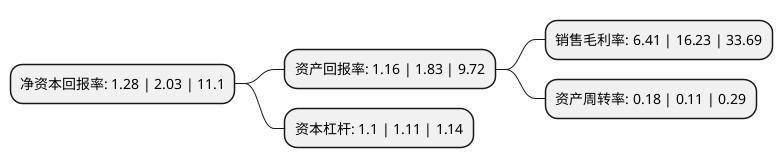

> 本页面由自动化程序生成于 2022年5月20日 01:20
> 内容可能存在错误，如有bug请提交issue至：https://github.com/Eroleice/doc-pi/issues
{.is-warning}

# 上市公司基本情况

## 基本资料

北京中科海讯数字科技股份有限公司（以下简称“中科海讯”）成立于2005年07月18日，北京市。于2019年12月06日在深交所创业板上市。

中科海讯注册资本11,805万元，主营业务为声纳领域相关产品的研发，生产和销售，主要产品包括信号处理平台，声纳系统，水声大数据与仿真系统，无人反潜系统等。以下是详细信息：

- 公司名称: 北京中科海讯数字科技股份有限公司
- 股票代码: 300810.SZ
- 所在地: 北京 - 北京市
- 成立日期: 2005年07月18日
- 注册资本: 11,805万元
- 法定代表人: 蔡惠智
- 主营业务: 主营业务为声纳领域相关产品的研发，生产和销售，主要产品包括信号处理平台，声纳系统，水声大数据与仿真系统，无人反潜系统等
- 公司官网: www.zhongkehaixun.com
- 公司介绍: 公司长期专注于声纳领域相关产品的研发、生产和销售。公司围绕国家特种电子信息行业战略发展方向，紧贴最终用户需求，主要为客户提供信号处理平台、声纳系统、水声大数据与仿真系统、无人探测系统等声纳领域相关产品。公司产品主要应用于国家特种电子信息行业声纳装备领域，声纳装备主要作用为水声目标探测与识别、水声通信与数据传输、水声导航与测绘等，最终用户为国家特种部门。公司根据国家特种电子信息行业发展需求不断加大研发投入，形成了丰富的产品类型，储备了较多核心技术，系公司所处行业声纳装备领域的核心配套供应商和重要分系统供应商，并在以“配套为主、系统为辅”向“系统为主、配套为辅”的企业战略转型中取得较大成效。

## 股东及高管情况

上市公司第一大股东为宁波梅山保税港区中科海讯科技投资合伙企业(有限合伙)，持股34,546,824股，占比29.26%，**疑似为**上市公司实际控制人。

截至2022年03月31日，上市公司的前十大股东中，共有8名自然人股东，2名机构股东，其中5%以上大股东共有2名。上市公司前十大股东明细如下：

> 未能通过持股比例判定出上市公司实际控制人（持股30%以上）
> 可能存在通过间接持股、联合持股、协议控制等方式拥有实际控制权的主体，具体请参考上市公司定期公告！
{.is-warning}

> 截至2022年03月31日，上市公司前十大股东信息如下：

| 股东名称 | 持股数量（股） | 持股比例 |
| --- | --- | --- |
| 宁波梅山保税港区中科海讯科技投资合伙企业(有限合伙) | 34,546,824 | 29.26% |
| 平顶山海讯声学科技投资合伙企业(有限合伙) | 19,052,813 | 16.14% |
| 蔡惠智 | 5,394,033 | 4.57% |
| 徐俊华 | 1,800,954 | 1.53% |
| 罗文天 | 981,439 | 0.83% |
| 郎芝飒 | 778,000 | 0.66% |
| 王丽凤 | 525,000 | 0.44% |
| 王立法 | 521,499 | 0.44% |
| 陈青云 | 500,000 | 0.42% |
| 赵文立 | 441,040 | 0.37% |

## 利润表分析

上市公司2021年总收入为2.02亿元，净利润为0.12亿元，实现盈利。

## 杜邦分析

> 数据列示周期：2021年 | 2020年 | 2019年
{.is-info}

上市公司的净资产收益率在近一年有所下降，下降幅度为-36.95%，其变化情况分解如下：
- 上市公司的销售毛利率在近一年下降了-60.51%，可能是生产效率的下降、商品原材料价格上涨或商品价格的下跌所致。
- 上市公司的资产周转率在近一年上升了63.64%，可能是源自于更快的销售回款或库存管理效果提升。
- 上市公司的财务杠杆比率在近一年下降了-0.9%，可能是减少负债降低财务费用。

