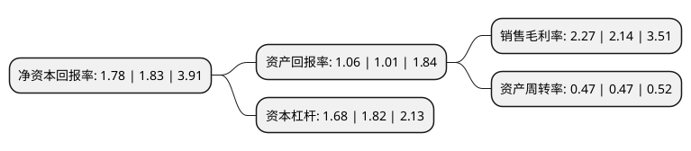

> 本页面由自动化程序生成于 2022年5月20日 01:26
> 内容可能存在错误，如有bug请提交issue至：https://github.com/Eroleice/doc-pi/issues
{.is-warning}

# 上市公司基本情况

## 基本资料

中国船舶重工集团动力股份有限公司（以下简称“中国动力”）成立于2000年06月13日，保定市。于2004年07月14日在上交所主板上市。

中国动力注册资本216,068.212万元，主要产品:铅酸蓄电池，蓄电池壳体，隔板，非蓄电池塑料制品。以下是详细信息：

- 公司名称: 中国船舶重工集团动力股份有限公司
- 股票代码: 600482.SH
- 所在地: 河北 - 保定市
- 成立日期: 2000年06月13日
- 注册资本: 216,068.212万元
- 法定代表人: 周宗子
- 主营业务: 主要产品:铅酸蓄电池，蓄电池壳体，隔板，非蓄电池塑料制品
- 公司官网: www.china-csicpower.com.cn
- 公司介绍: 公司原是军用起动铅酸蓄电池的定点生产单位，多年来公司引进了多条蓄电池专用生产线和检测设备。公司是一汽大众、上海大众、上海通用、北京现代、东风汽车、长安汽车的常年合作方，是奥迪A6、帕萨特领驭、别克荣御等中高端车型的独家配套商，国内汽车起动电池市场占有率较高并连续多年跻身于“中国汽车零部件百强企业”、“中国机械工业百强企业”。2016年，公司收购多家公司股权和债权，业务范围涵盖燃气动力、蒸汽动力、化学动力、全电动力、民用核动力、柴油机动力、热气机动力等七大动力，成为多维度的高端动力装备研发、制造、系统集成、销售及服务的上市公司。

## 股东及高管情况

上市公司第一大股东为中国船舶重工集团有限公司，持股563,578,173股，占比26.08%，**疑似为**上市公司实际控制人。

截至2022年03月31日，上市公司的前十大股东中，共有7名机构股东，1个产品账户，2个海外主体，其中5%以上大股东共有3名。上市公司前十大股东明细如下：

> 未能通过持股比例判定出上市公司实际控制人（持股30%以上）
> 可能存在通过间接持股、联合持股、协议控制等方式拥有实际控制权的主体，具体请参考上市公司定期公告！
{.is-warning}

> 截至2022年03月31日，上市公司前十大股东信息如下：

| 股东名称 | 持股数量（股） | 持股比例 |
| --- | --- | --- |
| 中国船舶重工集团有限公司 | 563,578,173 | 26.08% |
| 中国船舶重工股份有限公司 | 454,731,000 | 21.05% |
| 中国信达资产管理股份有限公司 | 118,081,403 | 5.47% |
| 军民融合海洋防务(大连)产业投资企业(有限合伙) | 99,776,245 | 4.62% |
| 深圳市红塔资产-中信银行-中信信托-中信·宏商金融投资项目1601期单一资金信托 | 95,675,607 | 4.43% |
| 深圳新华富时-中信银行-国投泰康信托-国投泰康信托金雕399号单一资金信托 | 95,449,873 | 4.42% |
| 中国证券金融股份有限公司 | 51,989,343 | 2.41% |
| 长信基金-浦发银行-聚富8号资产管理计划 | 45,532,925 | 2.11% |
| 中国船舶重工集团公司第七0四研究所 | 43,435,898 | 2.01% |
| 中国华融资产管理股份有限公司 | 40,169,721 | 1.86% |

## 杜邦分析

> 数据列示周期：2021年 | 2020年 | 2019年
{.is-info}

上市公司的净资产收益率在近一年有所下降，下降幅度为-2.73%，其变化情况分解如下：
- 上市公司的销售毛利率在近一年上升了6.07%，可能是生产效率的提升、商品原材料价格下跌或商品价格的上涨所致。
- 上市公司的资产周转率在近一年下降了0%，可能是源自于更慢的销售回款或库存管理效果下降。
- 上市公司的财务杠杆比率在近一年下降了-7.69%，可能是减少负债降低财务费用。

