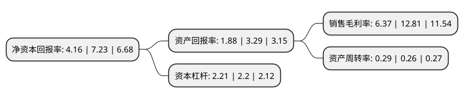

> 本页面由自动化程序生成于 2022年5月20日 01:01
> 内容可能存在错误，如有bug请提交issue至：https://github.com/Eroleice/doc-pi/issues
{.is-warning}

# 上市公司基本情况

## 基本资料

方大集团股份有限公司（以下简称“方大集团”）成立于1994年04月20日，深圳市。于1996年04月15日在深交所主板上市。

方大集团注册资本107,387.423万元，主要产品:节能幕墙，光电幕墙，LED彩显幕墙等各类建筑幕墙及铝板材料;太阳能光伏;房地产等。轨道交通屏蔽门系统;主营业务:高端幕墙系统及材料，轨道交通设备及系统，太阳能光伏发电，房地产和金融等板块。以下是详细信息：

- 公司名称: 方大集团股份有限公司
- 股票代码: 000055.SZ
- 所在地: 广东 - 深圳市
- 成立日期: 1994年04月20日
- 注册资本: 107,387.423万元
- 法定代表人: 熊建明
- 主营业务: 主要产品:节能幕墙，光电幕墙，LED彩显幕墙等各类建筑幕墙及铝板材料;太阳能光伏;房地产等轨道交通屏蔽门系统;主营业务:高端幕墙系统及材料，轨道交通设备及系统，太阳能光伏发电，房地产和金融等板块
- 公司官网: www.fangda.com
- 公司介绍: 公司业务范围涵盖高端幕墙系统及材料、轨道交通设备及系统、太阳能光伏发电、房地产和金融等板块，主要产品为节能幕墙、光电幕墙、LED彩显幕墙等各类建筑幕墙及铝板材料、轨道交通屏蔽门系统。公司秉承“科技为本，创新为源”的经营理念，坚持自主创新，以“方大工匠”精神发展“节能、环保、低碳”产业。公司先后荣获“亚太地区100家最佳管理公司”、“建设创新型国家杰出企业”、“中国建设科技自主创新优势企业”、“全国质量效益型先进企业”、“中国工业行业状元”、“国家863计划CIMS应用示范企业”、“全国CAD应用工程示范企业”、“全国建设信用AAA级诚信企业”、“广东省知识产权优势企业”、“广东省诚信守法示范企业”、“广东省守合同重信用企业”、“深圳市民营领军骨干企业”、“深圳市制造业信息化重点示范企业”、以及世界质量大奖——“白金明星奖”、“国家级重点新产品”、“中国建筑工程鲁班奖(国家优质工程)”、“詹天佑土木工程奖”、“全国建筑工程装饰奖”、“白玉兰”奖、“用户满意工程”等诸多荣誉。“方大FANGDA”被评为“中国驰名商标”。

## 股东及高管情况

上市公司第一大股东为深圳市邦林科技发展有限公司，持股119,332,846股，占比11.11%，**疑似为**上市公司实际控制人。

截至2022年05月09日，上市公司的前十大股东中，共有1名自然人股东，6名机构股东，1个产品账户，2个海外主体，其中5%以上大股东共有4名。上市公司前十大股东明细如下：

> 未能通过持股比例判定出上市公司实际控制人（持股30%以上）
> 可能存在通过间接持股、联合持股、协议控制等方式拥有实际控制权的主体，具体请参考上市公司定期公告！
{.is-warning}

> 截至2022年05月09日，上市公司前十大股东信息如下：

| 股东名称 | 持股数量（股） | 持股比例 |
| --- | --- | --- |
| 深圳市邦林科技发展有限公司 | 119,332,846 | 11.11% |
| 深圳市邦林科技发展有限公司 | 119,332,846 | 11.11% |
| 盛久投资有限公司 | 108,579,318 | 10.11% |
| 盛久投资有限公司 | 107,862,104 | 10.04% |
| 方威 | 32,543,178 | 3.03% |
| 共青城时利和投资管理合伙企业(有限合伙) | 15,860,609 | 1.48% |
| VANGUARD EMERGING MARKETS STOCK INDEX FUND | 6,032,894 | 0.56% |
| VANGUARD TOTAL INTERNATIONAL STOCK INDEX FUND | 5,886,621 | 0.55% |
| 第一上海证券有限公司 | 3,938,704 | 0.37% |
| 上海银叶投资有限公司-银叶量化对冲1期私募证券投资基金 | 3,755,500 | 0.35% |

## 利润表分析

上市公司2021年总收入为35.57亿元，净利润为2.26亿元，实现盈利。

## 杜邦分析

> 数据列示周期：2021年 | 2020年 | 2019年
{.is-info}

上市公司的净资产收益率在近一年有所下降，下降幅度为-42.46%，其变化情况分解如下：
- 上市公司的销售毛利率在近一年下降了-50.27%，可能是生产效率的下降、商品原材料价格上涨或商品价格的下跌所致。
- 上市公司的资产周转率在近一年上升了11.54%，可能是源自于更快的销售回款或库存管理效果提升。
- 上市公司的财务杠杆比率在近一年上升了0.45%，可能是增加负债扩大生产规模。

