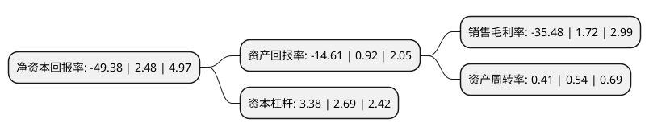

> 本页面由自动化程序生成于 2022年5月20日 01:05
> 内容可能存在错误，如有bug请提交issue至：https://github.com/Eroleice/doc-pi/issues
{.is-warning}

# 上市公司基本情况

## 基本资料

深圳市宝鹰建设控股集团股份有限公司（以下简称“宝鹰股份”）成立于1993年04月30日，深圳市。于2005年05月31日在深交所中小板上市。

宝鹰股份注册资本151,624.869万元，主营业务:综合建筑装饰工程业务以下是详细信息：

- 公司名称: 深圳市宝鹰建设控股集团股份有限公司
- 股票代码: 002047.SZ
- 所在地: 广东 - 深圳市
- 成立日期: 1993年04月30日
- 注册资本: 151,624.869万元
- 法定代表人: 施雷
- 主营业务: 主营业务:综合建筑装饰工程业务
- 公司官网: www.szby.cn
- 公司介绍: 公司是中国建筑装饰行业领先的大型综合装饰企业，是一家控股平台型的上市公司，下属主要经营主体的主营业务为建筑装饰工程设计与施工，业务范围涵盖：装饰装修工程、幕墙钢结构工程、集成智能化工程、建筑消防工程、机电安装工程、安防技术工程、金属门窗工程、展览展会工程和医疗设备工程，主要为大型房地产项目、政府机构、大型企业、跨国公司、高档酒店等客户提供装饰设计和施工综合解决方案及承建管理服务。公司是全国建筑装饰行业拥有较齐全业务资质的企业之一，具备多个设计甲级(装饰、幕墙、智能化、消防)和多个施工壹级(装饰、幕墙、智能化、消防、机电设备)、钢结构施工贰级、洁净工程贰级，以及展览展示工程施工一级、安全技术防范系统、医疗器械、金融安全防范设施等多项施工设计资质。公司曾获得“中国守合同重信用企业”、“中国优秀诚信企业”、“中国建筑业AAA级信用企业”、“中国建筑装饰行业AAA级资信企业”、“广东省优秀企业”、“广东省著名商标企业”、“广东省全国名牌企业”、“广东省守合同重信用企业”、“广东省最佳诚信企业”、“深圳老字号”等荣誉称号。

## 股东及高管情况

上市公司第一大股东为珠海航空城发展集团有限公司，持股470,037,095股，占比31%，为上市公司实际控制人。

截至2022年03月31日，上市公司的前十大股东中，共有7名自然人股东，3名机构股东，其中5%以上大股东共有2名。上市公司前十大股东明细如下：

> 截至2022年03月31日，上市公司前十大股东信息如下：

| 股东名称 | 持股数量（股） | 持股比例 |
| --- | --- | --- |
| 珠海航空城发展集团有限公司 | 470,037,095 | 31% |
| 深圳市宝贤投资有限公司 | 115,576,845 | 7.62% |
| 古少明 | 61,333,658 | 4.05% |
| 深圳市宝信投资控股有限公司 | 41,701,076 | 2.75% |
| 郑伟光 | 10,120,763 | 0.67% |
| 王俊新 | 8,256,100 | 0.54% |
| 刘心怡 | 6,472,400 | 0.43% |
| 强国才 | 5,200,000 | 0.34% |
| 刘运华 | 4,872,400 | 0.32% |
| 李彬彬 | 4,737,000 | 0.31% |

## 利润表分析

上市公司2021年总收入为46.69亿元，净利润为-16.57亿元，**未实现盈利**。

## 杜邦分析

> 数据列示周期：2021年 | 2020年 | 2019年
{.is-info}

上市公司的净资产收益率在近一年有所下降，下降幅度为-2091.13%，其变化情况分解如下：
- 上市公司的销售毛利率在近一年下降了-2162.79%，可能是生产效率的下降、商品原材料价格上涨或商品价格的下跌所致。
- 上市公司的资产周转率在近一年下降了-24.07%，可能是源自于更慢的销售回款或库存管理效果下降。
- 上市公司的财务杠杆比率在近一年上升了25.65%，可能是增加负债扩大生产规模。

